With all this metal laying around it was about time I started putting it to use.

While the 2x6 rocker mod (aka rock sliders) for XJ isn't uncommon by any means, I'm planning on taking a slightly different approach in how I tie them into the unibody. My goal is to hide the welds, and also leave some hidden access holes that'll let me spray fluid film down into the rockers each year before winter.

The materials I'll be using are:

- (2) 6' cuts of 3/16 2x6 steel
- (2) 6' cuts of 1/8 2x2 angle
- (2) 6' cuts of 1/8 1.5x1.5 angle
- Key Parts outer rockers (0482-101 L, and 0482-102 R)
- Key Parts inner rockers (0482-301, and 0482-302)

For 2x6 rockers you don't need 6' cuts ([60 1/2" is more than enough](https://www.cherokeeforum.com/f67/length-rocker-panel-2x6-rocker-206773/#post3044897)) but the metal distributor I bought them from sells them cheaper at specific lengths vs custom cuts so I figured a little extra length wouldn't be a big deal.

And if you decide to buy inner rockers but don't want to spend the extra cash for Key Parts just be sure to double check the thickness before ordering. OEM spec for the inner rockers is 16ga (1.6mm) but a lot of aftermarket inner rockers appear to be only 17ga - 18ga (1.2mm - 1.4mm). The Key Parts inner rockers are 16ga.

I imagine the difference in strength is negligible if you're doing the 2x6 rocker mod but the extra thickness should help make it easier to weld the thick metal to them.

# The Tear Down

I'm trying to be more proper about my repairs so I took the time to weld in a brace before going any further.

Lots of rust on the rocker panel.

Turns out in order to reach all of the spot welds holding in the rocker panel you need to remove the front fender first.

But to remove the front fender you also have to remove the front facia to reach a couple of the fender bolts that sit behind the headlights.

I've never actually taken the fenders off this Jeep before!

Looks like there's some more rust I'll need to address.
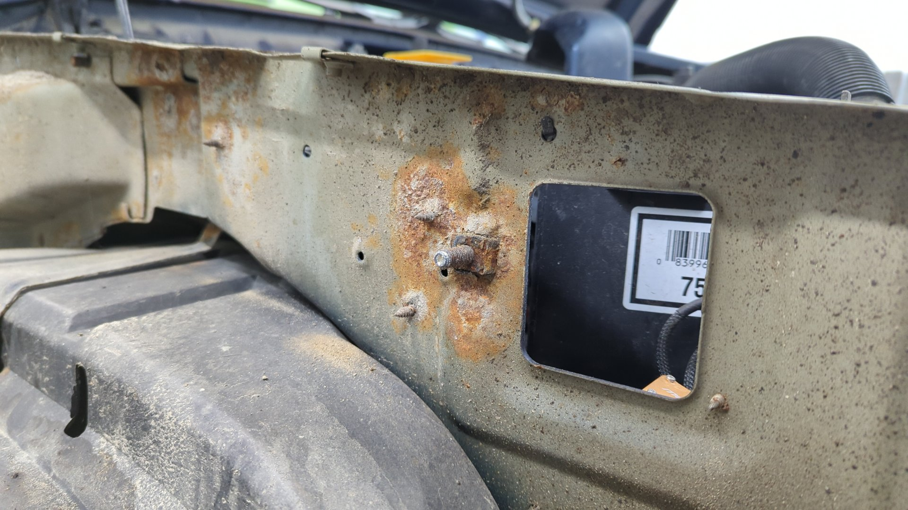

With the inner fender lining removed I could see one of my old patch jobs I did to fix some rust it had down at the bottom of the passenger wheel well.

Not bad for one of my first repairs. I remember doing this while sitting outside on the gravel driveway at my parent's house with nothing but my 110v welder and an angle grinder.

This step is optional, but I decided to remove the brace that sits below the rear bench seat. I could see some rust popping out from underneath the seam sealer covering the bottom of it and it seemed like it'd make things easier to replace the rocker panel with it out of the way so I figured I may as well just remove it for now.

Apparently there was a bolt hidden beneath the seam sealer!

It appears to help hold the leaf spring mount in place.

Amazingly the thing came out without an issue. I was pretty certain I'd have to drill it out given the luck I've had with just about every other bolt on this thing.
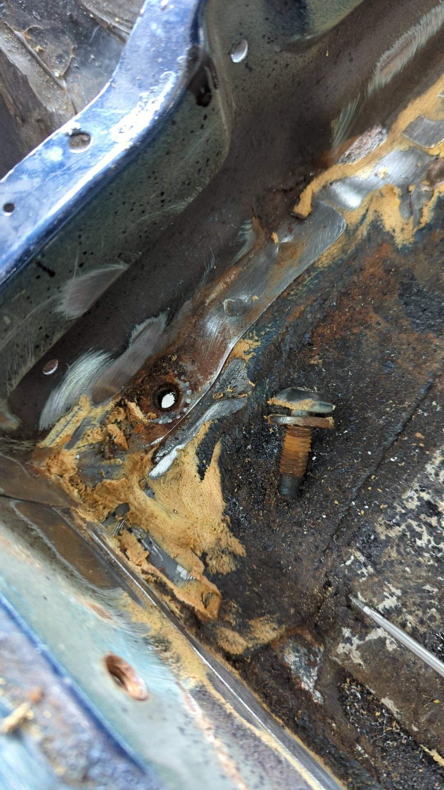

And after drilling a few more spot welds out the rear brace was removed.

I plan on sand blasting / painting the brace before it comes time to weld it back in.

With the brace out of the way, it made life a little easier to wire wheel all the seam sealer out so I could expose where the floor pan is welded to the inner rocker.

Back on the outside I used the angle grinder to put a couple cuts into the outer rocker. This step wouldn't normally be required if you're removing the OEM rockers but the last time I replaced the rockers I welded up these seams so there was no other option.
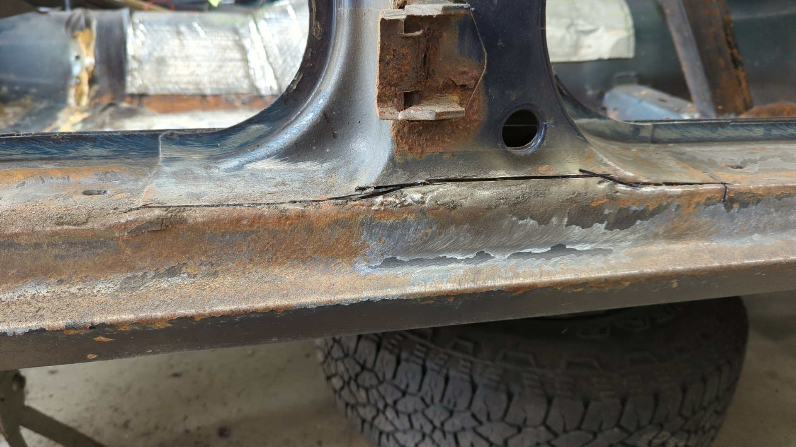

Lots of spot welds on the bottom of the front pillar.

After that I drilled out every spot weld on the upper lip.
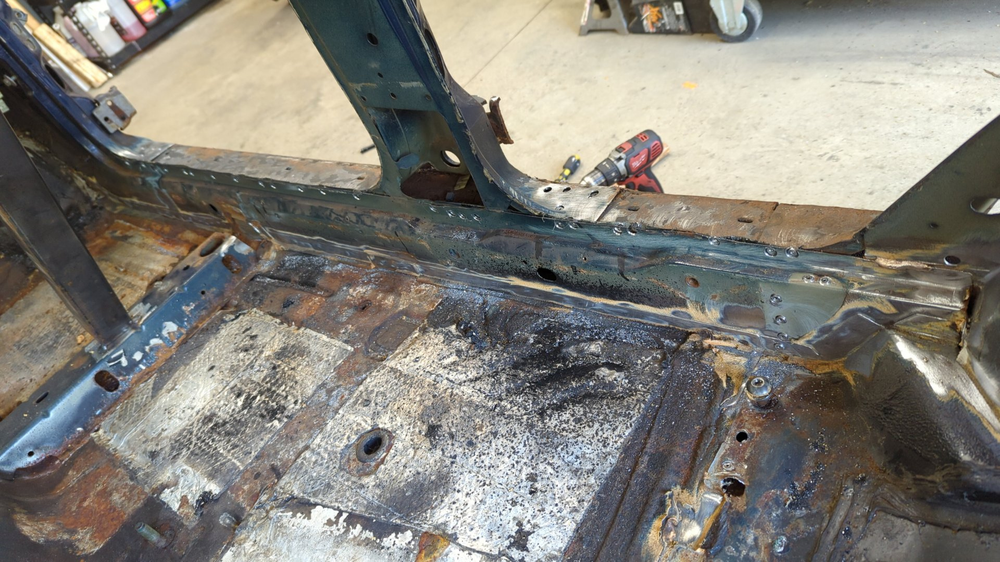

Where the rocker meets the rear wheel well arch was so rusted that I couldn't find any of the spot welds holding the two panels together. I ended up taking the brute force approach and randomly drilled holes until I could pry the metal apart.

The metal is too far gone anyways so I was already planning on fully replacing it.

And after that I used my sawzall to run a cut along the bottom of the outer rocker directly above the lower pinch weld so I could remove it.

Inner rocker panel doesn't look great.

Lots of rust on the bottom of the pillars where the metal is sandwiched against the outer rocker.

Lots of mig wire stalagmites sticking out of my old welds lol.

With the outer rocker removed the only thing really holding in the inner rocker at this point was a bunch of spot welds down where it mates to the floor.

To remove the spot welds I drilled pilot holes from the inside of the Jeep, then drilled out the welds with the spot weld cutter from the other side.

It was hard to get the drill positioned nicely with them so close to the floor that I figured it'd just be easier to drill them from the outside.

## No Turning Back Now

There's not much metal left on this side of the Jeep with the rocker fully removed.

Old vs new.

# Beginning the Rebuild

Nothing like a test fit to see how the new inner rocker will look.

It looks pretty good but there's a lot of rust around the rear wheel well where the inner rocker connects to it, and also a bunch of rust below the front passenger pillar. Both of these areas will need to be addressed before I can weld the inner rocker in.

## Patching the Rear Wheel Well

I figured I'd start working on the rear wheel well because it felt like the easier of the two.

After cutting out all the rust.

First patch welded in.

Second patch was a little more complicated as it had a bend. I need a lot more practice working with curved metal.
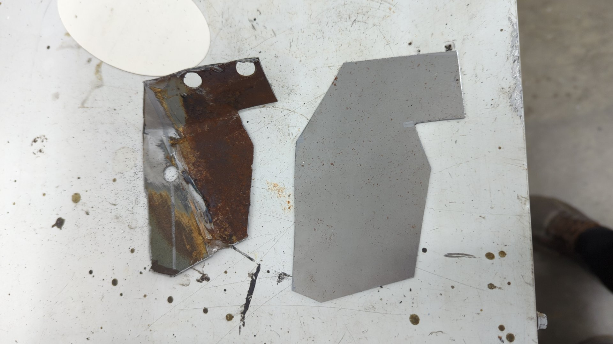

But thankfully this is pretty hidden within the wheel well and will be covered up with bed liner when finished so no one will be able to tell.
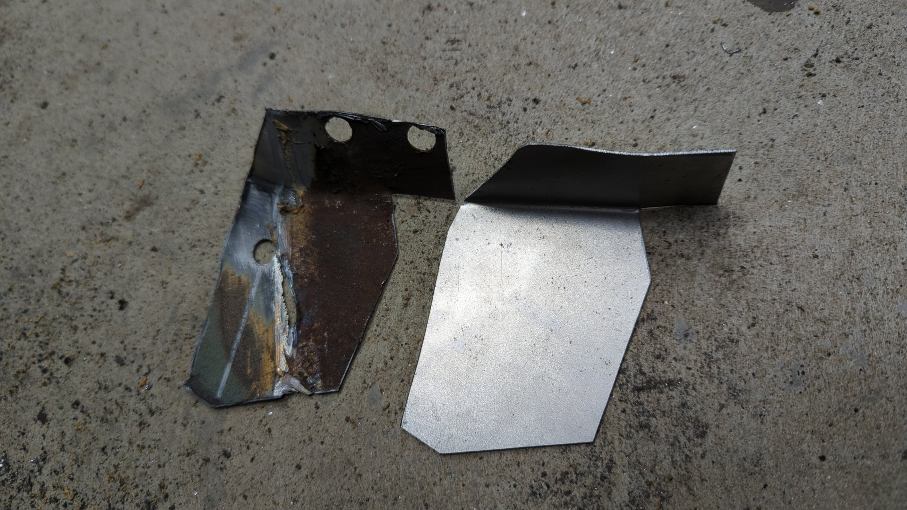

Much better.

I've been making these small patches using my mini bandsaw I made from a Milwaukee portaband.

## Rebuilding the Front Pillar

Over in the front of the rocker where it meets the b pillar there was some rust in tight spots and also some more rust between the sandwiched layers of metal that I wanted to address.

I figure if I've already gone this far, I may as well go after as much of the rust as I possibly can.

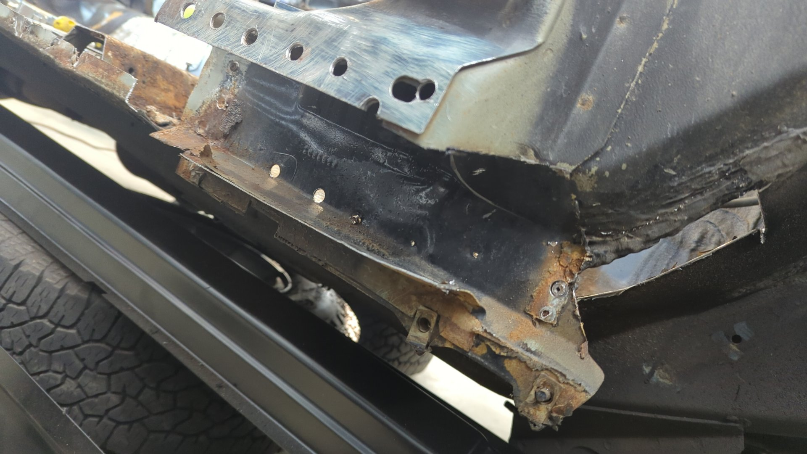

There's a lot of rust hidden behind all that old POR15.

I decided to cut out most of the backside so I could make a completely new replacment.

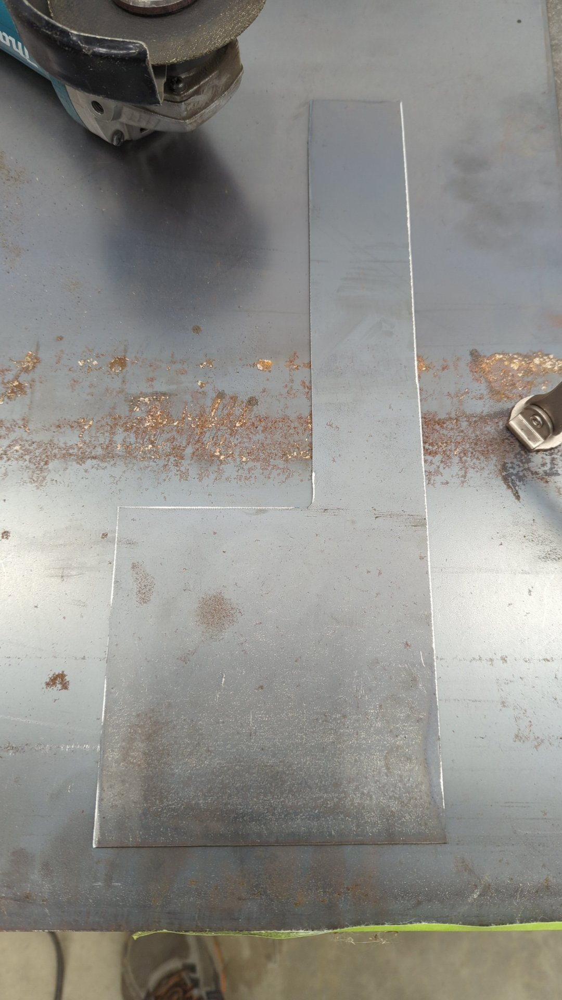

Then I bent it up in my metal brake to an almost perfect fit!

And lastly, I hit it with the flap disc until the edge that'd be welded to the body mated lined up nicely.

You'll notice my new piece is actually shorter than the original metal. Since I'm doing the 2x6 rocker mod I omitted what would be used for the pinch weld since I'll be cutting that lower edge off the inner rocker later on.

Welded in.

To close up the gap on the left I cut a notch out of the metal and hammered the edge down to give it a curved look.

I really like how this came out.

And with the inner piece taken care of it was time to move onto the next step. One of the fusebox mounting studs had a lot of rust around it that I wanted to clean up. In order to get to it I had to cut an access hole in the A pillar.

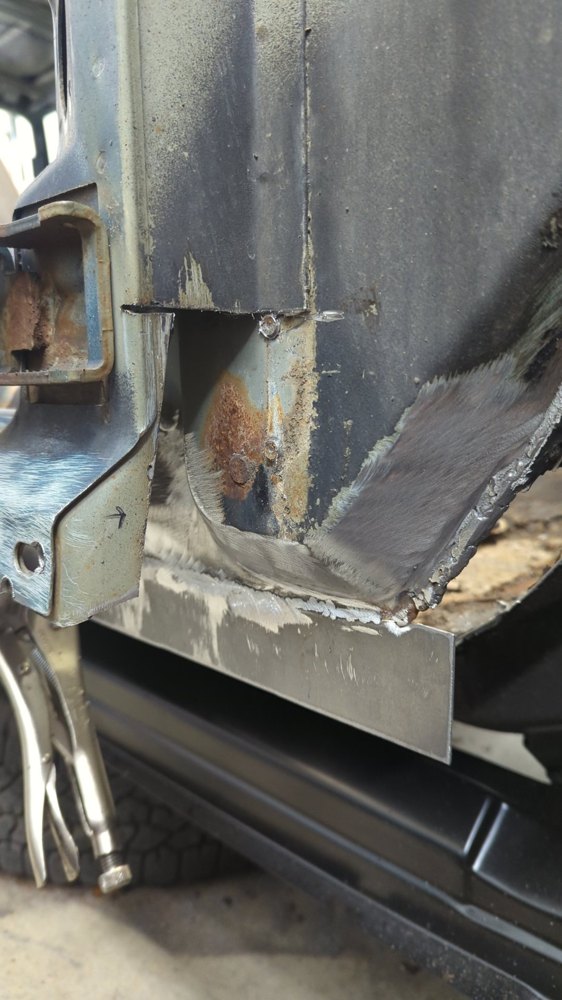

Old one cut out.

The new patch I'll be welding in. I used 16ga for this.

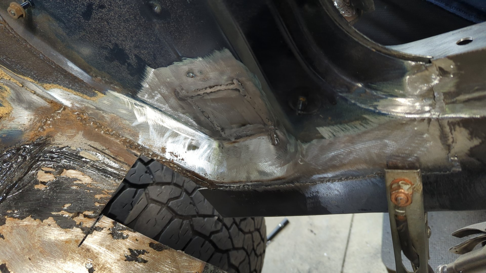

After that I wanted to fix up the lip that mates the inner fender to the firewall.

I didn't like how it used to look after my last patch job and there was also a lot of rust on the backside of it. I figured it'd be easier if I just made a new patch for this piece.

Welding to the original metal always kicks my butt. The stuff is so thin that I keep blowing holes even though the new patch was only 18ga.

And lastly, after welding up the new patch I drilled a hole and welded in a new stud for the fusebox. I used a stainless bolt that way it wouldn't rust.
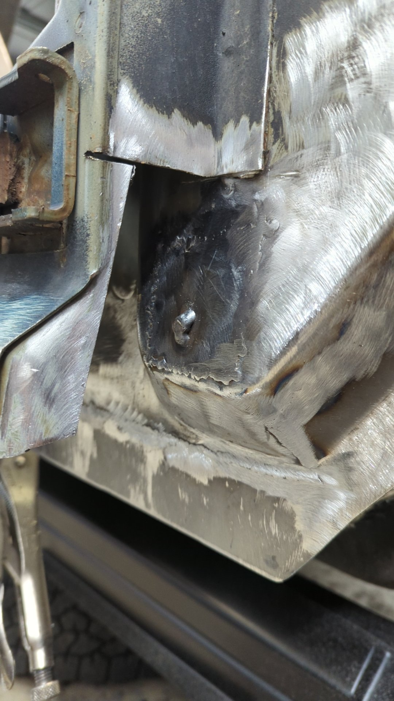

I opted to do a test fit of the fusebox as a sanity test before moving forward. Imagine how frustrating it'd be to not find out that the stud was in the wrong spot until after all the body work had been finished?
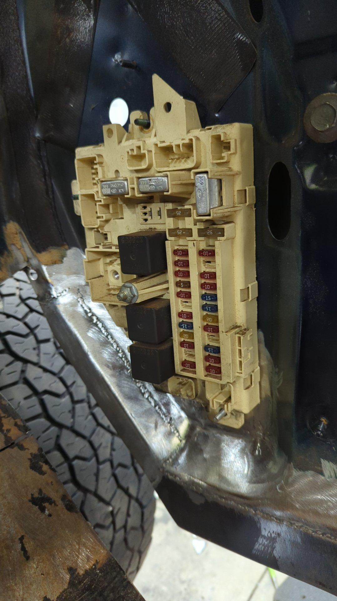

And two coats of epoxy primer later things were looking pretty good.

With the inner fender all set I was able to start finishing up the A pillar. There's two layers of metal sandwiched here so I had to make two separate patches out of 16ga.
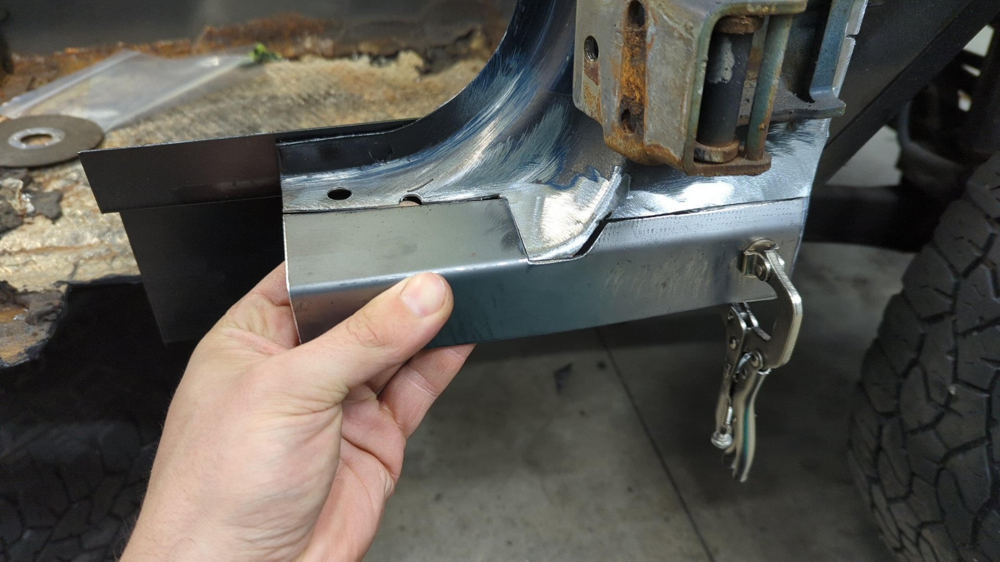

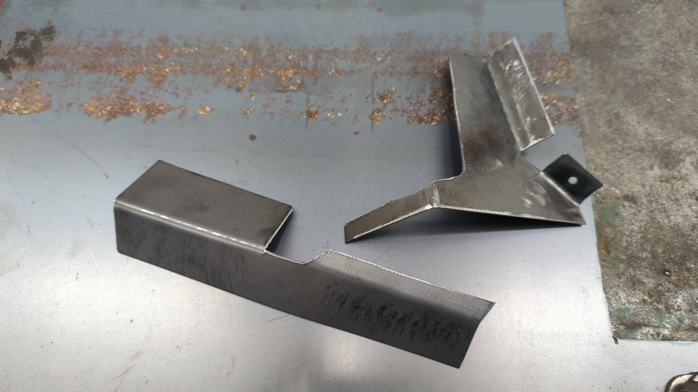

## Welding in the Inner Rocker

Before welding in the rocker I decided it was time to cut off the lower lip. I don't need it since it would sit lower than the 2x6 itself.

I also took the time to spray 2 coats of epoxy over the rocker first since some spots won't be accessible once installed.

Three spot welds on the front, and two in the rear and the inner rocker is officially installed!
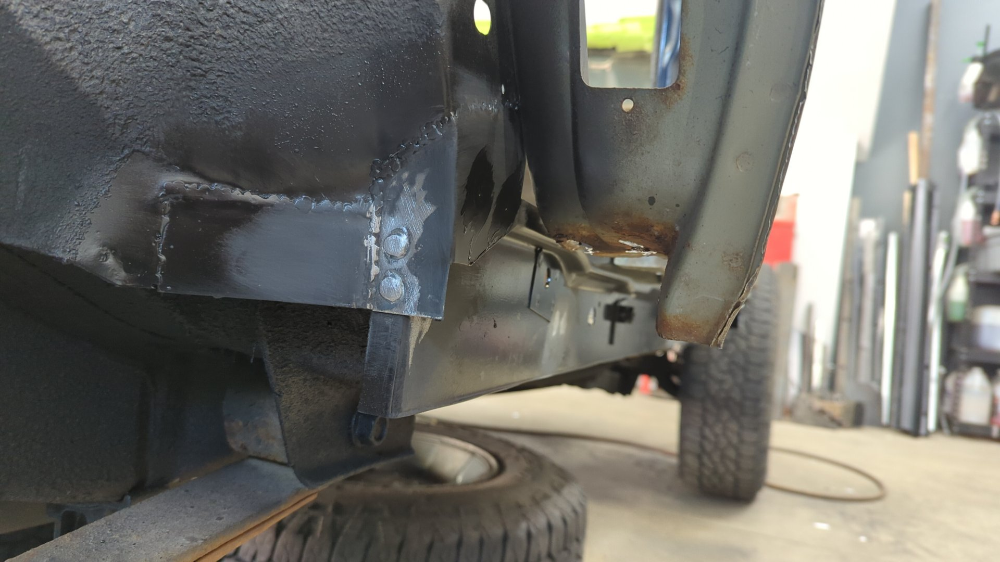

I welded some additional temporary bracing into place so I could ensure the angle of the rocker wouldn't change while I continued to work on the rest.

Last but not least, don't forget to weld a nut (7x16-14) on the inner rocker for the rear seat mount! If you forget this step you won't be able to re-install your rear seat.

Yet another coat of epoxy was sprayed to cover up the exposed metal from the welds.

[Continue on to Part 14]()

# Resources

These threads were super helpful when planning out how I wanted to tackle the 2x6 rocker mod:

- https://www.naxja.org/forum/showthread.php?t=1044089
- https://www.cherokeeforum.com/f58/same-2x6-different-xj-167656/
- https://jeepkings.ca/forums/showthread.php?105565-Extrem-XJ-Rocker-replacement
