Sometimes life does that thing where it gets in the way for awhile. The XJ ended up sitting and collecting dust for a few months due to other priorities eating up my time but I'm finally tearing back into it and making progress again.

Picking up where I last left off was a bit harder than I anticipated since I had stopped at an extremely challenging point. I needed to rebuild the entire inner rear quarter, which is something I've never done before.

## Starting With the Wheel Well Lip

The inner wheel well has a pretty complicated shape that didn't seem easy to replicate. On the inner edge it's very round similar to a half circle, but on the outer edge that mates to the quarter panel it's much more square-ish.

Given my knowledge and tooling on hand I didn't think it'd be possible to build it in a single piece so I opted to start off by building a inner lip that I could work off of.

I started with a 48" long strip of 18ga that I then bent up in my metal brake.
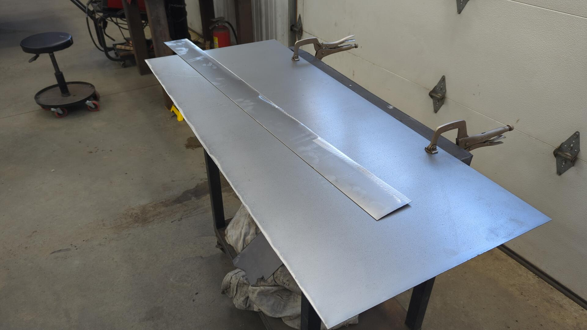

Then from there I used my metal shrinker / stretcher to slowly curve the lip until it matched up against the original wheel well.

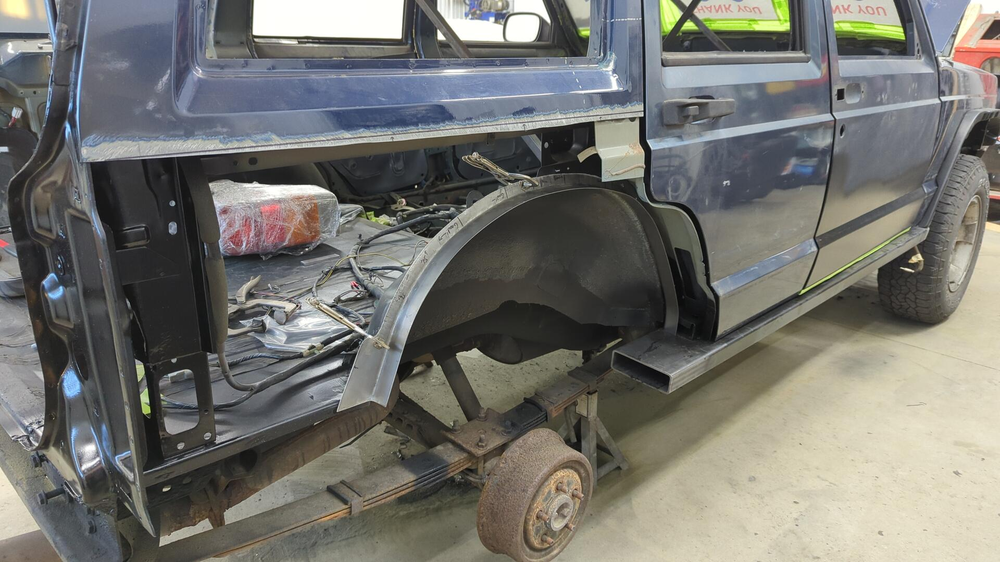

Once the inner lip was looking good I fitted up the quarter panel so I could see what I was up against.

Oh boy, there's a lot missing in there.

## Undoing the Cut-n-Fold Mod

I've always had some regret with doing the cut n fold mod but back then I was on a time crunch and couldn't fix the quarter panel properly. It also didn't help that the original looked like this:
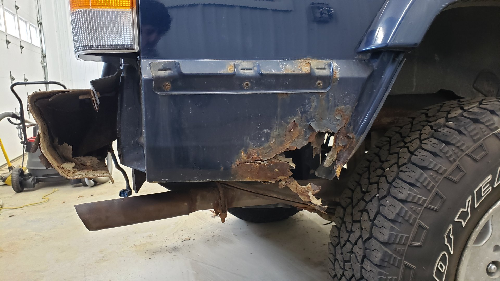

Visually I think the mod looks cool and the extra clearance is nice, but I found it was hard to keep the panel from leaking and when water did leak in, it had nowhere to drain out due to the flat bottom.

The OEM design isn't perfect either, but it does allow water to leak out via the pinch weld at the bottom which is why I felt it'd be the better of the two options for my needs.

I started off by making the slanted portion so I could ensure the quarter panel skin was perfectly positioned.

The rusty black piece of metal is the original inner wheel well. I was using it, along with the tail light as a guide to help tell me how far outwards the quarter panel needed to sit.

After that I made a cap to close the end below the taillight.

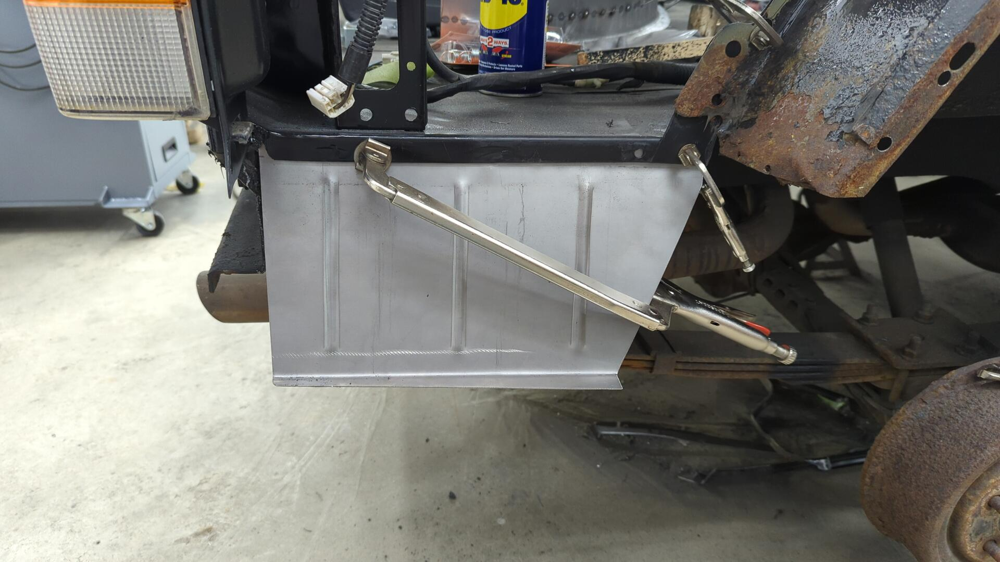

With both of the new pieces welded into position it secured the quarter panel enough that I felt comfortable starting on the wheel well.
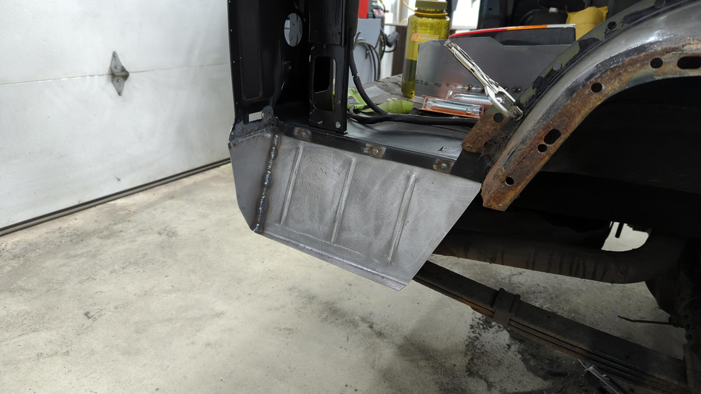

Closing up the wheel well was a pretty slow process. I opted to make a bunch of small patches that way I could ensure everything fitted up nicely. I wanted to get the inner wheel well to sit perfectly against the quarter panel to avoid any chances of warping the outer skin.

These were some fun spot welds to do. I had to lay underneath the Jeep and reach up from the backside.
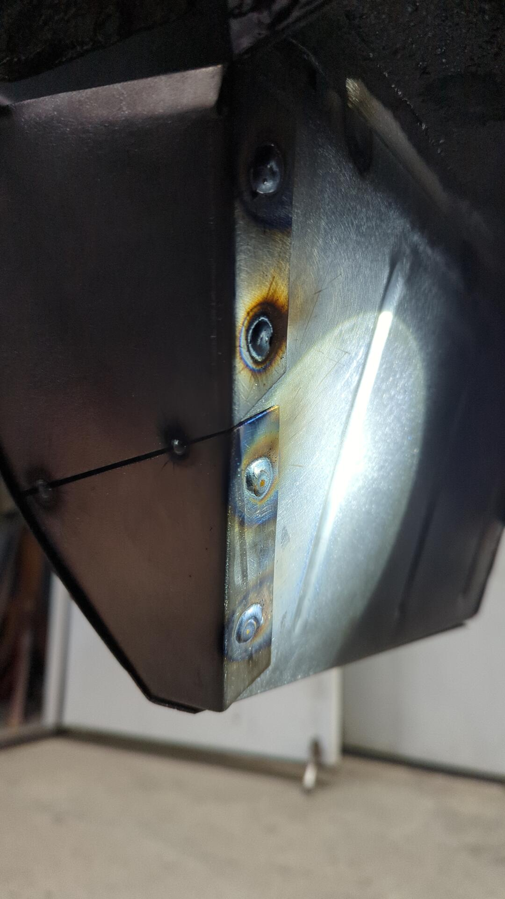

If you've noticed all the metal I'm welding in looks funny it's because I've taken to sanding everything with 80grit prior to shaping / welding it in. I've found metal to be much easier to sand when it's just a flat sheet and once installed it can be really hard to access everywhere needed for sanding. It's not a necessity by any means to do this, but it makes things soo much easier to paint later on.

## Building out the Wheel Well

The Jeep looked a bit silly with the lower quarter in place while still missing the wheel well but at least it was progress.

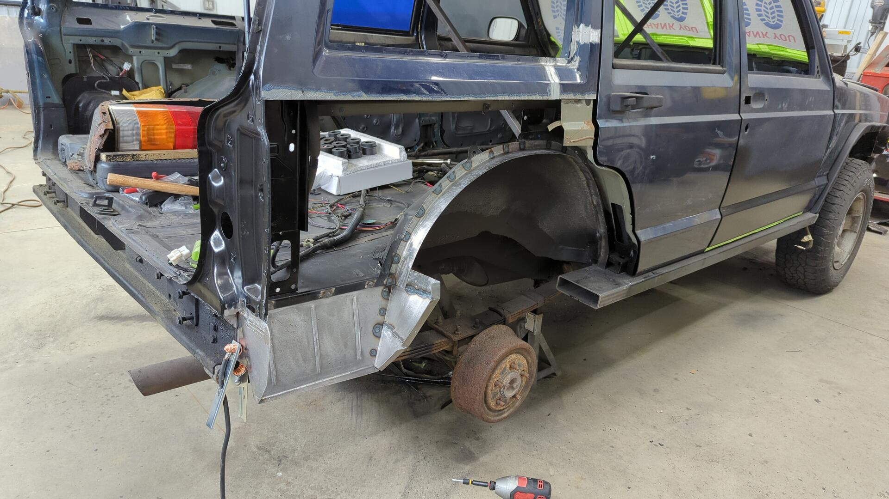

Every time I finished a patch I'd re-install the quarter panel to check fitment. I think I removed / reinstalled the quarter panel skin close to 20 times once all said and done.

Having a metal shrinker / stretcher is a godsend for work like this. That and some hammers + dolly's too.

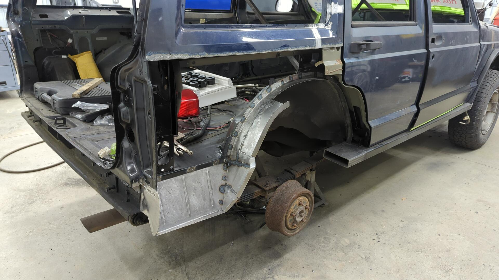
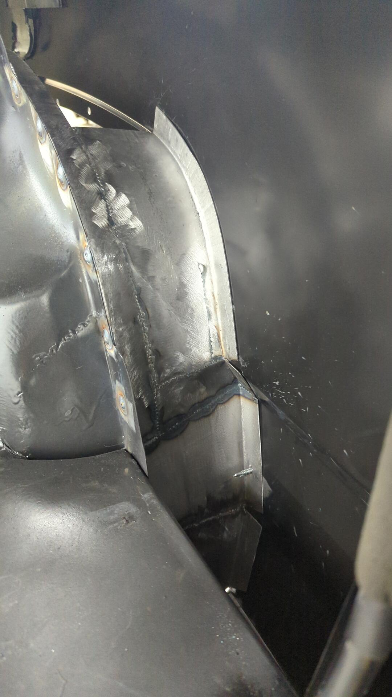

Mind the gap(s).

I'm not too worried on perfectly finishing the welds here. The underside of the wheel well will be sprayed with bed liner so it should hide any imperfections.

Yet another test fit of the quarter panel so I could adjust the lip on the inner wheel well until it sit perfectly flush.

At this point I decided to start on the front side and work my way back towards the rear.

I was worried about not having a reference point of where to end my wheel well so I thought it'd be better to switch.

Making patches for the front half was way harder too since there was less access to the backside.
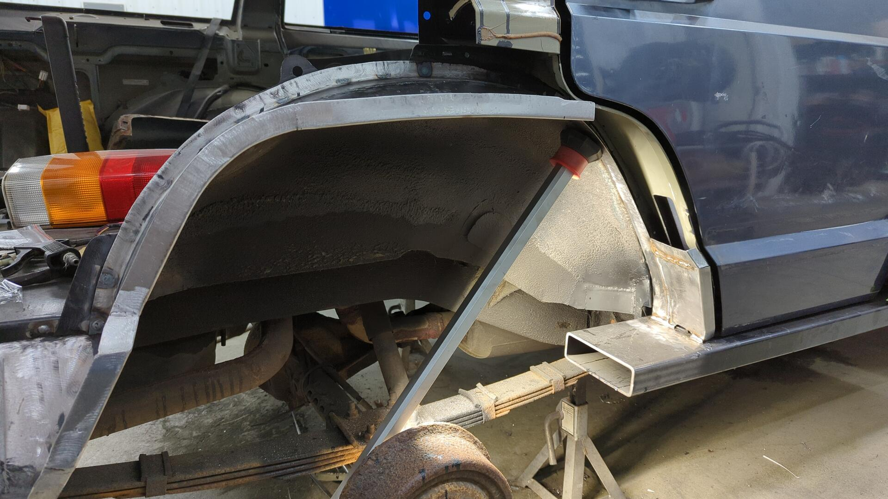
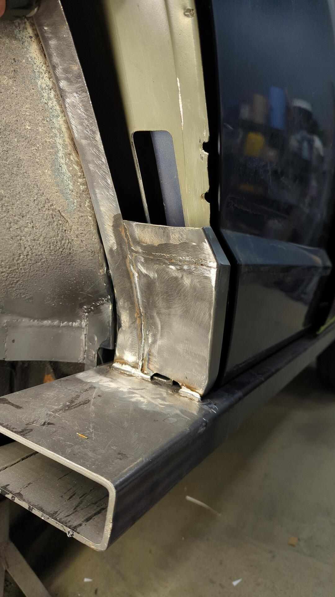

If you're wondering how I made these patches I'd start with a 5" wide cut of 18ga and bend it so it had a 90\* lip that was 7/8" tall on one side. 5" is actually wider than needed but it left plenty of spare metal that could be trimmed down to size.

Then I'd hold it up against the curve I wanted and slowly stretched the metal until I replicated the curve.

It's a slow process and each piece would take several iterations to dial in. Eventually you'd get it super close until the metal was close enough and could be finessed by hand.

Getting a little better at managing the gaps.

Boom!
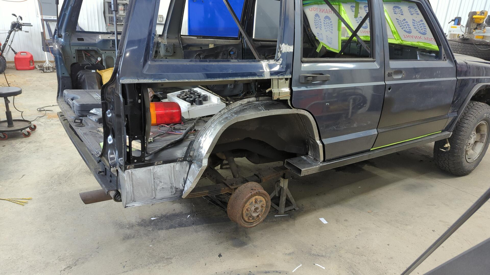

## Access for Mounting the Fender Flares

Something I hadn't really accounted for until near the end was how I'd mount my fender flares. I'm going with Bushwacker flat flares and they require 4 bolts on the lower portions that normally are accessible from within the wheel well but due my wheel well having a different shape I had to either weld the nuts to the back side of the quarter where they would never be accessible once finalized, or redesign the wheel well so I could access them from the outside.

I opted to make small reliefs that would give me enough space to fit a wrench around the nut.

I only actually needed 4 for the passenger side but I made 8 total so I'd have 4 ready to go on the driver side when I get to that point.

Here's what they look like welded in.

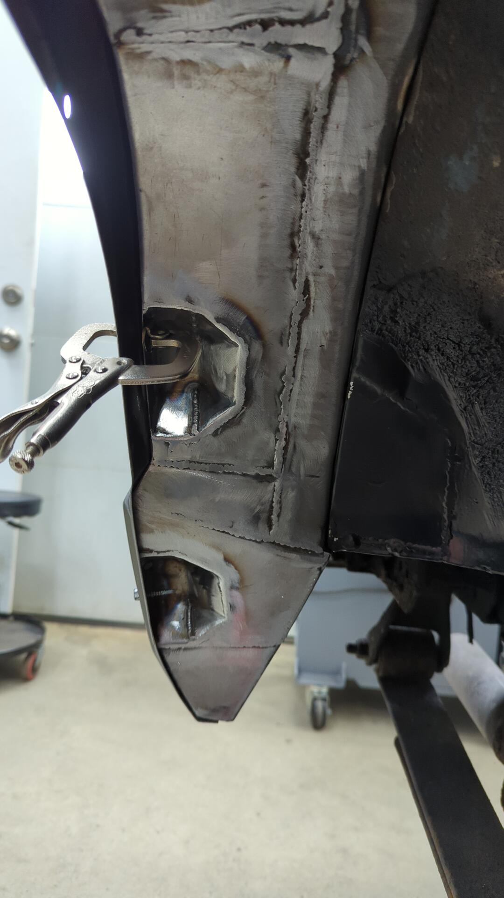

I also welded some tabs that sit on the lip of the quarter panel since the bolt holes for the fender flares were pretty close to the edge.

## A Quick Test Fit

With this side being so close to done I couldn't resist a test fit of everything.

I did have to trim the bottom of the fender flare by the 2x6 due to the new rocker sticking out further than the OEM design.

I also had to cut the 2x6 down to size since I left a ton of overhang that was getting in the way of the wheel. I opted to cut it at a 115\* angle since it matched up with the wheel well almost perfectly.

Looking good!

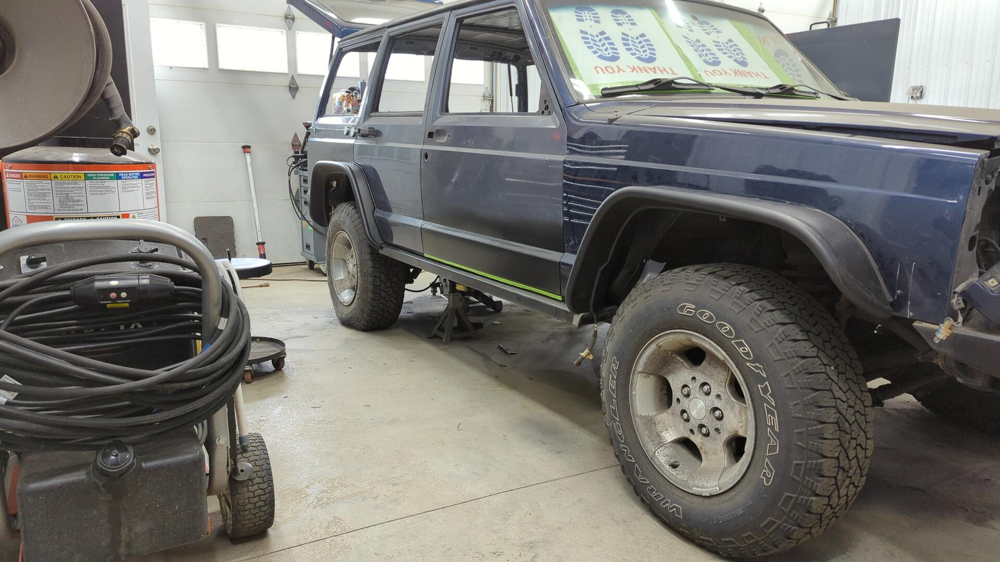

Overall I'm super happy with how the Jeep is looking! The height of the Jeep may slightly change as I still haven't picked up my lift kit (either the 2.5" or 3.5" Old Man Emu Kit) and will be bumping up the wheels to 31s.

The sizing of the wheels is already looking pretty good to me even though it's just on 30s right now but I would like them to stick out a bit further.

The current rims are TJ canyons from a wrangler and they've got a lot of backspacing which is why they sit so far in.

I plan on switching back to the dark gray icons I've got laying around and will be using wheel spacers to bump them out just a tad.
