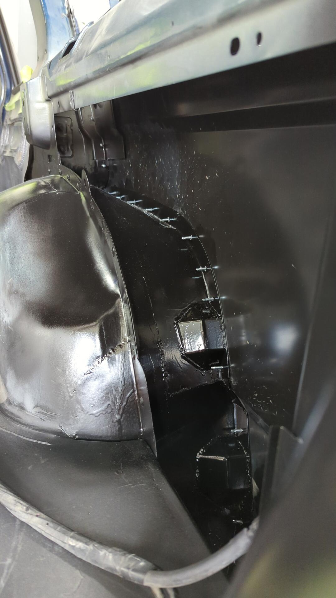
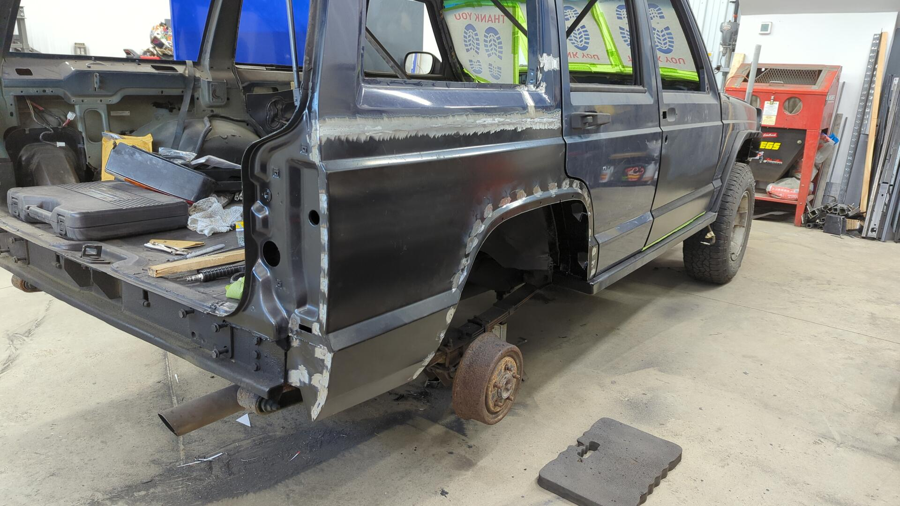

It's taken me roughly 3 times as long as I imagined to finish all the work on the passenger side, but it's been well worth the effort. To recap the past 6 months I've replaced:

- The front / rear door.
- The drip rail along with the edge of the roof
- The inner and outer rocker including installing a 2x6 for extra strength
- The bottom corner of the A pillar
- The bottom of the B pillar
- The lower half of the C Pillar (AKA dog leg)
- The outer half of the inner wheel on the rear
- The inner lower quarter panel structure to undo the cut n fold mod
- The entire outer quarter panel skin
- And many more little pieces

So much work but the progress is really starting to show.

# Painting the Inner Quarter Panel

Since I'm getting ready to weld on the outer skin I wanted to finalize the inner quarter panel and paint everything I could.

I also made some braces that will be welded on the inside of the quarters below where the taillights mount. From the factory, the Cherokee's have a second inner layer that's there to help stiffen things up but I had to remove it to get at some rust between the layers.

Anytime I make a piece like this I'll make a second one for the other side while the design is still fresh in my head.

Test fit.

Welded in.

# Fitting up the Outer Skin

Replacement panels are never perfect fits so it can take some time to really dial in where you want to position the new one. Using a bunch of self tapper screws and my hammer to "massage" some spots I was able to get the panel to line up almost perfectly with the body and my DIY inner wheel well.

Each self tapper is where I intend to spot weld so there's no harm in all the holes. The trick is to remove one screw at a time and weld up the hole. This keeps the panel from moving.

After one last sanity check and some measurements to ensure I was absolutely happy with the placement I drilled out the holes to about 3/8" and grinded off any paint around them to prep for welding.

# Welding it in

About 40 spot welds later the panel was officially welded in! Well minus the top seam.

When doing plug welds like these I like to run the welder on the hotter side to ensure the welds are as strong as possible.

Welding up the top seam took longer than all of the plug welds. You can't put too much heat into the panel otherwise you risk warping it so you have to make small tacks that are as spaced out along the seam and give the panel time to cool down every so often. It's a real test of your patience but it's worth the wait.

A bit of careful grinding cleaned everything up nicely.

Not bad! I'm not seeing too much warpage so I don't anticipate too many difficulties when it comes to the body filler stage.

# Paint!

Of course the repair wouldn't be complete without some paint to protect it in the mean time. Two coats of epoxy primer fixed that problem.

The upper seam looks a little lumpy but it's not that bad. I think with some planishing it'll smooth out nicely.

It's exciting to finally have finished the first side. I've still got a ton of work to do on the driver side, floor pan, and firewall but it feels like a huge accomplishment getting such a large portion done.

[Continue on to Part 18]()
