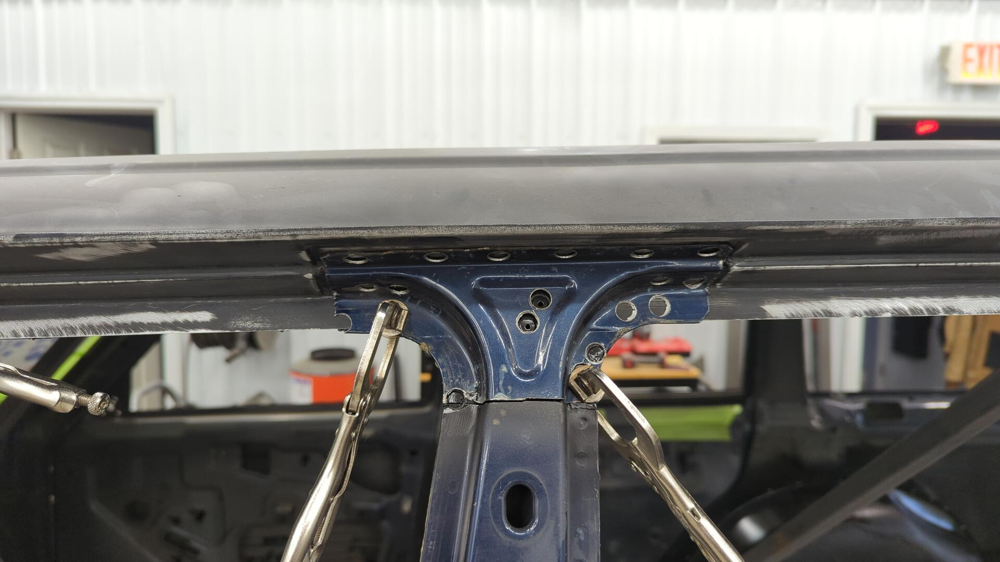
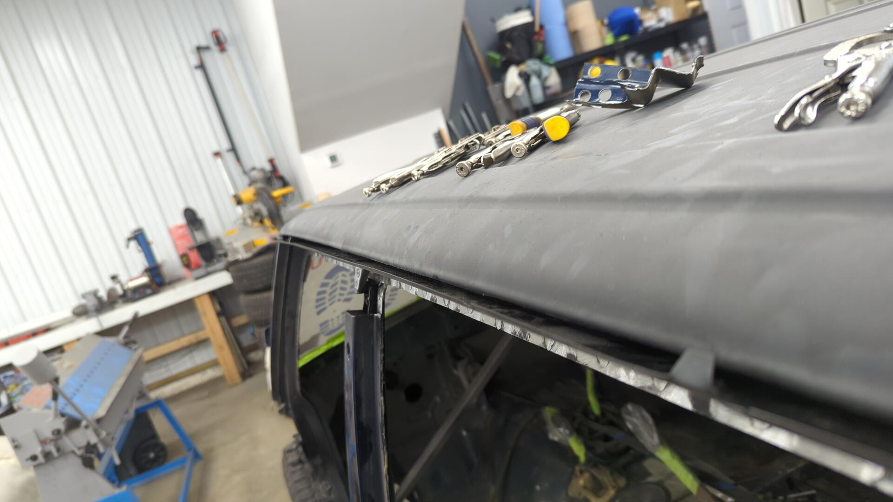
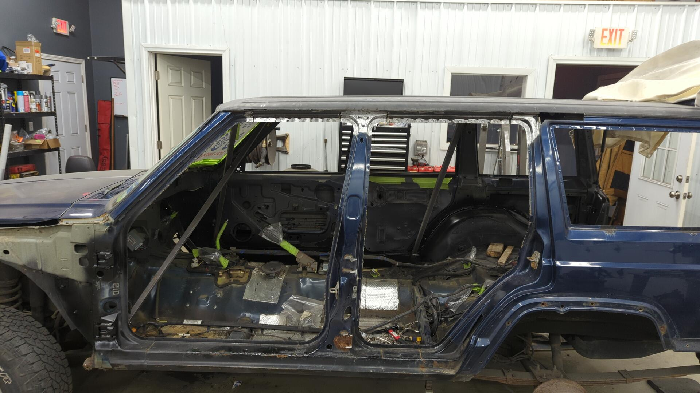
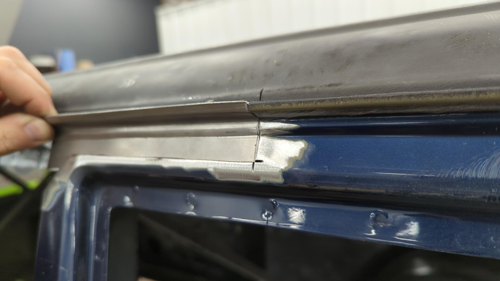
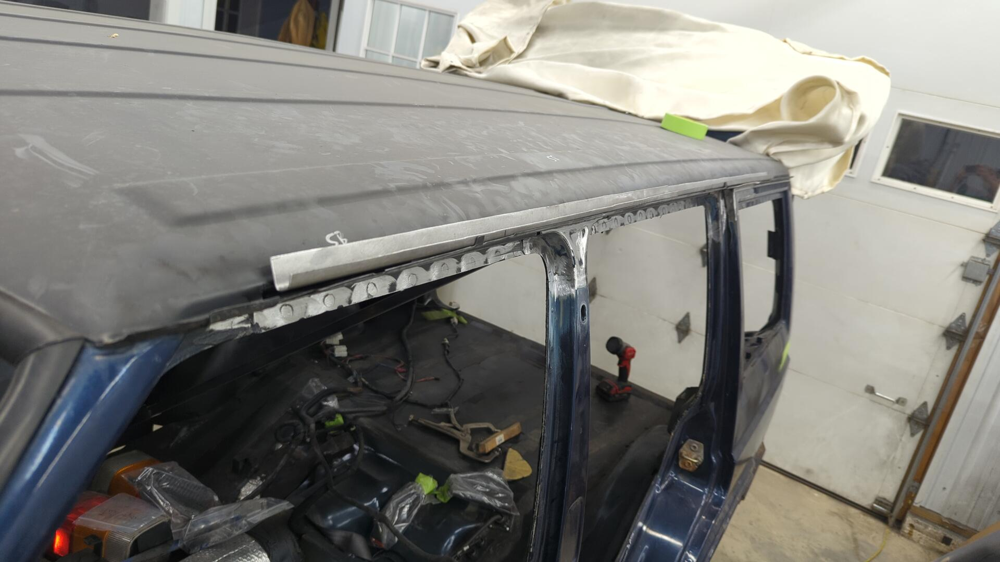

Having finished the passenger side, it was a little daunting looking at the completely untouched driver side knowing I had so much work ahead of me. I was a little worried I'd lose my motivation from analysis paralysis on where to start so I decided to dive right into it and start with the roof like I did on the passenger side.

To work on the roof I needed to remove those pesky doors first.

Removing the front door was a cake walk as all 6 bolts came out with just some PB blaster.

The rear door wasn't as easy though as I had to cut both hinges in half in order to remove the door since the bolts were completely seized in place.

# Why I'm Replacing the Drip Rail

It may look like I'm being over the top by replacing the drip rail, but don't let the photos deceive you. The drip rail doesn't look bad on the outside but all of that rust is coming from the inside.

The drip rail is super prone to rusting out because it's basically two layers of metal stamped together. It's where the roof skin attaches to the sides which is why it's necessary.

And If I really wanted to I could grind down the rust on the outside and call it good, but eventually the rust would return since it's on the inside. This is why I've decided to bite the bullet and do it now vs waiting and see the future paint job get ruined within just a few years.

# No Turning Back Now

I started off by removing a piece of the B pillar since it's the easiest of the three to work with.

Then from there I cut a chunk of the upper rear quarter panel. I had to cut further than expected here because the rust has crawled it's way down the seam further than anticipated.

Up front by the windshield wasn't too bad. There was actually a pin hole in the roof there that I had forgotten about.

Once the top of the pillars were trimmed, I drilled out all the spot welds holding the lower drip rail in and also cut along the edge of the roof so I could remove everything.

The lower seam isn't too bad. There's some rust but it's primarily on the front half.

# Unleashing the Sandblaster

While cleaning out the rust on the inside of the roof I noticed one of my old roof rail bolt holes that I had deleted by welding it up had built up a good amount of rust on it.

It's not easy to tell by the photo but the roof rail mounts are directly above the inner roof structure so it's hard to access them. Way back when, I had sprayed them with paint from the inside but this left the back side (the side closest to the edge of the Jeep) bare.

Knowing now would be my only time to clean it up properly I decided to break out the sandblaster and clean everything up since I had no way of reaching it with my bare hands.

Much better!

# Starting to Rebuild

With everything cleaned up I was safe to start the rebuild. I started off by welding up the inner layers I had split in order to access trapped rust.

Then everything was coated with fresh epoxy.

The backside of the drip rail was also sprayed with a couple of coats for extra protection.

The old roof rail hole delete should never rust again.

Doing some test fits to plan out where to weld in the new panel.

Placement of the drip rail is actually super important. It needs to be slightly bowed to ensure water will drain off it, while at the same time not being too bowed otherwise the door gaps will look to big.

# Welded In

Many spot welds later and some cleaning up with the grinder, the lower drip rail was officially reinstalled.

With the drip rail looking good it was time to finish up welding the pillars.

# Addressing the Hole in the Quarter Panel

Because of the rust in the seam, I had to cut a lot more of the roof off than I had initially planned. The OEM replacement panel I had bought didn't extend this far though I was basically on my own to close things up.

With a bit of experimenting using my bead roller I was able to replicate the OEM bends. I'm actually super proud of this piece!

It took 6 tries to perfect it.

Prepping to weld it in.

Boom!

# Patching the Roof

With the last piece of the lower drip rail done all I had to do now was weld up the roof. The gap looks absolutely massive because when the roof was cut it pulled inwards due to some unreleased tension.

But from the side it looks perfectly normal lol.

Building the drip rail is pretty tricky. The bends are so tight that any tighter and my metal brake wouldn't be able to do it.

I actually had to make it from two 30" long pieces that were welded together to create a 60" long drip rail. My metal brake is only good for 48".

Trimming it down to fit ended up slightly warping it. I think it was the heat of the angle grinder or something. No worries though, it was easy to straighten out.

Making some holes to plug weld it from below.

After plug welding it on the bottom I began to work the roof and make tacks to hold it in place.

Working the center of the roof was tricky. I had to push outwards from inside the roof using a custom tool (some bent 1/8 flat stock) to reach up behind the inner structure of the roof.

I got things pretty close though.

Tack, tack, tack.

Two hours later...

And then another hour later after a ton of grinding.

# Finishing up

And just like that I can officially announce the roof is rust free.

I did a quick test fitment of the old drip rail cover to see if it still fit.

Before painting the outside I dripped a ton of paint down into the new seam. Doing this protects all the exposed metal in the seam, and also fills up the seam so water can't get down into it

Looking from the inside you can tell that the seam is fully filled due to the painting dripping out.

And lastly, two coats of epoxy were sprayed over everything.

Next up will be replacing the inner rocker.

[Continue on to Part 19]()
