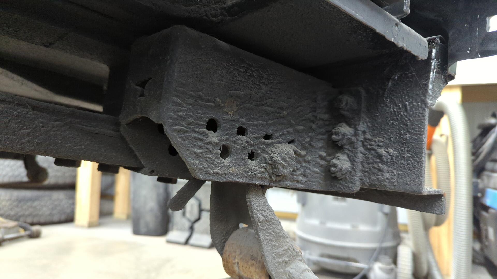
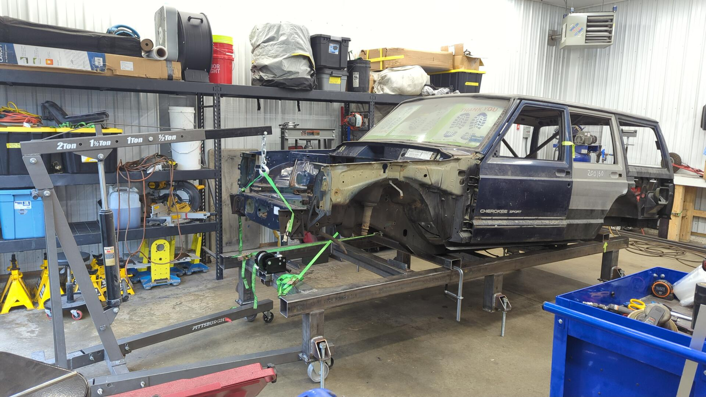
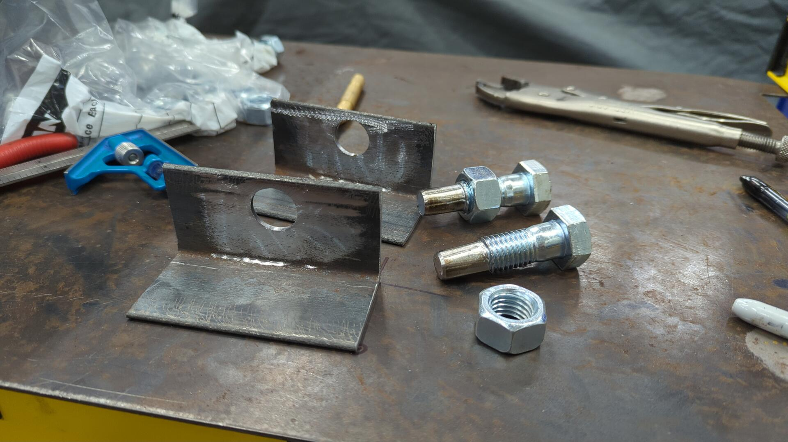

I've made it pretty far on the metal work for my XJ without a chassis table but once I finish up the driver side I'll need to start replacing the floor and frame rails so the rear suspension needs to come out and that means the XJ won't have any wheels. That's gonna be a problem because every so often I need to move the XJ around to make space for other projects like repairs on my daily so a chassis table just seems like the best option.

[Building a chassis table isn't terribly difficult and I was able to come up with my own design and build one over the course of the past month or so.]() It's a little over built for my needs but I wanted something nice and beefy.

Getting the XJ up onto the table was a bit of an adventure. I purposely built the table lower than most chassis tables so it'd be easier since I don't have a lift but it was still harder than I had hoped.

I used a cheap hand winch from Harbor Freight (don't recommend) and slowly dragged the XJ onto the table. I also cut the front lower control arm brackets off the XJ since I won't be needing them and that made it slide better.

As I was dragging it, the XJ would occasionally get stuck on the studs sticking out of the frame rails that the transmission cross member used to attach to. Each time it got stuck I'd use my floor jack and lift the XJ up about an inch or two so the studs could clear the chassis table.

## Removing the Rear Axle

Once the XJ was pulled far enough up on the table I started removing the rear leaf springs and axle.

The front bolts for the leaf springs were so stuck that I had to use a 6' breaker bar to get them to pop free. I was worried the bolt heads would strip and I'd have to cut the bolts out but thankfully the only thing that got damaged was one of my sockets.

It was just a cheapo socket so I tossed it but I'm surprised I was able to break an impact socket by hand.

The rear bolts were much easier and came out without any trouble because they weren't original and had also been protected by a nice thick layer of fluid film and dust.

## Getting the XJ Temporarily Secured

With the rear axle removed I was able to continue pulling the XJ up onto the table and secured it via straps until I could make some jigs for it.

I added the straps because I had to pause at this point for about two weeks for some other projects around the shop and I didn't like how easy the XJ was sliding around on the table.

The rear axle is just a Dana 35 and I'm not sure if I'll actually have a use for it but I stripped it down and set it aside in my parts pile for now.

The gutted axle just above it is a Chrysler 8.25 and is the axle I plan on swapping into this XJ.

## Making Some Custom Jigs To Hold the XJ

I used some 3x4 3/16" tube I had laying around for the jigs.

The tubing was a little rusty from sitting but a flap disc cleaned them up nicely.

Using my engine hoist and some undersized straps (I'm gonna get some stronger ones I swear) I lifted the XJ up so I could slide the bars underneath it.

The front jig lines up with some factory holes in the frame.

Then I made some positioning brackets out of 1/8" angle and 3/4" bolts that I grinded half the threads off of.

The pins help ensure the XJ can't be lifted up or slide forward / backwards.

Then using some 2" 1/8" tube I made some rear jigs to hold the XJ level.

And just like that the XJ was officially secured to the table.

[Continue on to Part 23]()
