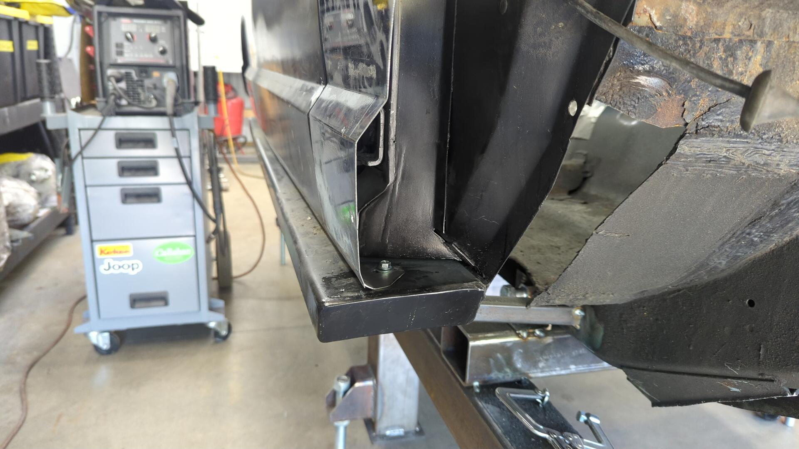
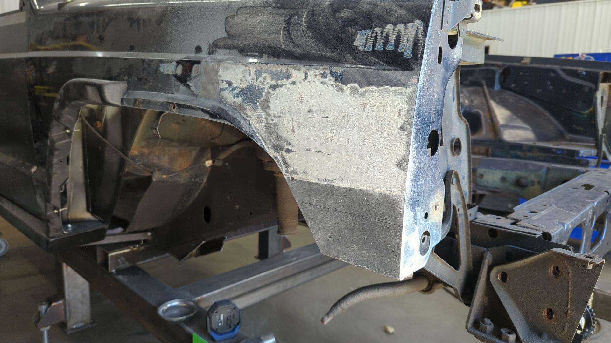
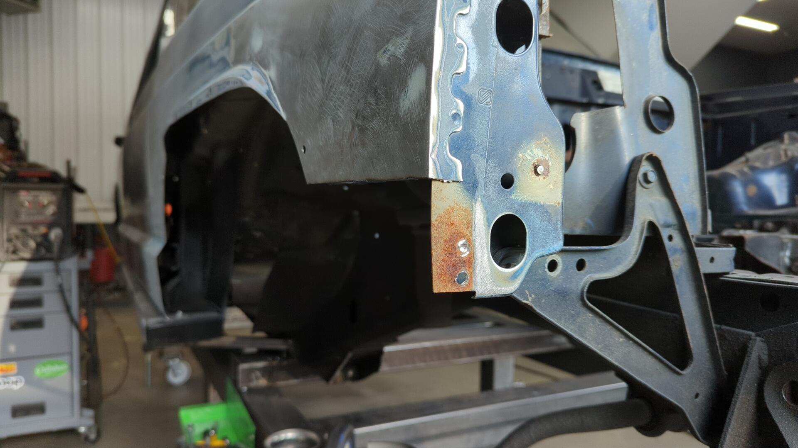
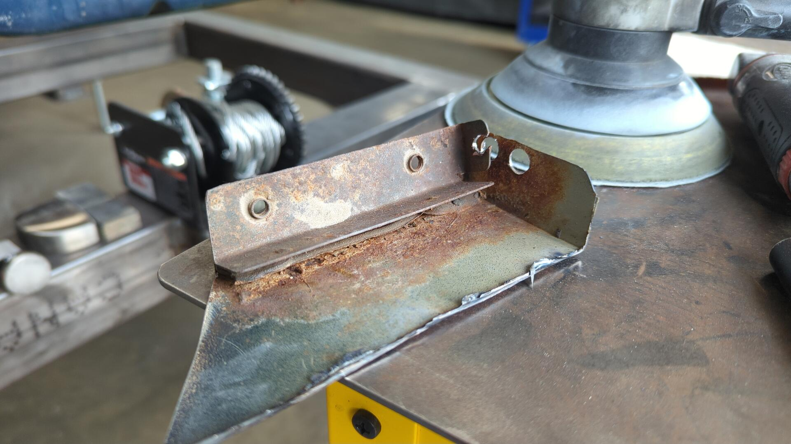
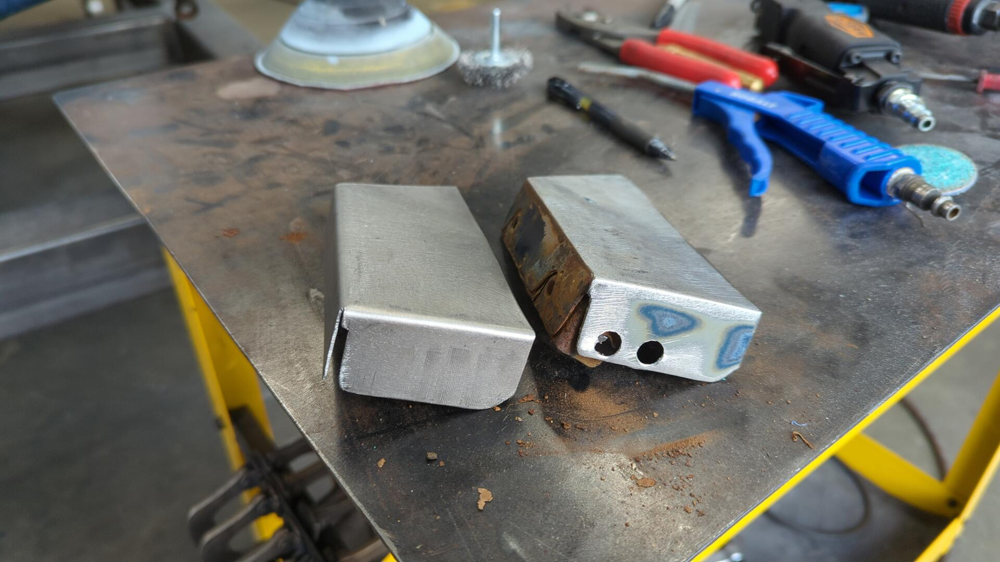
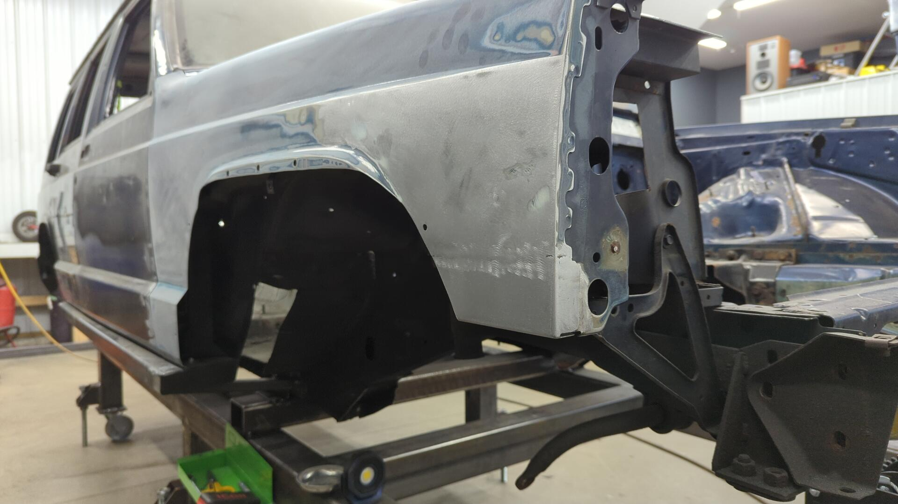
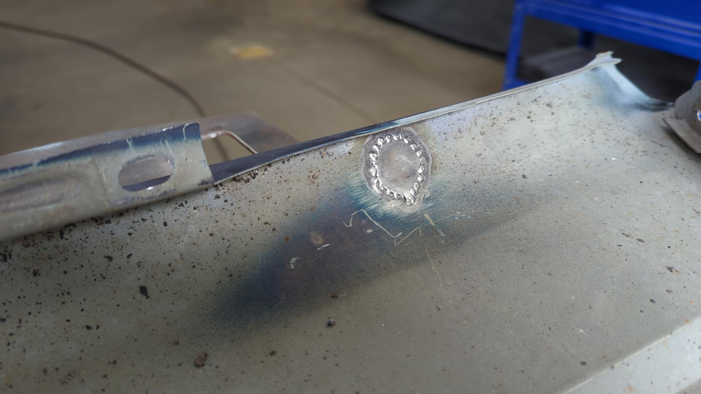
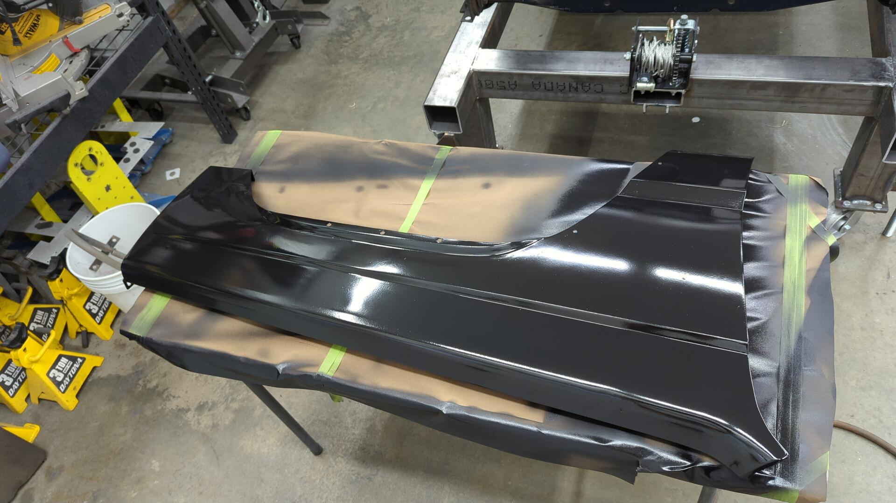

With the passenger side just about sorted out, the last panel that needed some attention before I switch over to the driver side was the front fender.

It wasn't actually in that bad of shape relative to the rest of the Jeep but it did need a new mounting point down by the 2x6 rocker, and also had some rust in the lower front corner by the side marker.

Fenders aren't super expensive and you can easily find aftermarket ones online but the OEM ones are known for having better fitment so I figured it'd be smarter to save my current ones.

## A New Lower Fender Mount For The 2x6 Rocker

Normally the fender extends all the way to the bottom of the rocker where the OEM pinch weld usually is but with 2x6 rockers that's just not possible. This is problematic because the nearest fender bolt is about halfway up the fender so the bottom edge just flops around.

Most of the solutions out there seem to involve welding the fender to the 2x6 or not extending the 2x6 all the way to the front fender so you can still bolt it to the OEM mounting point but I'm not a fan of either of those options.

Instead I wanted to try and make custom brackets that could be welded to the bottom of each fender and then drill and tap a hole in the 2x6 for the fender.

Each bracket gets plug welded to the fender so it should be reasonably strong. The mounting hole is slotted so you can move the fender forward or back as needed.

A bit of work with my drill and a m6x1.00 tap and I had my new mounting bracket all done.

## Investigating the Rust by the Front Fascia

The passenger fender had a good amount of rust in the lower front corner just behind the side marker. The rust looked to be fairly isolated but I would still need to cut it out to address it properly since it was coming from between two pieces of metal sandwiched together.

To prep for making a patch I started grinding the paint off and ended up finding a bunch of body filler so I kept grinding and grinding until all of the filler was gone.

This wasn't a surprise for me since I knew the Jeep had been in some kind of minor front accident but I was surprised to see how far the filler went. The metal underneath wasn't actually bad, the fender just had a high spot about mid way up and two tiny dents so the filler was there to flatten it out.

Getting back to the task at hand I used my air saw to cut the lower corner off.

The reason why I opted to remove it.

In terms of fixing it I started off by patching the inner piece.

Then I spent some time replicating the lower corner. This was actually a fun challenge and gave me a chance to really make use of my box brake.

Test fit with the front fascia to dial in it's position.

Tack welded.

Welded and grinded.

I'm very happy with how that came out.

## Deleting the Antenna

I've opted to delete my antenna because the OG mounting setup was rusted out and didn't survive being removed from the fender. One of my other vehicles (93 Civic) has a deleted antenna as well (it has a hidden one) so I plan on doing the same for the Jeep.

My welds didn't come out as great on this patch but they are solid and will work.

## Replacing a Snapped Stud

One final thing that bugged me about the fender was that one of the studs on the front had snapped years ago. The front fascia never had an issue and always felt secure but it was one of those things where I figured I may as well fix it while I'm here.

To fix it I grinded out the stud from the rear and then welded a new bolt with washer in place.

It looks kinda silly in the back but it's solid.

## Finishing It Up With Some Primer

And of course I couldn't leave the fender bare so I gave it a couple fresh coats of epoxy front and back.

Much better!

The fender looks and fits great.
