The driver side frame rail was in far worse shape than the passenger side on my XJ. I opted to replace the passenger side first since there's a little less going on on that side. On the driver side the fuel neck hoses pass through the frame, and all of the fuel lines, brake lines, and vacuum lines run parallel down the frame rail.

I figured once I had a little experience under my belt, the driver side would be a lot easier to manage.

To prepare, I began by drilling out all of the spot welds holding the driver side frame rail in place, and then chopped out a good portion of the rear floor. This was surprisingly easy to do now that I knew where every spot weld was.
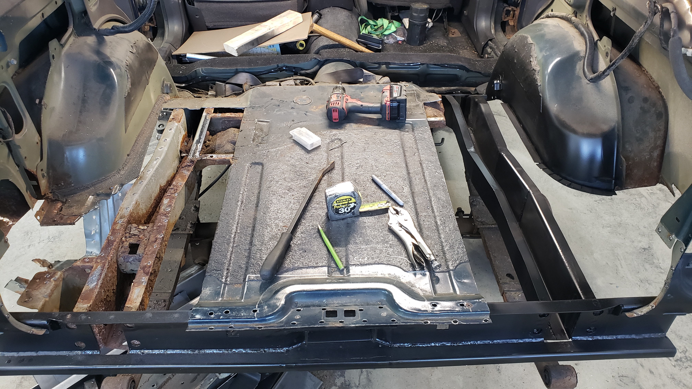

After that I took a deep breath and kept cutting. I needed to remove the entire rear floor along with the shock crossmember.
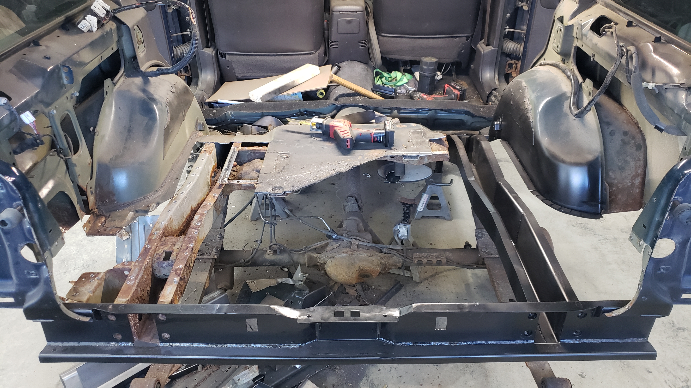

It's crazy how different the new metal looks compared to the old.
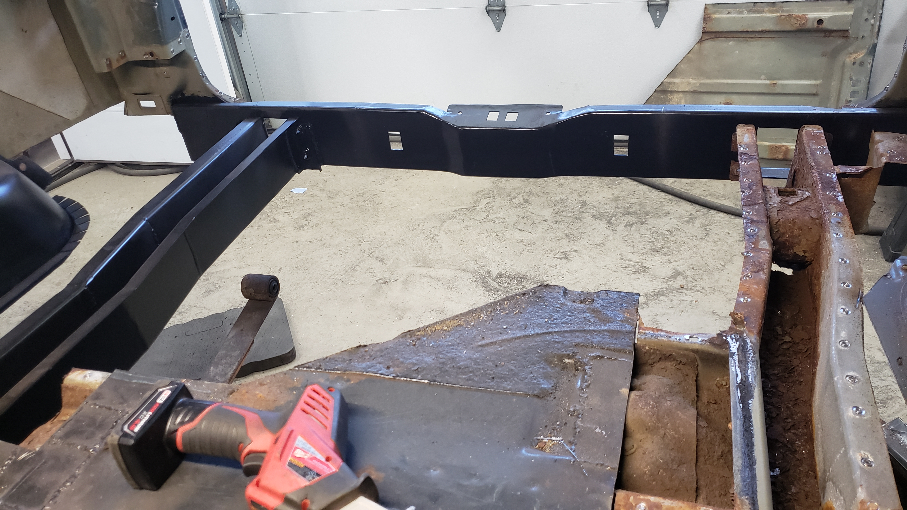

Don't mind the chewed up acorns sitting in what was once the shock crossmember.
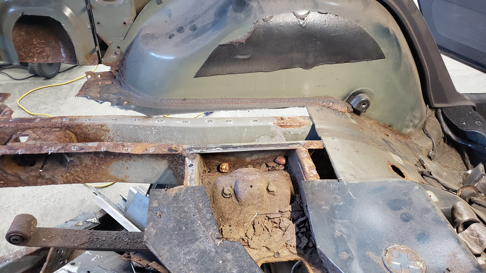

Fully removed. The majority of my cuts are made with a 4 1/2" angle grinder. Occasionally I'll use the sawzall to remove parts that are either tough to reach with the angle grinder, or when the angle grinder can't cut deep enough.
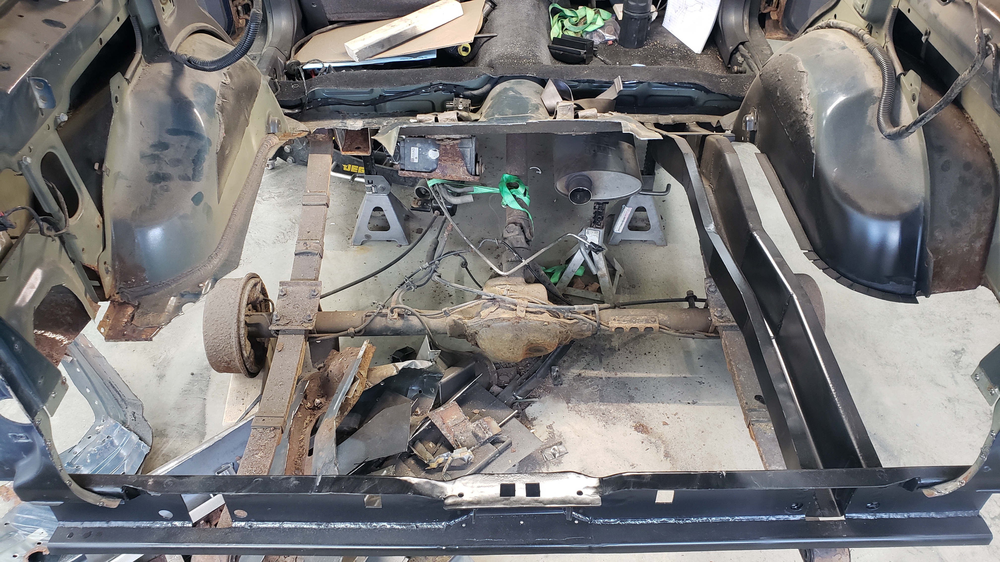

I removed the driver side frame rail in one complete piece that I way I could compare my new frame rail to it.

The rusted out bracket below the remnants of the shock crossmember appears to be what was once a sway bar mount. Which is a little odd because my XJ came with the Up Country package which deletes the rear sway bar.

Test fitting of the new frame rail. I had the driver side frame rail pieces already laying around because I fabricated them back when I was doing the passenger side.

The new driver frame rail in all of it's glory.
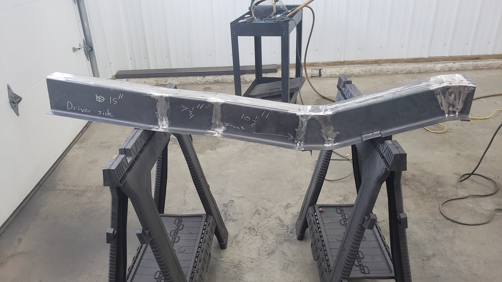

Then I added a hole for the gas neck to pass through. I made the hole from a 2x6 that I resized to 2 3/4"x5". It's 1/8 thick and pretty damn solid. Size wise it matches up with the OEM one on the original frame rail. It only looks larger because the corners are less rounded.

My welds are getting a little better. Still have trouble hiding my starts / stops.
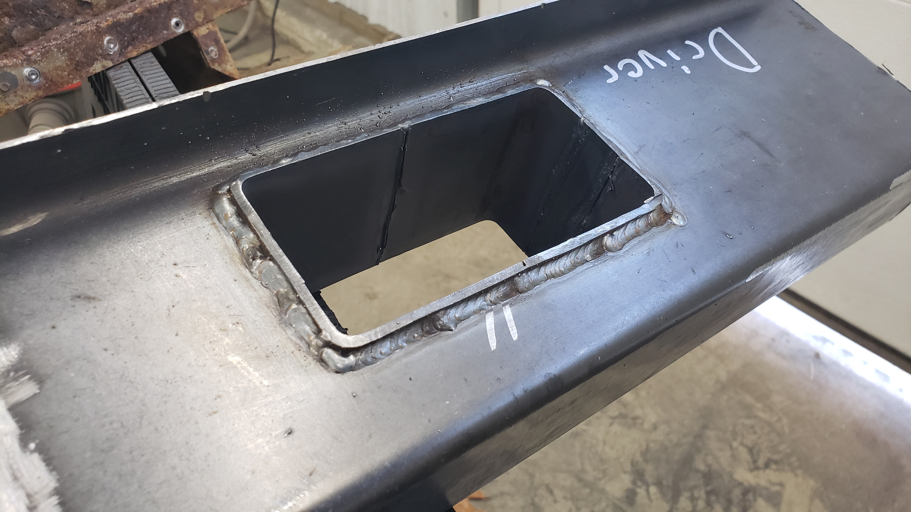

With the gas neck hole done I notched the frame for the seat belt bracket the same way I did the passenger side. After that I sandblasted and sprayed the rail with more epoxy primer.
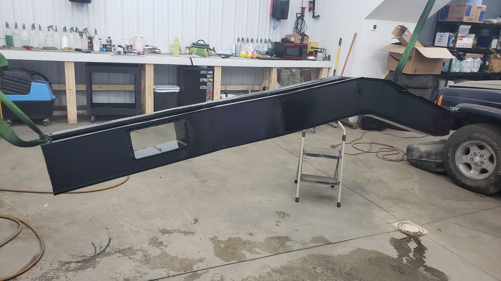

So glad to be fixing all those rust holes. My grinding skills could use some improving.
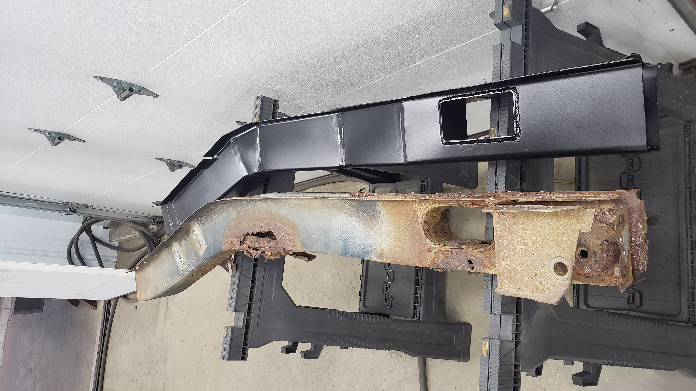

Just like on the passenger side there was a few rust spots I needed to address on the inner wheel well. The driver side was a little worse off with two large rust spots.

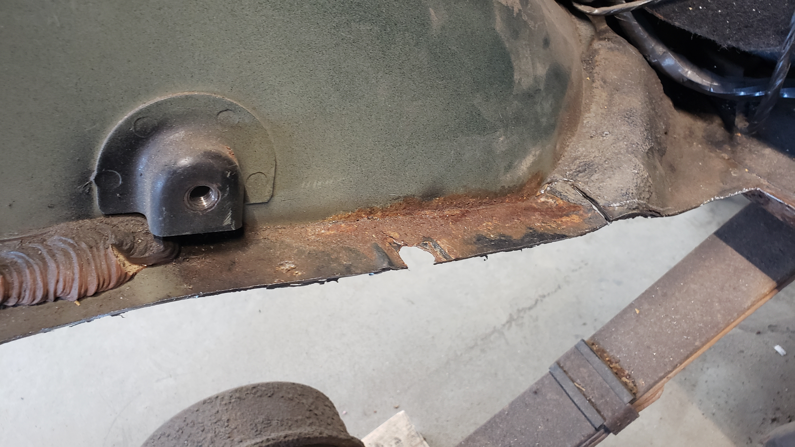

I chopped out the rusted portion and welded in a new patch. I used 18ga because it was the thinnest metal I had on hand. I think the factory stuff is 20ga.

In the back of the wheel well was another rust spot that needed replacing.
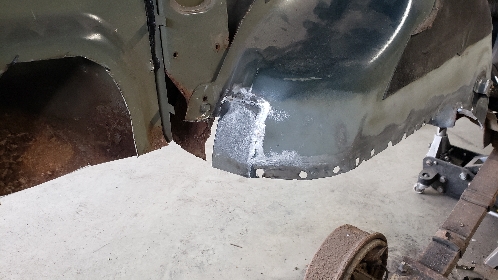

I'm not the happiest about the outer halves of the wheel wells. They're pretty rusted and need replacing but unless I want to chop up my quarter panels I have no real way of fixing them properly. I've decided to pretend I didn't see the rust and come back to address the issue later on.

With the rust issues resolved on the wheel well I painted it up.
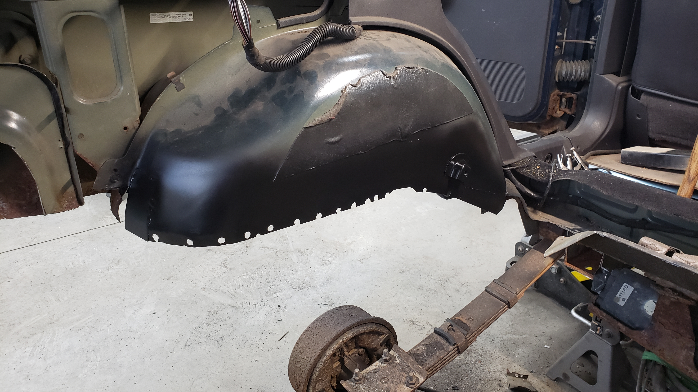

The half circle is the brace I made for the seat pivot bracket earlier on. To ensure no rust would form between the brace and the wheel well I poured paint down between them after spot welding it in place.

At the same time as painting the wheel well I went ahead and sprayed up my frame tie in brackets and no lift shackle brackets.

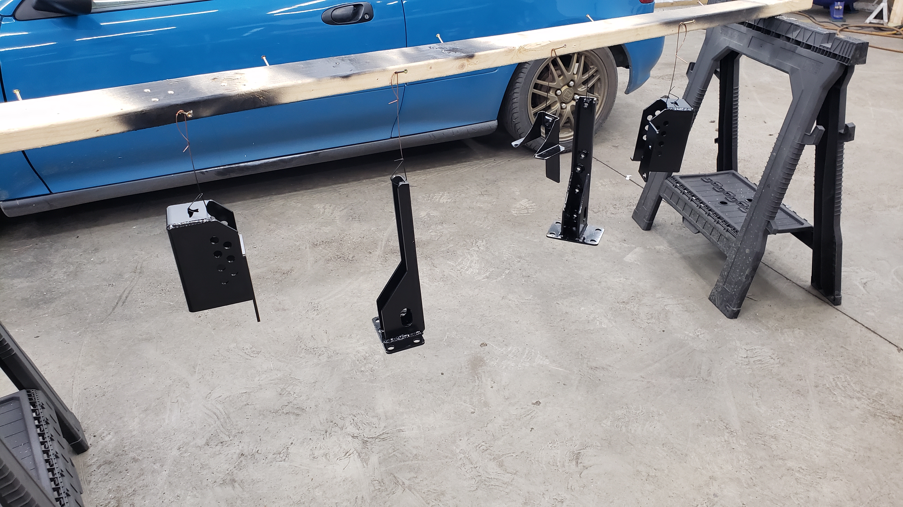

The shackle brackets are made by [Ironman 4x4](https://ironman4x4fab.com/products/xj-no-lift-shackle-brackets), and the frame tie in brackets are just no name ones from Ebay. Both are made from 3/16".

Then after taking way too many measurements to ensure my frame rails were the proper 36 1/2" inches from center to center of each other I welded the driver side in place.

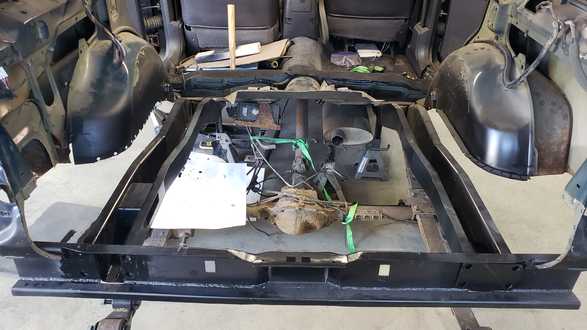
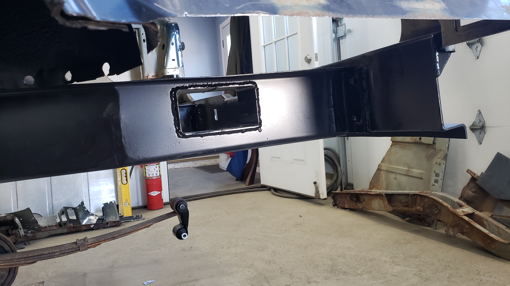

Don't mind my brush marks. I'm not trying to make this a show car since it's just an old Jeep. Plus most of this paint will be ground off later on to weld on frame stiffeners.
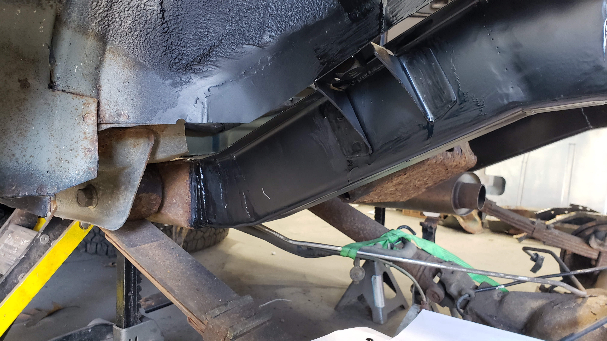

Spot welded the seat belt bracket in place.

It felt awesome to see a frame under the XJ again.
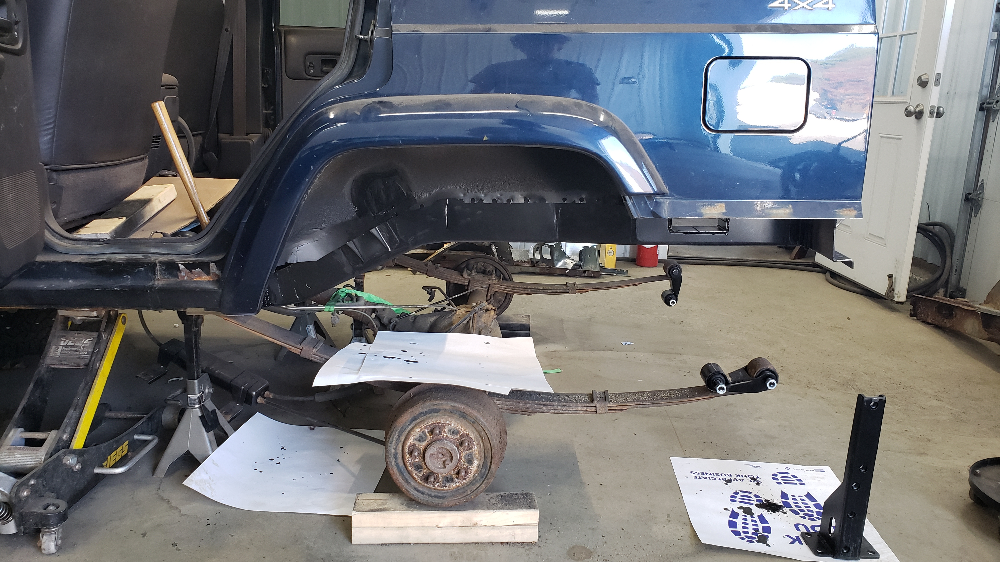

Fresh metal is the best.
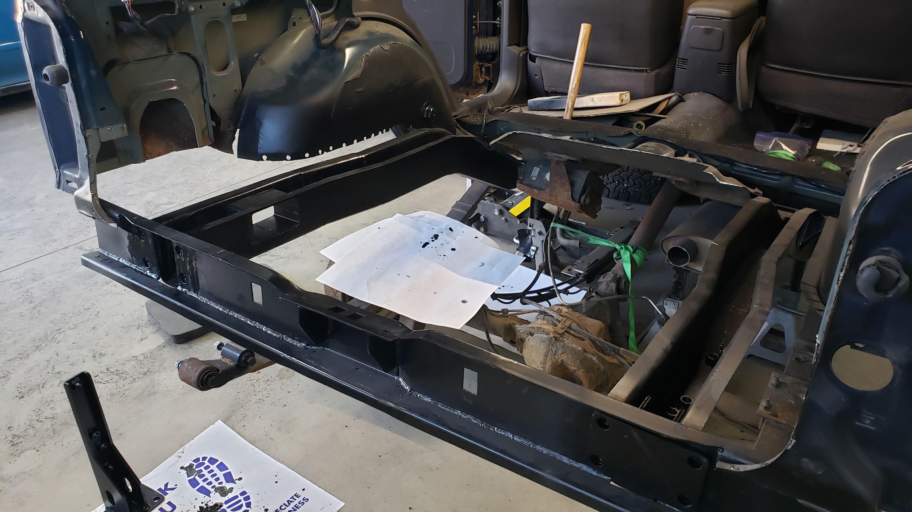

On a slight tangent my metal brake went through a few more revisions. The handles have been relocated to be out of the way on the sides, and the bending brace is now removable as I tapped (4) M10x1.5 bolts into the blade. Removing the brace allows for less distance between bends but should only be used for smaller pieces, or thinner metal.

When I first welded the handles on the edges I angled them to prevent you from having to bend down to reach them. This proved to be a bad idea as it made it incredibly hard to make 90 degree bends as you couldn't lift them high enough easily. Frustrated I chopped them and welded them back on straight down. This is why they look a little funky now.

My workstation. Most of the fabrication was done with me kneeling on the floor and working on the ground.

[Continue on to Part 4]()
