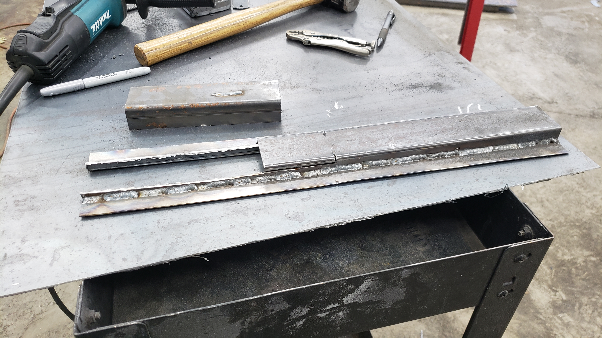
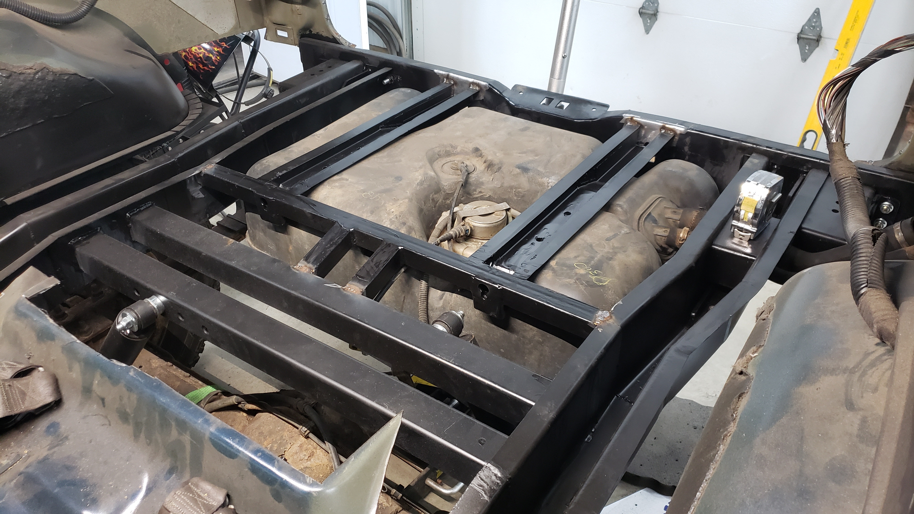
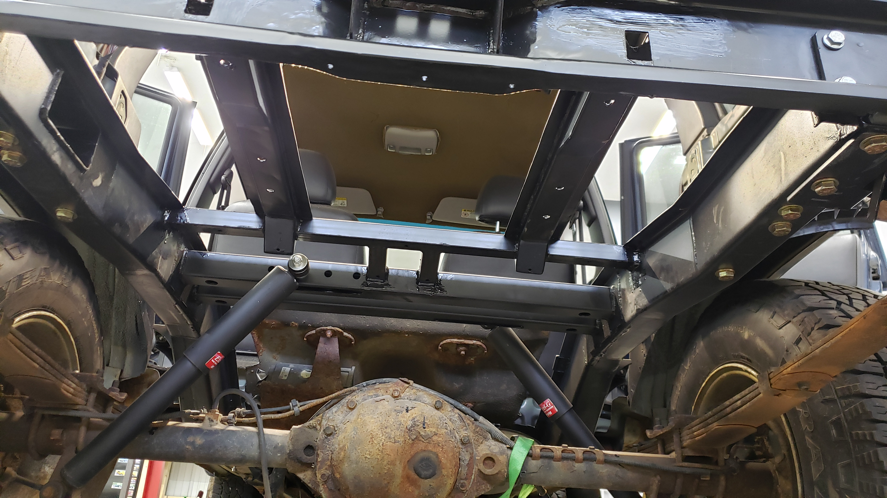
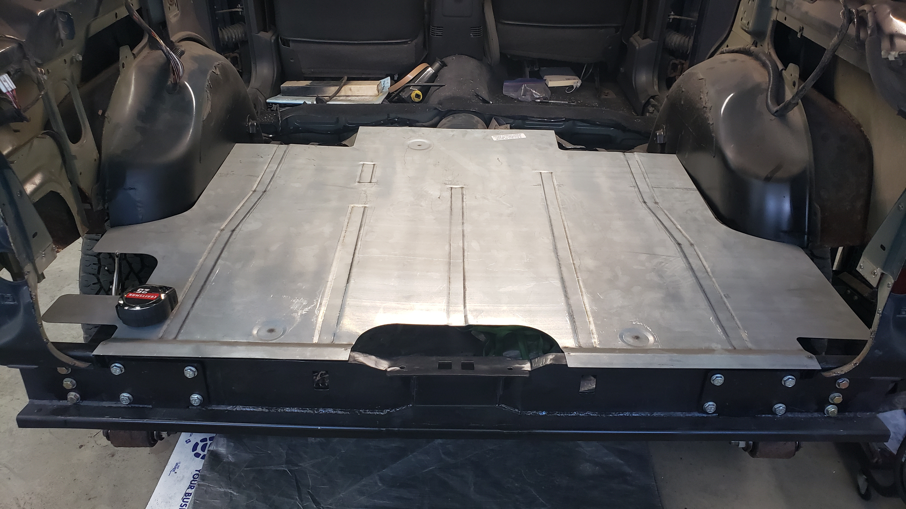

Directly below the floor of the XJ in the cargo area sits the gas tank. Tucked tight between the frame rails it rests a mere 1/2" from the floor. The mount for the gas tank is also what braces the floor in the cargo area.

Well that's how the OEM set up is at least. In my case I had a large gaping hole with nothing there.

Shortly after completing the rear crossmember and realizing how hard fabrication really is I began to dread having to build a new gas tank cradle. But thanks to the frame rails going smoothly I had a new found confidence that let me more forward and ignore those fears.

I didn't take many pictures during the initial design phase as I really wasn't sure what I was building until I got about halfway through. Several searches on the internet dug up no results so there's a slim chance this might be the first custom gas tank mount for the OEM tank in an XJ.

The mount is made using a run of 1x1 16ga tubing in the front, and almost half of a 2x2 16ga tube for the angled mount thingy. The bends on this piece were too close for my metal brake to replicate. That's why the flat edges running along the 2x2 tube piece are welded. A better metal brake would have made this part much easier to build.

The angles on the mount are to hold the gas tank in position and prevent it from sliding forward or backwards when accelerating or braking.

Example of how it sits on the tank

To build each side I started with this.

From there I cut off 7 inches of the top, and made two 3" cuts further into the sides.

Then a small angle was made and some scrap was welded into the sides.

And another piece of 2x2 tubing was then welded in to create the raised edge.

A quick test fit was done to determine where to weld the new piece on.

The steep slope at the front was made using even more 2x2 tubing that was cut similar to a set of stairs.

To ensure the gas tank strap had a solid mounting point an additional plate of 1/8" steel was welded on to the front of the steep sloped part. Then two holes were drilled and the space between them was filed to create a mounting point for the gas tank straps.

I'll be using a set of OE gas tank straps. I've put a lot of effort into making sure OEM parts still work with all of my custom stuff.

I cleaned up the gas tank strap mounts by welding in filler and grinding the edges until they were smooth.

And after that I sandblasted it to prepare for paint. There was some tight spots I wasn't sure I could get my hand and sandpaper into so I figured this was the best choice.

Then two coats of epoxy primer later it was ready to be installed. After I spray a part and let it dry overnight I'll pour the remaining paint into any tubing to try to coat every inch. I don't want rust finding a new home inside my work.

With the gas tank cradle ready to go I squared it up into position and put a few tack welds to hold it in place. To make sure it was good to go I jacked up the gas tank for a test fit.

The tank is sitting a little lower than it will be when finally installed due to difficulties with holding it up via a jack.

Since the gas tank cradle supports the floor I ensured it was as level as possible too.

A few more welds later the new cradle was fully installed.

It looks really cool against the new floor.

When I say floor I mean patch panel.

It's a patch panel for the pre-face lift (96 and older) Cherokees at that. I couldn't get my hands on anything better so I'll be building it out into a full fledged floor.

[Continue on to Part 6]()
