I didn't want to try to salvage the original cargo area floor from my Jeep. It had rusted through in several spots, and I kinda chopped it up into several pieces because I only removed bits of it as a time when I was fabricating the new frame rails.

I was really hoping to get my hands on a new OEM floor pan, but Mopar seems to get rid of parts as soon as they're no longer legally required to hold onto them as just like every other part I need it was already discontinued. Such a shame as they used to only charge a hair over $400 for an entire! cargo floor pan. That's a steal IMO since it would have saved me tens of hours of work.

The only other options I had were to either fabricate a floor from scratch, or buy a patch panel from Classic 2 Current Fab. At the time I wanted to save as much time as possible so I opted for the patch panel, but looking back I wish I had bought a bead roller and made my own. The patch panel quality is a little subpar in my opinion but I'll make it work.

I should mention the patch panel is also meant for an 86 - 96 Cherokee but with a bit of sharpie on the label and some welding and grinding we can make it work.

I only saved a small section of the original floor around where the hatch striker is located.

Before welding it in I made sure to sandlbast it to ensure it was rust free.

With the sheet metal being so thin I welded it in very slowly with a lot of tack welds.

Welding it in went great and I was able to avoid warping the floor pan. Sadly, I failed to notice I was welding it in crooked and shortly after had to cut it out and proceed to weld it back in all over again.

I accidentally welded it in crooked because I didn't notice the floor pan was asymetrical. The floor pan looks fine at a quick glance, but if you break out the tape measure you'll find nothing matches up. I had an incredibly hard time trying to determine where my "true north" measurement would be.

When I finally positioned the floor pan into the best spot possible I used vise grips to hold it down so I wouldn't have to worry about accidentally nudging it.

The first thing I needed to do was extend the floor behind the tail lights. There's a bracket that braces the hatch and the patch panel was designed to go around the brace so it didn't include the floor underneath it.

Since I have no floor to use, I bent up a small patch with my metal brake and welded it onto the patch panel.
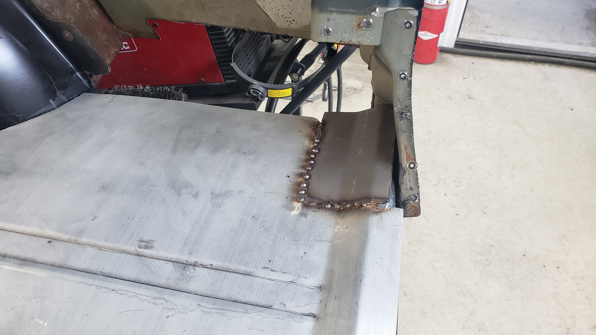

After that I bent a small lip to extend the edge that runs parallel with the quarter panel.

The lip strengthens the floor and I need it there so I can finish up my quarter panels later on.

On the driver side things were a little more complex as the gas tank filler neck passes through the floor.

Using the metal brake I extended out the floor panel and made another lip.

The only part of the floor that I was worried about replicating was the lip around the hatch that the weatherstripping mounts to. My metal brake isn't the best and can't make bends that are closer to each other than 3/4" at best. I also didn't have the original peice of the floor since I threw it out before realizing I had done so.

My best idea was to make two 90 degree bends and weld them together to recreate the lip.

It'd take a lot of spot welds but I knew I could make it work.

With a bit of grinding and careful work it actually seemed like it'd be ok.

The other side was basically the same process.

Now we're getting somewhere.

Once the lips were roughed in I removed the floor from the Jeep so I could finish up welding and finalize grinding everything up.

And a final test fit to see how it looked before paint.
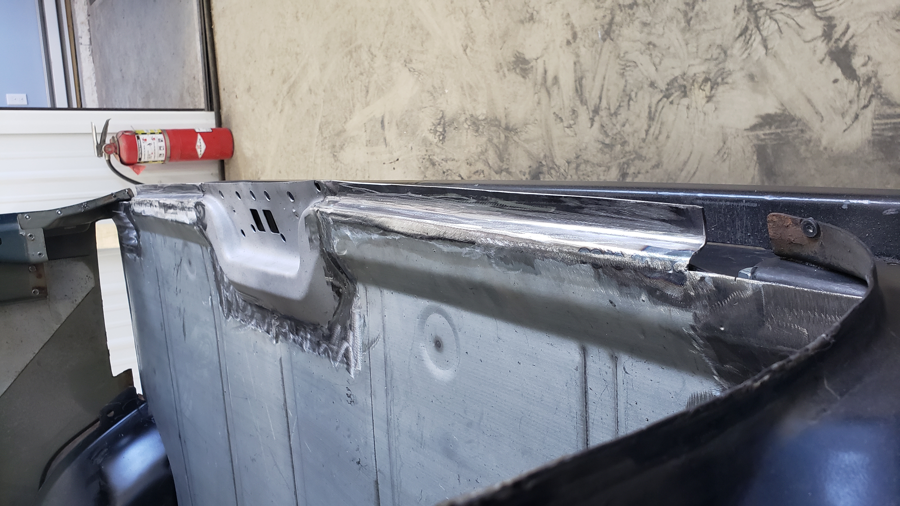

Removing the floor is a royal pain as it's a pretty tight fit. It's basically like a chinese finger trap as it's easy to pop in, but removing it is another story.

But it had to come out yet again so I could scuff and paint it. 80 grit on a DA was used to sand it down.

I love fresh epoxy. This is the biggest piece I've ever painted with a gun.

Atop my rear crossmember I had to add two little braces to support the floor. The original crossmember sits flush up against the floor with a bunch of tack welds but mine sits about 1" below. The two braces are just a way to compensate.

# A Slight Detour For An Alignment

I was a little uneasy about welding in the floor because I still wasn't 100% sure my work on the frame and suspension was squared up. I took as many measurements as I could, but I was a little in over my head on this repair.

Before going any further I gave the local mechanic shop a ring to get an appointment for an alignment the next day. To prepare I simply had to weld in the tail pipe, mount up and re connect the gas tank, reinstall the tail lights + wiring, and flush the coolant. No big deal for one night right?

Installing the gas tank wasn't too crazy. Just hook up the straps and connect two fuel lines.

But I hit a few snags rigging up the tail pipe. For one, I needed a new exhaust hanger since the original one was too rusted to salvage. I ended up buying an OE replacement but was very unimpressed with the design.

The upper half of the mount sits flush beneath the frame and has two studs coming out of it. But for one it was missing a bolt hole, and two had two bolts welded in place instead of studs that would be rubbing up against my brand new frame.

I ended up having to drill the third hole in the middle of the bracket.

And I made a few strategic bends to create a gap between the bolt heads and my frame. I didn't want them to rub against each other and ruin the paint giving rust the perfect chance to take hold.

Installed.
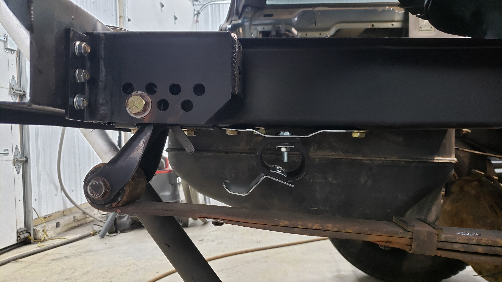

With the hanger perfectly position I was ready to weld back in my tail pipe. I had to cut out the tail pipe directly behind the muffler when I first started this repair because some dummy (me) who welded in the exhaust initially never bothered to put any flanges in. Oops.
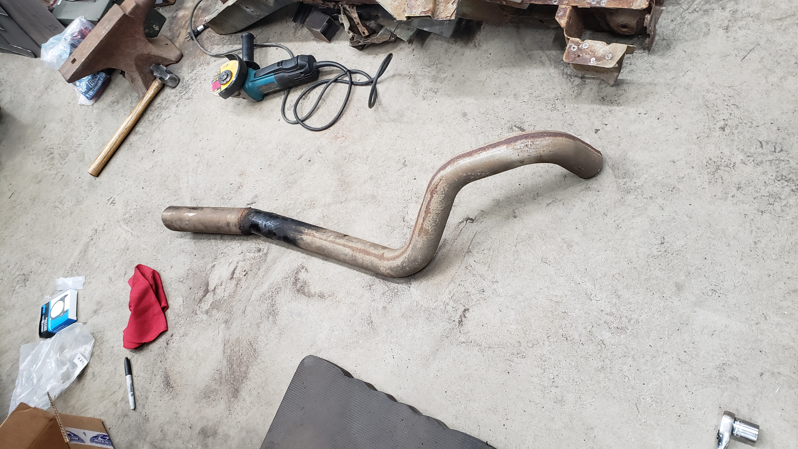

But lo and behold the tail pipe wouldn't fit in my Jeep anymore. My new shock crossmember hangs to low and was getting in the way of it. To compensate for this I chopped out 1" from the offending area.

Now we're getting somewhere.
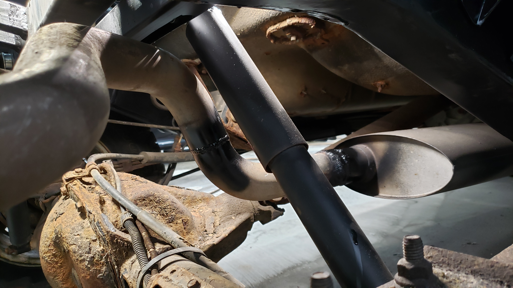

With the tail pipe sitting nicely underneath the shock crossmember all I had left to fix was cutting off the tip and welding it back in at the correct angle. It was pointing off to the side because when I chopped out the 1" I purposely welded them back together at a new angle to better position the pipe.
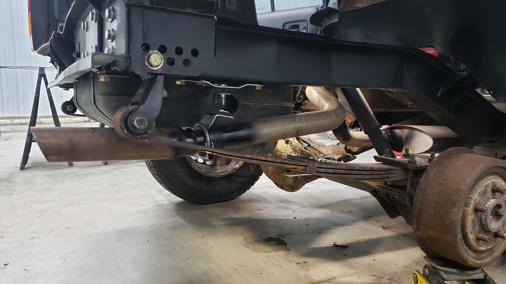

With fuel and exhaust all dialed in I just had to bleed my coolant system. (I replaced my heater core a few months ago and haven't moved the Jeep since).

And for the first time in nearly 2 months the Jeep drove out of the shop. Driving around without the rear floor isn't too bad. It's a little noiser and you hear every pebble that you drive over but it was still fairly warm with the heat on. I cracked the driver window during my drive just in case any exhaust fumes came in.

The next day the mechanic shop performed the alignment and to my surprise everything was within spec!

The rear thrust angle (the angle of the rear axle relative to the body) is at -0.2 degrees which is at the edge of the allowed window but I think some of it is due to a broken centering pin on one of my leaf springs. I'll investigate this later on.

With the alignment good to go I felt safe to continue on with my work.

# Welding The Floor In

I decided I wanted to weld my rear floor in. Some people are a fan of rivets, and others use structural adhesive, but I wanted to go with a repair that would match the factory construction. Since the rest of the floor and most panels in the Jeep are spot welded together I wanted to do the same.

After removing my gas tank for the fifteenth time I plopped the floor back in so I could outline everywhere I'd need to spot weld.

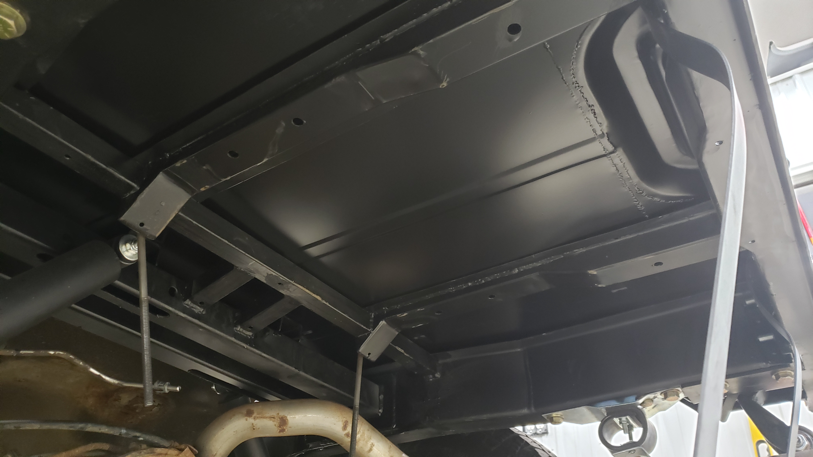

I used a silver sharpie to draw outlines of every piece that touches the floor on the underside. This way I'd have a good reference of where my spot welds should be when I drill them with the floor removed from the vehicle.

And after drilling just shy of 60 holes later I had a floor that somewhat resembled a cheese grater. Each hole was cleaned up with the air grinder to remove any burrs or paint to prepare for welding. The holes are 5/16" and spaced about 3" from each other.

The little whirl marks are just dust from grinding.

Once again I re installed said floor so I could mark each new hole on everything beneath the floor so I could clean the paint off them. And then I got to remove the floor AGAIN.

But before I put the floor back in for the last time to weld things up I wanted to address one little issue. The two braces that the gas tank mates against were getting in the way of the gas tank straps and made it a complete pain to attempt to pop them into position.

As a quick fix to get the tank installed for the alignment trip the other day I filed the openings bigger so I could mount my tank.

But not wanting to leave this as the final design I wanted to cut bigger openings.

It was actually pretty challenging to cut these without hitting the rear crossmember.

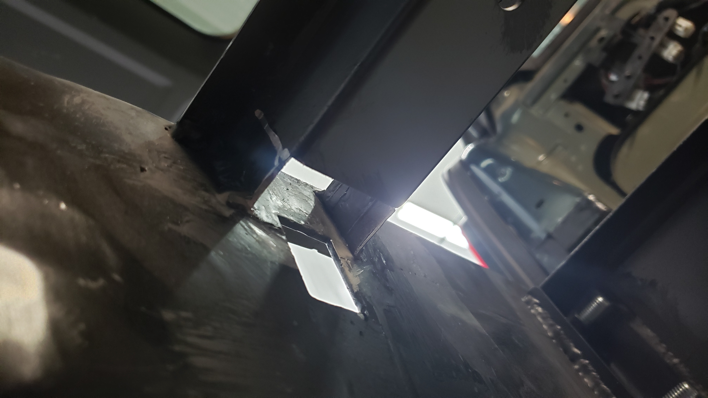

But with that issue addressed I could finally weld in the floor.

Welding in the floor was far more stressful than I thought it would be. Every weld has to be just about perfect and you can't leave any gaps between the floor and the parts it mates against. I ended up having to use some clamps to hold things close together when spot welding.

I was kneeling on the floor as I was welding it in and foolishly created a ton of small dents in the floor from my knees. Don't kneel on the floor until it's mostly welded in.

Underneath the hatch striker area I had to make a 1/8" shim to close up a gap.

After the shim was welded in place every single weld was cleaned up with the grinder.

And just to keep things from rusting for the time being I brushed epoxy primer over all the welds.

When I welded in the floor I didn't bother to weld the wheel well lips up. The patch panel curves are pretty atrocious and don't line up with the inner wheel wells very nicely. I decided I would just drill them on the spot and weld them since I didn't care if they weren't symmetrical.

# Restoring The Hatch Braces

Now that the floor and Jeep are forever joined in a holy matrimony I could move on to fixing the brackets that brace each side of the hatch opening.

The passenger side one was pretty much okay, but it had suffered some damage during my slightly rough removal process.

The driver side one had to be removed in pieces, and had some rust issues.
The driver side one on the other hand had to be cut out in pieces as I couldn't reach every spot weld holding it in.

Each bracket was sandblasted to see what was left underneath the paint and rust.

Looks like I only have to replace two small sections on the passenger one.

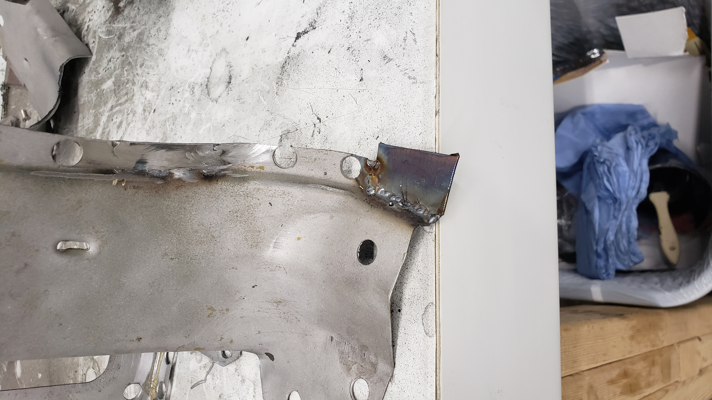
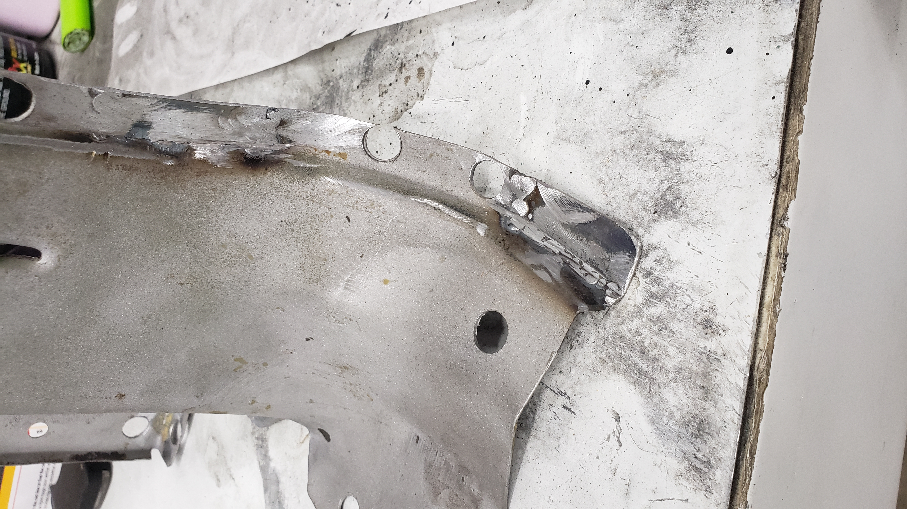

The driver side one ended up looking like Frankenstein's monster.

But a little bit of grinding prettied it up.
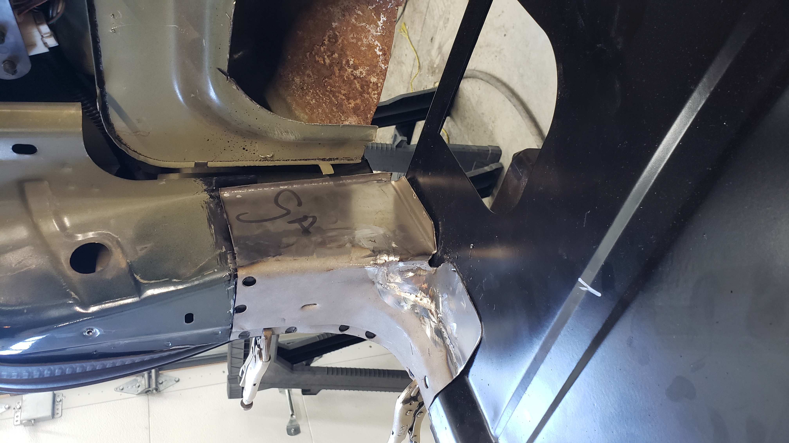

Welding these in was pretty difficult. The metal is extremely thin and I kept blowing through it.

Lots of clamps and vise grips had to be used to position them just right.

Touched up the paint.
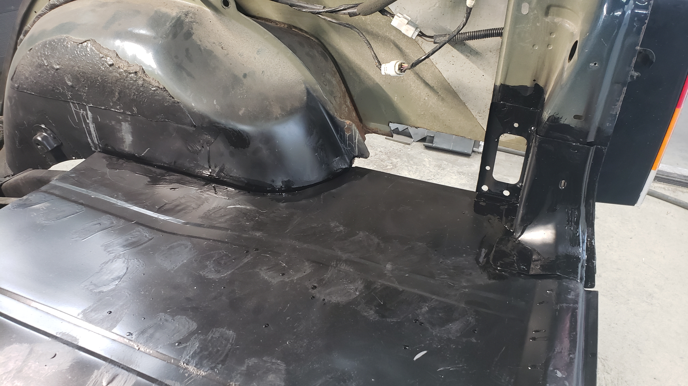

Not bad!

[Continue on to Part 7]()
