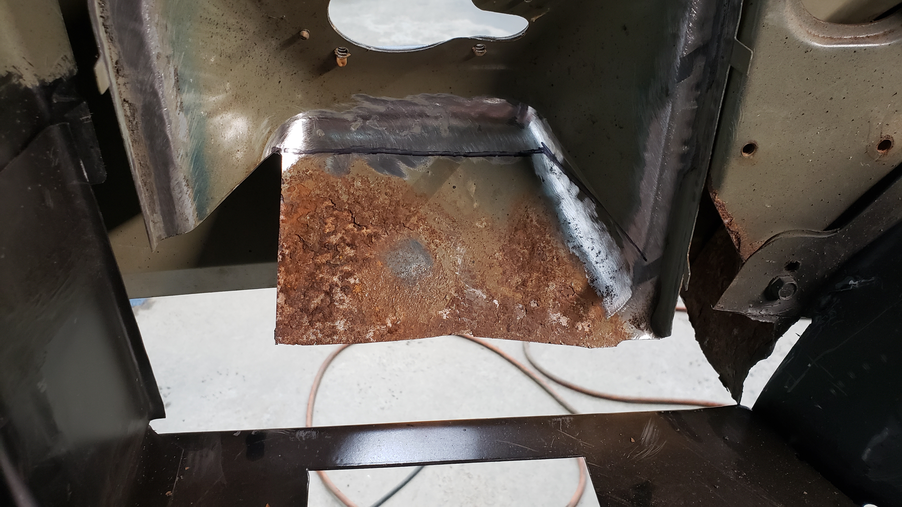
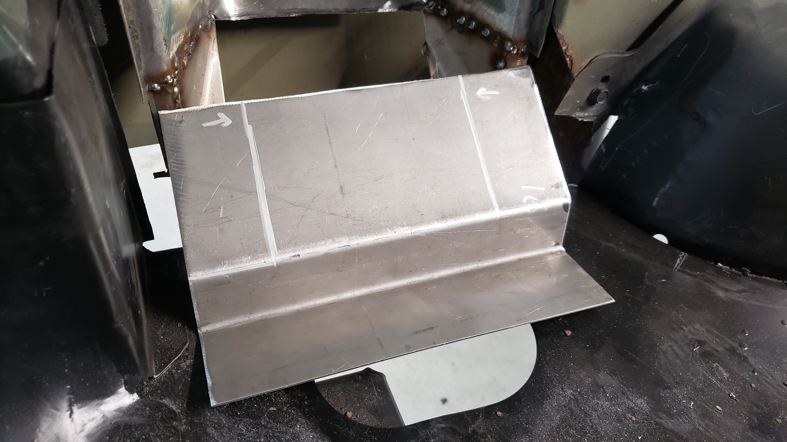
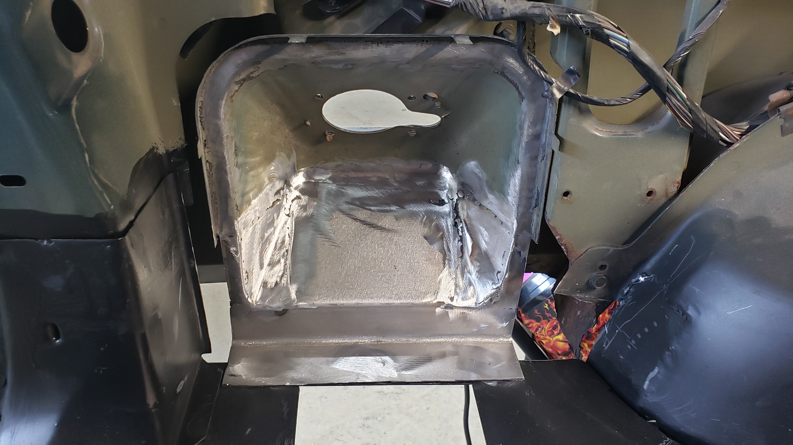
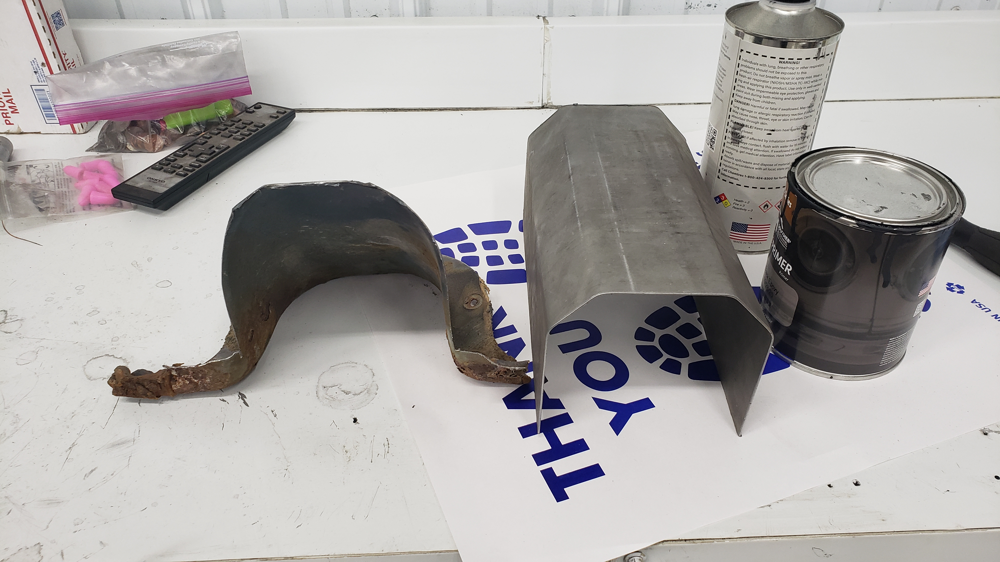
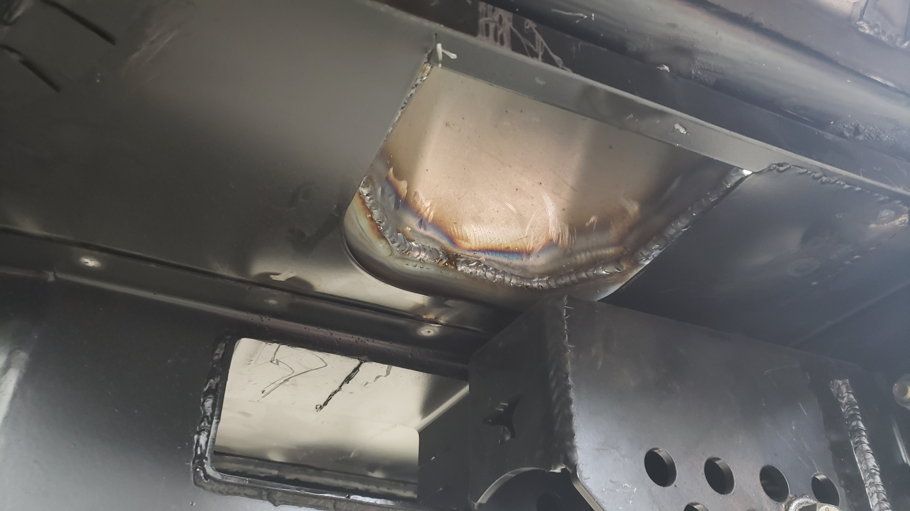
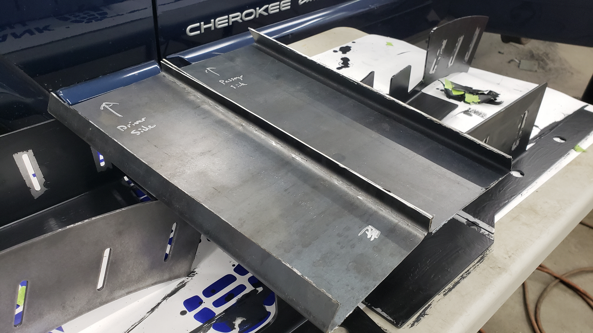
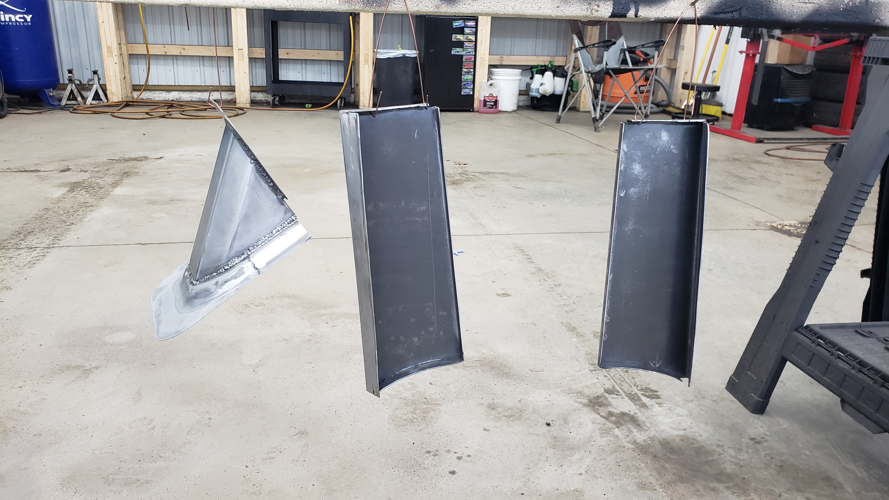

# The Fuel Neck Housing

I've been ignoring the gaping hole around where the fuel neck passes through the interior to travel down towards the gas tank. I had a feeling it'd be easy to fix so I never put much thought into it. I honestly didn't bother to worry about it until I had the floor fully welded in and no choice but to finally address the issue.

There used to be a cover that went over the fuel neck to protect it on the interior side.

But when I first started this project I chopped it out with the angle grinder so I could see how rusted the floor was beneath it.

The cover was basically junk.

To get started I reinstalled the fuel tank and neck that way I could ensure things would still fit with whatever contraption I came up with.

If you're wondering why I left part of the cover in place and cut a rounded arch in it to remove just the sloped portion it's because the lip that mates against the inner fuel neck housing is held in place via structural adhesive.

At the time I didn't know how to remove structural adhesive but I did know how to use the angle grinder so I opted for what I was familiar with to save time.

Turns out all you have to do is heat up the adhesive with a heat gun and it seperates like nothing. Whoops!

A wire wheel on the drill was used to remove the left behind adhesive.

The inner fuel neck housing was pretty rusted. It's missing about 1" from the bottom of it because I had to make a cut with the angle grinder when I removed the original cargo floor.

The metal was actually too rusted to save and I was planning on just leaving it for the time being, but I realized in order to properly seal everything up I'd have to at a minimum remake the missing part.

I figured at that point why bother welding to rusty metal and doing 3/4 of the work when I could just fix it properly now instead of going back in a year or two down the road.

So I broke out the angle grinder and cut off one of the corners.

And using my trusty metal brake I bent up a new one and tack welded it in place.

After that, I repeated the process for the other corner.

Don't mind that the corners aren't symmetrical. I realized this shortly after welding in the second one but didn't feel like fixing it as this part of the Jeep is going to be 100% hidden.

With the corners done I chopped out the last bit of rusted metal from the center.

Whenever I'm making a part I like to try to make it in as few pieces as possible. It's mostly because I'm lazy so I'll run a few possibilities through my head before starting on something just to see if I can find a way to rebuild it properly while saving time. Welding and grinding thin metal takes a lot of time so the less I have to do of it, the better.

I'm starting to really like my metal brake. I never realized how many opportunities it's opened up for me.

I feel like I can rebuild the world with just my brake and angle grinder.

It may not seem like it, but the placement of this piece is incredibly important. It's the missing link that connects the quarter panel to the floor. If you weld it all together and have to push things around for everything to line up you risk leaving the quarter panel warped. It'll make the reflection in your paint around the gas door look wavy.

And some magical grinding later our new fuel neck housing was complete. Well half of it atleast.

Now I just had to remake the interior cover that will sit flush up against the new housing.

I was able to save some of the lip from the original cover by just replacing the lower 2" on each side of it.

I bent up a new piece that would be used for the slope part via the metal brake.

The original cover is (I think) 19ga but my replacement is 16ga. Way overkill, but I don't have much 18ga left and I need to save it to finish off my floor. I've got a lot of 16ga scrap from when I rebuilt the frame rails.

A bit of trimming turned our mailbox shaped thing into the propery slope.

With a bit of welding, the lip and slope were mated to recreate the fuel neck cover.

An additional lip was added to help seal up the opening on the floor.

Looking down in from the fuel door.

From underneath.

Just like every other piece on this Jeep, it was sprayed with SPI epoxy primer. God I love this stuff.

# Cut N Fold Panels

I'm trying to avoid doing any bodywork on my Jeep right now because knowing me it'll snowball into a full paint job since there's a lot of things wrong on the exterior. But with Christmas coming up next week I need this thing on the road ASAP.

To save some time and close up my quarter panels I decided to make some custom cut n fold covers.

I was winging it when I made these so I didn't take too many pictures of the process.

Just like the fuel neck housing they're made from spare 16 gauge steel I had laying around.

They're not perfect, but they're not meant to be permanent. I plan on bed lining them to hide the blemishes and give them a rugged look.

They're sloped to mimic the angle of the body line directly below the 4x4 badge. Plus the angle makes the Jeep look **fast** which it totally is(n't).

Satisfied with their fitment they were sprayed with epoxy primer to act as a base coat.

Then plenty of self tappers later they were installed.

Of course as fate would have it I left a major paint blemish on the driver side one. Go figure I can paint every part that's going to be hidden underneath the Jeep almost perfect, but the most visible one was messed up exactly where it'd be most noticable.

When I positioned the self tappers I measured everything up on the driver side. This was a bad idea because more of the quarter panel was cut off on the passenger side. And of course not a single one of the three self tappers on the quarter panel actually hit any metal to dig into.

I ended up having to weld in some scrap just to get one to bite.

They're not 100% water tight yet because I still need to put seam sealer down. My goal is to time everything up so the seam sealer will be the last thing I put on right before I bedline the entire underside / quarter panel covers.
