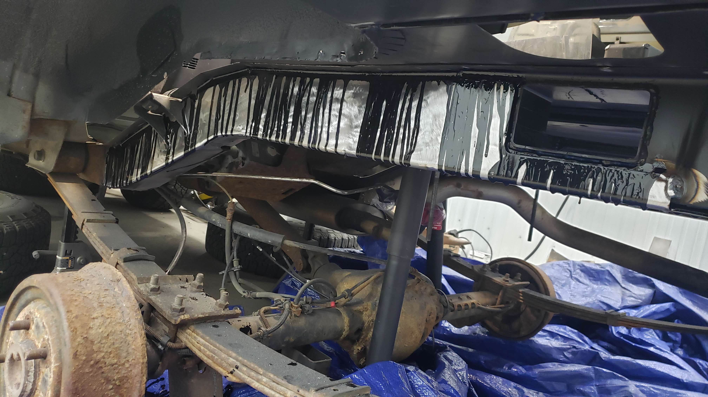

One of my biggest concerns about my custom fabricated frame rails was the vertical welds joining the frame sections. Vertical welds like those are a big no no when it comes to frames because they're especially prone to failing. The common fix for this is to weld on fishplates that help brace the welds but since I'd have to weld on 6 fish plates on each frame rail I figured it'd be simpler to just go with frame stiffeners.

I ended up buying a set of rear frame stiffeners from DirtBound. They're made of 10 gauge steel which is the max limit of what my little welder can do, and they were also one of the cheapest out there. Plus I have their battery tray in my XJ and I really like their products.

For awhile I was on the fence about welding on frame stiffeners because I feared they'd give rust the perfect breeding ground to live in the space between the frame and the stiffeners. I've heard about weld thru primer being used in situations like these, but personally I've found it doesn't offer much protection against the road salt we use up here in the Northeast.

Because of that I decided to apply some SPI epoxy primer (my favorite paint) on the backsides of the frame rails.

I had this "great" idea to tape off where I would need to weld so I wouldn't have to grind any paint off.

But since I was feeling lazy and brushed the paint on instead of spraying it with a gun, the paint seeped underneath the tape causing me to have to break out the die grinder anyways.

I used a bunch of clamps to hold the stiffeners against the frame so I could mark where I'd need to grind off paint on the frame rail for welding.

I love how perfect the frame rails go around my fuel neck passage hole. Guess I lucked out positioning it just right. (The factory one is an oval, I opted to make mine a square since it was easier to make.)

A bit of welding later my first frame stiffener was welded on. Well half of one atleast.

I did some stich welding on the backside.

The angle grinder was used with a flap disc to clean up the visible welds.

For some reason I thought welding on the straight portion of the frame rail would be the harder of the two. But it turns out the curved one actually took more time. Part of it is due to the seat belt bracket that you need to weld around, and the need to close up the gap between the two sections of the frame stiffener.

When prepping for welding it felt odd grinding off the paint on the frame stiffener that I had carefully sprayed on it just a week prior.

It almost felt wrong in a way ruining something that was perfectly good.

But paint and welding don't go together. Like at all, the stuff will literally catch fire, releasing a horrible smelling smoke and cause your welds to be porous. So the moral of the story is don't mix the two. Especially so when the strength of the welds is critical.

Grinding down the welds isn't necessary by any means, I'm just doing it to hide the fact that I welded on these frame stiffeners. Whenever I do things I like to try to do them in a way that would leave you thinking it came like that from the factory. Some of the weld outlines are still visible, but these will be hidden once I bedliner the rails at the end.

Here's the done shot of the other side.

I decided to go a little overkill at this point in an attempt to make them extra rust proof. I bought some oral syringes off Amazon and used them to inject paint down between the frame rail and the stiffeners.

I kept pouring more and more paint in until I saw it start to drip out the other side. It made a royal mess but I injected about 16 ounces of paint in total between the two sides.

If you look between the stiffeners and the frame you can see the black paint. My hope is that the paint will fill most of the void preventing any salt or sand from finding their way down into the crevice.

The next day I had a lot of fun sanding off all the drips on the outside of the rails. It was worth the extra work though.

To finish off the stiffeners I sprayed them with my paint gun to give them a final coating on the outside.

Not too shabby. Like I mentioned earlier, I was on the fence about installing frame stiffeners. I almost waited till next year to do it, but I realized all of the welding would burn off the paint inside the frame rails behind the welds. I figured with the floor still open, if I did go ahead and weld in the frame stiffeners now, it'd be much easier to touch up the burnt paint. I'm glad I went this route because my frame is 100% protected (as far as I can see).

After sanding the loose stuff off, I touched up the paint with a brush as I'm not worried about how the finish on the inside of the rails look. As long as they're black, and not rusted I'm happy.

[Continue on to Part 9]()
