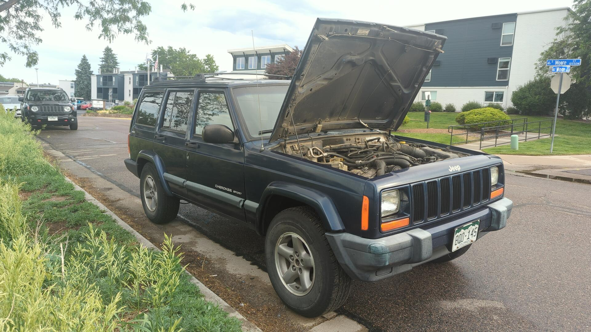
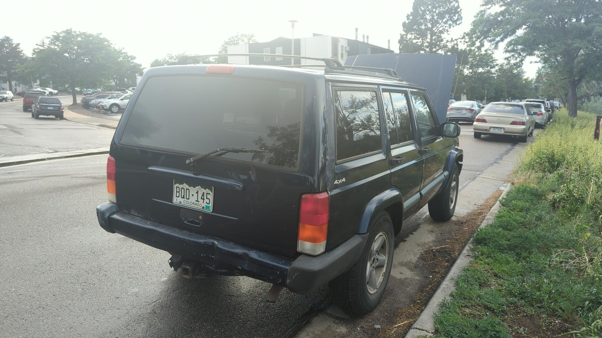
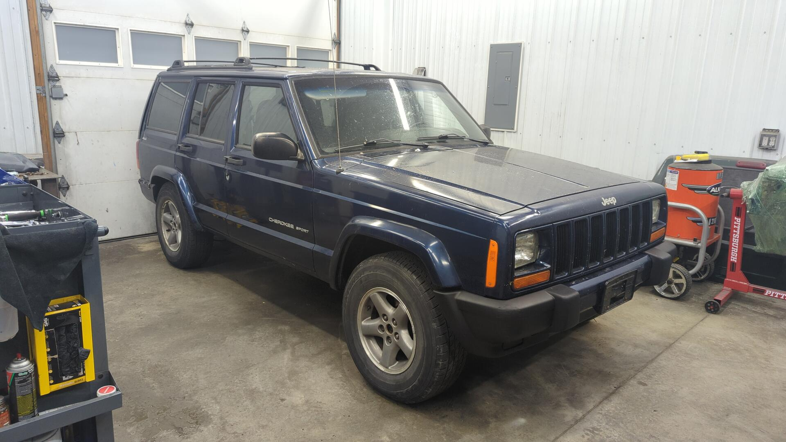
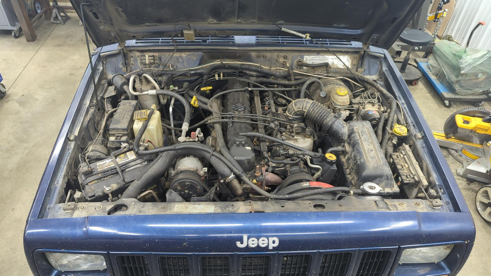
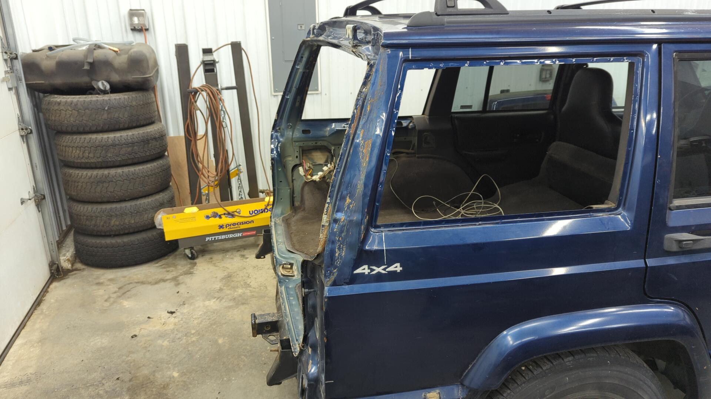

Back in June of 2024, the night before I was due to fly out to Colorado for a work trip I couldn't resist sifting through the Denver Craigslist to see what I could find. I wasn't actually in the market to buy anything, but whenever I'm traveling outside of the Northeast I always like to see whats for sale in the states that don't have to deal with road salt.

Lo and behold I stumbled across a 2000 Cherokee for sale that looked like it had a lot of potential but needed some serious elbow grease.

Now, for some context I already have an XJ but it's undergoing a massive rust repair project that'll likely take at least another year (or two) before it's back on the road.

And ever since my XJ was torn down I've been daily driving my 88 Integra because the XJ used to be my daily. The Integra is fairly reliable and in decent shape for it's age but I've found it to be a lousy daily driver for my needs.

My main gripes with the Integra are that it can't haul larger items (aka body panels, steel, etc...) so it was making it more difficult to acquire parts to finish the XJ, and it's also not a good car for winter. During the winter I only drive the Integra on clear days which means having to keep an eye on the weather and planning around it carefully.

So while I wasn't in the market for another vehicle like mentioned above, I had been day dreaming about acquiring another reasonably priced vehicle that I could get on the road sooner than later and use as a daily while I finished up my XJ.

Out of curiosity I gave the seller a call and sure enough he still had it. He said I could come take a look at it the next day so as soon as I landed in Denver I went straight from the airport to the XJ.

## A Little Rough But No Rust Underneath

I was pretty much sold on the XJ as soon as I saw it. Yeah, it had a lot of smaller issues like the battery tie down was missing, oil was leaking from several places, the starter was weak, and some major issues like death wobble, a rusting roof, a cracked windshield, the passenger quarter panel took a hit from a tree, and the hatch wouldn't open but I thought it had a lot of potential.

The biggest draw by far was that there was nearly zero rust on the underside. The "frame" rails were clean, the rockers were good, the floor pan was almost perfect. This is all stuff you'll never find in the Northeast.

So after peppering the seller with a million and one questions (super honest guy) and an exchange of money I had the keys, title and bill of sale in hand. Now all I had to do was figure out how to get it home.

## The Trip Home Was Not Smooth

After spending a few days in Denver doing work things it was time to try and get the XJ home. I had already taken a trip down to the DMV to get a temp plate and got insurance set up on it so the XJ was fully legal to drive but I needed to stock up on some tools and a couple parts.

My first stop was Harbor Freight to pick up a collection of basic tools like a tire patch kit, tire inflator, jump box, pliers, zip ties, wrenches, screw drivers, etc, and after that I shot over to Oreilly's to grab a track bar and a set of radiator hoses.

The reason for the track bar was that I believed it to be the source of the death wobble. Prior to buying the XJ I had the seller turn the steering wheel back and forth while I watched the front axle. I could see that the track bar had some slop on the axle side so I figured by swapping the bar it'd get the XJ in a better condition to drive home.

It took me about 30 minutes but I was able to swap the track bar in the Oreilly's parking lot and after checking over all the fluids and securing the battery down I felt I was ready to start the 2,200 mile drive home.

Luck was not in my favor that day as about 10 minutes into the drive home I experienced the first bout of death wobble while traveling roughly 60 mph. It was easy enough to get the wobble to stop by slowing down a bit but with the death wobble still occurring it meant I'd be limited to a max speed of 60mph the whole way home.

I didn't know this at the time but I'd later discover the slop I saw in the track bar wasn't the bar itself, but the mount hole for it on the axle was wallowed out.

### Day 1: Colorado to Missouri

I left Denver at roughly 11am and traveled down I-70 at a blistering 60 mph for a little over 12 hours before finally calling it a day and staying at a hotel in Columbia MO that night. The first day of driving was pleasantly uneventful other than several bouts of death wobble and driving through a small hail storm.

I don't recall what time I made it to MO but I believe I checked in to the hotel sometime around midnight and promptly fell asleep once I made it to my hotel room.

### Day 2: Missouri to New York

On the second day I departed from my hotel around 9:30am and stopped at a gas station to top off the tank before heading out and grabbed some gatorade for the drive. I was filling up the XJ about twice each day at this point. The weather on the second day was better than the first as it was nothing but sun and 80F out. All in all the XJ was doing surprisingly well so far.

The second day was more eventful than the first as about midway through the day I was pulled over by a state trooper in Illinois. I don't know why I was pulled over but he mentioned I was going 60 in a 75 which while on the slow side, is legal as far as I'm aware. He was friendly and let me go with a verbal warning for the cracked windshield at least.

A couple hours later while at a pit stop I noticed the XJ was had a small puddle of coolant underneath it and after investigating I found one of the plastic sides of the radiator had a crack in it. The leak wasn't severe but it was concerning so I stopped at an Autozone to buy a spare radiator to have on hand in case the one in the XJ blew.

I was pretty determined to make it home at this point so I pushed for New York before calling it a night. I won't lie, I underestimated how many more hours of driving that'd take and I didn't reach my hotel for the night until nearly 3am.

### Day 3: New York to Maine

By day 3 I was super beat but still had roughly 600 more miles to go. The death wobble was starting to get more frequent at this point and knowing that the roads in New England are rougher I decided to stick to back roads from here on out since I didn't think the XJ could maintain a reasonable highway speed without all the bumps triggering death wobble.

Driving down the back roads through upstate New York was actually kinda cool. It did require more stopping and going but it felt a little less monotonous than driving on the highway for hours. The third day was fairly uneventful like the first and I made it home that night around 1am.

All in all the trip was fun, but it was more stressful than I had hoped for. If I could redo the trip I would have split the driving up over 4 days, and also tried to put more effort into fixing the death wobble before hitting the road.

# Figuring Out What Exactly I Got Myself Into

With the XJ sitting pretty in the shop I started going over it with a fine toothed comb to get an idea of just how big this project would be.

I gave the engine bay a good scrubbing to see what it looked like underneath all the dust.

Not bad.

In terms of mechanical repairs under the hood I estimated it'd need:

- New valve cover gasket (leaking in rear / side)
- New water pump / inlet tube (tube was almost rusted through)
- Fan shroud (original was missing)
- Battery tray (OEM one is just plastic and was broken)
- Grounds / battery terminals replaced
- Timing chain (engine had 214k so it was due regardless)
- Oil pan gasket (leaking)
- Rear main seal (leaking)
- Radiator (leaking)
- Radiator hoses (rubber was crumbling)
- Starter (very weak)
- NSS (check engine light was on, and previous owner mentioned he bypassed it)

After that I focused on trying to get the hatch open because I wanted to see how far the damage on the passenger rear quarter panel went. This was harder than it sounds because the rear bumper was pretty banged up and blocking the hatch.

The bolts holding the rear bumper onto the XJ were seized due to rust so to make removal of the bumper easier I cut the lower half of the bumper off with my angle grinder and then removed the bolts with a large breaker bar.

For those that noticed the hatch interior panel is tan while the rest of the interior is gray it's because the PO had the hatch replaced with a junkyard unit. The hatch used to be red and it looks like it had a quick paint job sprayed over the red as I can see it coming through in chips / around the hatch window. I'm most likely going to steal the hatch off my other XJ since it's already the correct color and in better shape.

The rear interior was pretty dusty but nothing too terrible.

With the hatch working again I was able to remove it, the rear interior and quarter windows.

The damage was worse than I anticipated.

But on the bright side I could see clamp marks on the pillar from the XJ being on a frame puller so it looks like the previous owner at least had it straightened out so I wouldn't have to worry about any major unibody issues.

At the very least I'd need to rebuild the rear of the quarter panel and part of the pillar.

[Continue on to part 2]()
