With a rough idea of what it'd take to fix up the damage I decided to switch focus and tackle all the mechanical / electrical issues before diving into the bodywork.

I needed to replace basically every seal on the engine, water pump, thermostat, timing chain, and more so while I waited for all the parts to arrive I started scrubbing off the thick layer of grime covering the lower half of the engine bay.
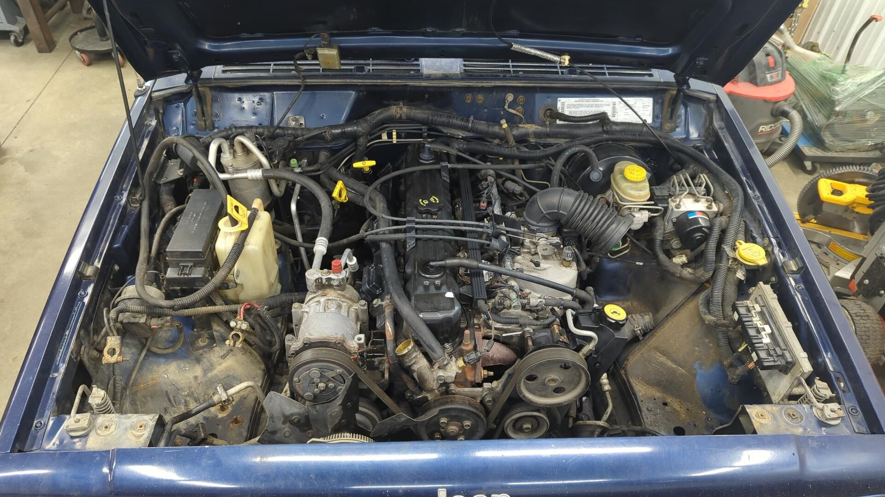

New timing chain installed.

The engine was surprisingly clean on the inside for 214k miles.
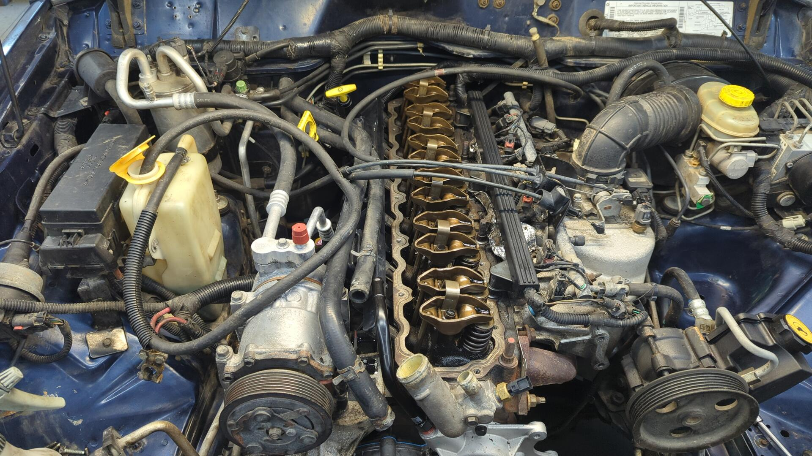

Engine bay all spiffed up. I stole the set of four hole injectors, billet fuel rail, battery tray, and fan shroud off my other XJ.
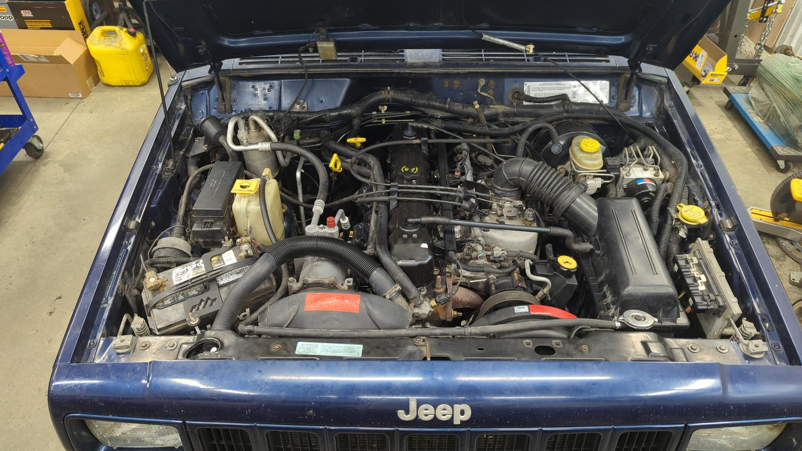

I wanted to see if I could fix the neutral safety switch with a good cleaning before replacing it so while I was underneath the XJ swapping the starter I popped it off the trans.

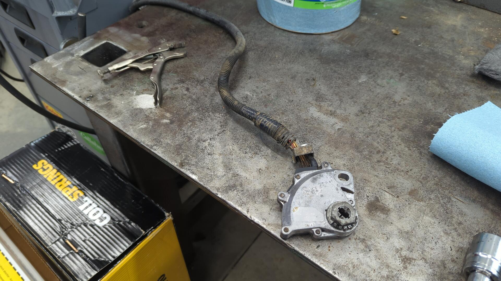

Hopefully that does the trick!

I also yoinked the dash so I could swap the heater core and AC evaporator.

## Sprucing up the Interior

After getting most of the mechanical issues dialed in I noticed the center console was loose. This is a super common issue on XJs and is typically due to the plastic bracket that holds the console in place cracking.

I swapped in a Barnes 4wd metal one. There's a few different options out there and they're all pretty much the same but I went with Barnes because they had the best price. I suspect it's because they don't paint the bracket but that was easy to take care of myself.

The shifter selector was broken and dirty so after giving it a good scrubbing I repaired it with some JB Weld.

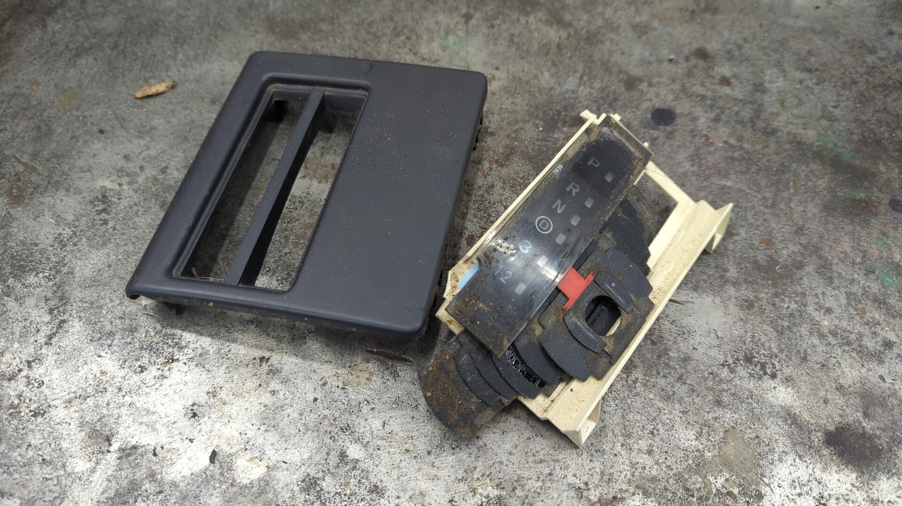
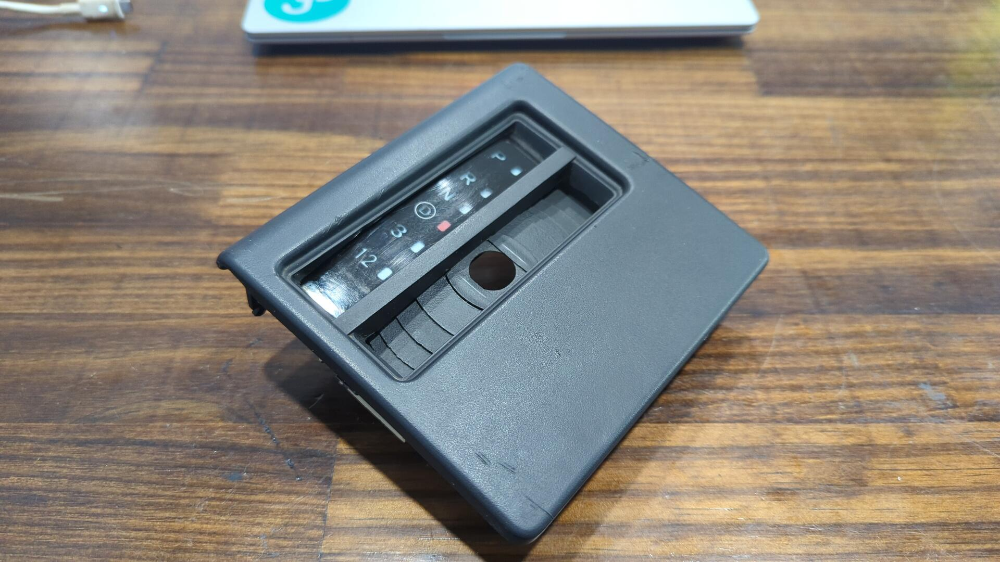
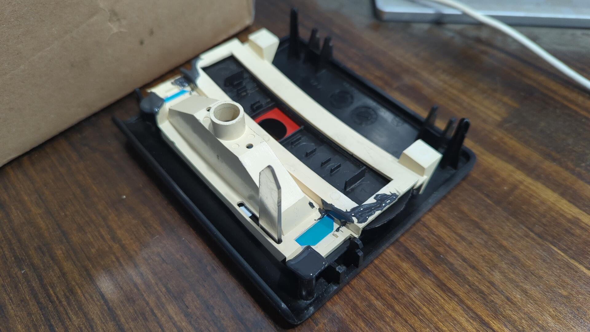

While driving the XJ home I noticed the driver door had some electrical issues such as the electric lock actuator wasn't working so I pulled off the panel to inspect the wiring. I found 2 broken wires, and several more were close to failing.
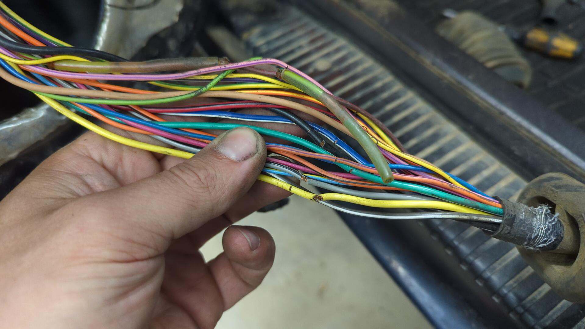

A little solder work later and the harness was good to go again.
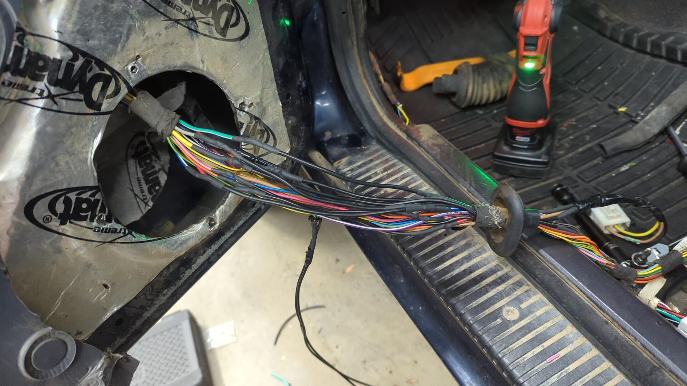

The front half of the interior was starting to really shape up.

# Sneaking in Some Upgrades - A 2" lift, ZJ Steering, and a Trans Cooler

Alongside doing all the maintenance work under the hood I wanted to do a few upgrades. The first upgrade was [adding a trans cooler along with AN lines](  ).

The second was [upgrading to the stronger ZJ steering setup](  ) and welding in a new track bar bracket on the axle. The new track bar axle bracket was needed to address the wallowed out bolt hole causing the death wobble, and the ZJ setup was just for fun.

The last upgrade was doing a [2" Old Man Emu lift]( ). I'll admit this was also mostly for fun, but the rear of the XJ was starting to sag due to worn out leaf springs.

New leaf springs installed.
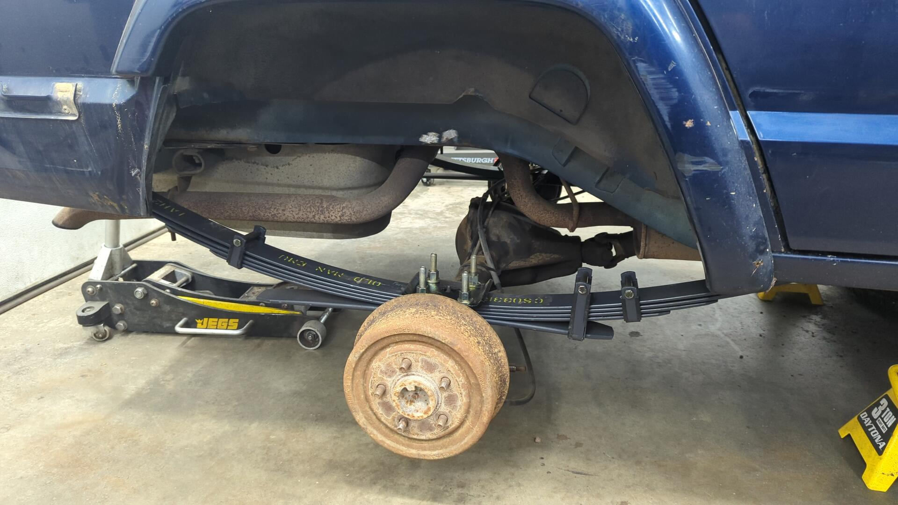

One of the rear upper shock bolts got stuck so I had to cut it off.

I decided to punch out the upper shock bolts with an air hammer and install some AzzyWorks rear upper shock mounts to replace them.

All done in the rear.
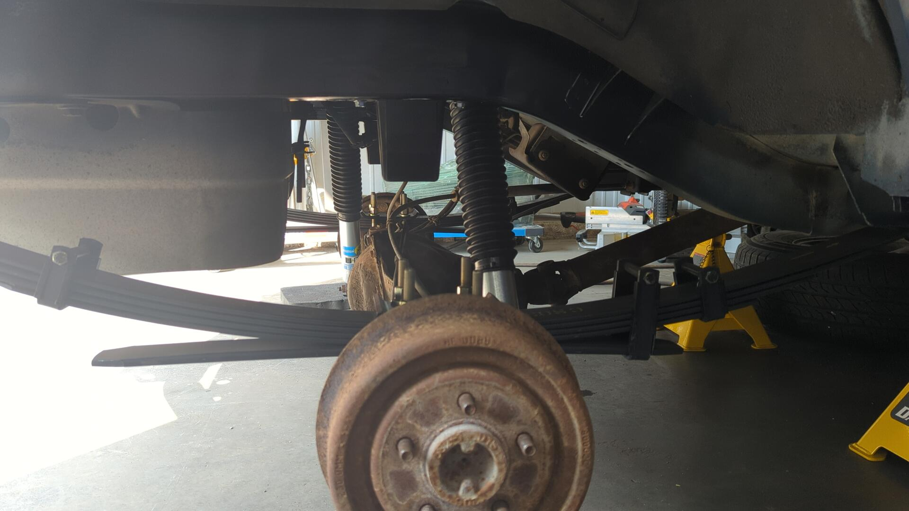

The front was much easier since it was swapping the shocks and installing new springs.
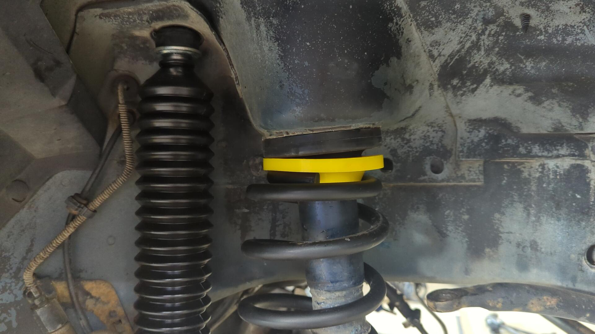

The lift looks a little tall for 2"s but I think it'll settle.
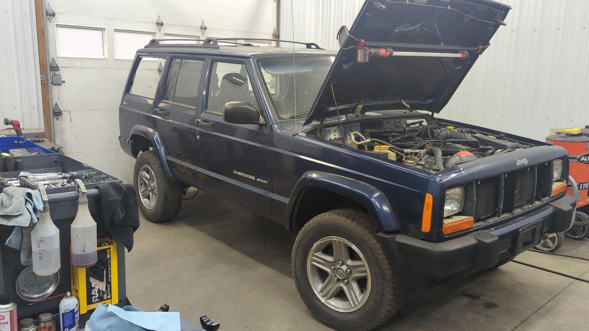
