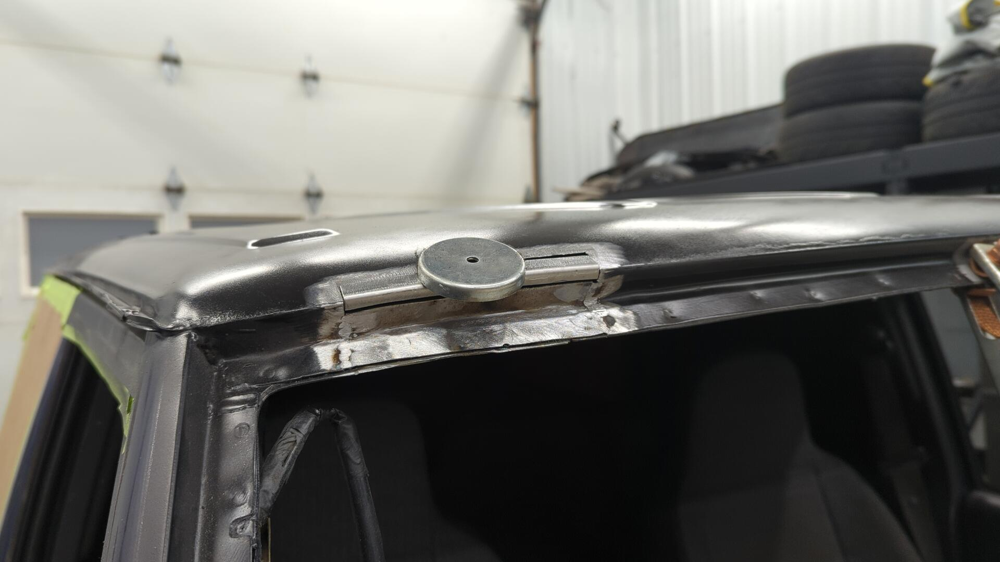
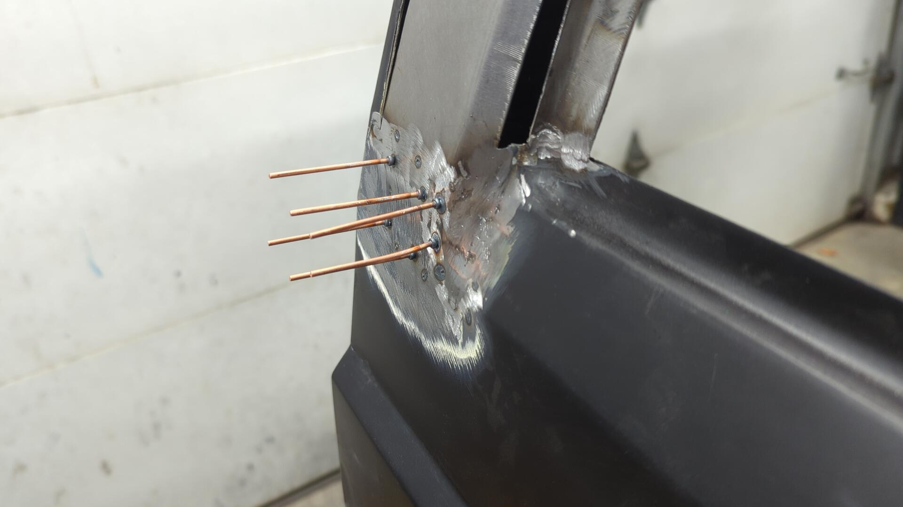
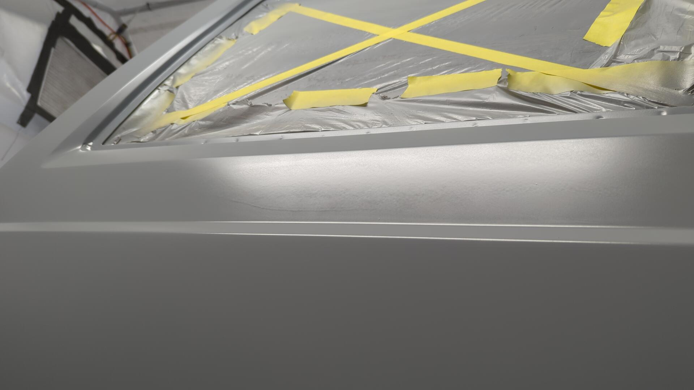
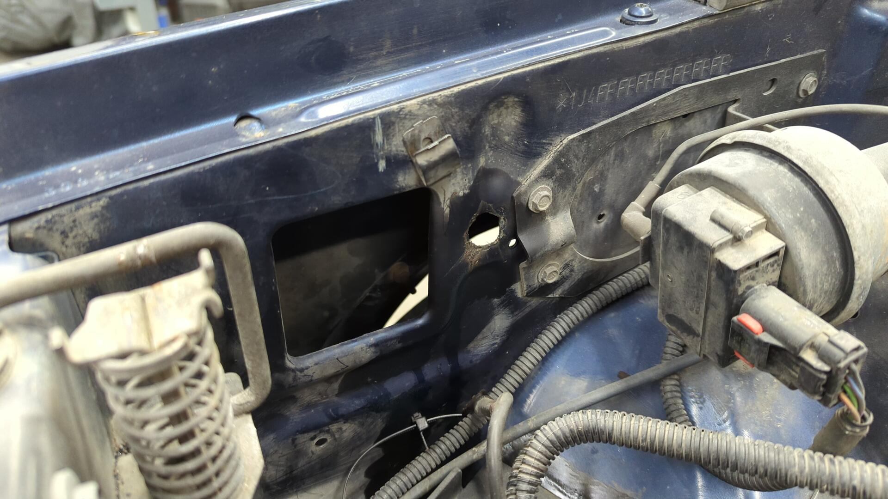
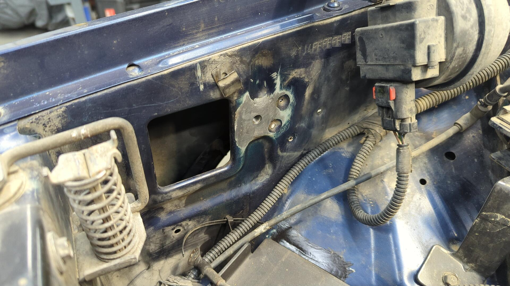
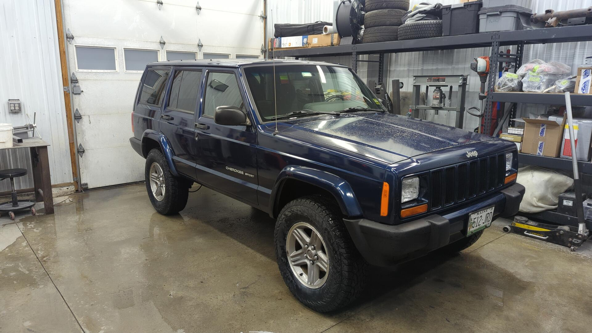

At this point the XJ was mechanically solid but in desperate need of some cosmetic work.

It was hard deciding where to draw the line in terms of what I'd work on vs what I'd leave as-is but I settled on repairing both quarter panels, and the roof as they were the worst. 

All the other panels have damage (hood paint is flaking off, front doors are starting to rust on the lower edge, rear doors are dented, fenders are dented, hatch is dented) but I wasn't confident I had the motivation or desire to do a full paint job.

## Rebuilding the Passenger Quarter Panel

Since the passenger quarter panel had the most damage I figured I'd start there.

I started by cutting off the crumpled metal and figuring out where I could rebuild from.

While working on the pillar I noticed some rust down at the bottom of the quarter panel.

Rusted metal removed, new metal welded in.

Then I sprayed two coats of epoxy on the inside to protect everything.

New lower patch panel welded in.

From there I worked on building a replacement skin for the pillar. This was a slow process and I ended up building it out of a few patches welded together.

Passenger quarter panel metal work "done".

I was really worried I'd end up with a second unfinished XJ at this point.

## Goodbye Windshield and Rusty Roof

With the windshield cracked it seemed like my best option was to remove it so I could do a proper paint job on the pillars / roof without having to worry about tape lines.

I also could see a little rust on the top of the windshield that I wanted to address.

I used one of those cheap piano wire tools to remove it.

The rust ended up being worse than expected and some of the metal up top would need to be replaced. 

I cleaned up everything salvageable via a mix of grinding / sandblasting and coated it with some epoxy to protect it.

Just to make sure I'd be welding to good metal on the roof I decided to do a test spot with the sandblaster. 

Before:

After:

It took roughly 2 hours to sandblast that spot. 

### Patching the upper windshield channel

Making patches for the windshield channel wasn't that bad. After cutting out the old metal I bent up two L shaped pieces of metal in my brake and curved them to match the profile of the roof via my shrinker / stretcher.

Then it was just a matter of welding the new metal back in.

### Sandblasting the Roof

With the windshield channel taken care of all I had left for metalwork was to sandblast the roof. This ended up being a pretty miserable experience that took 9 hours. 

It was hot that day and the blasting hood I was wearing kept fogging up so I'd have to pause every 15 minutes or so to clear the lens otherwise I could see at all.

Plus by the time I finished I was completely covered in media since I didn't wear a jump suit.

In terms of media I used coal slag and went through 6 bags.

With the roof blasted though it felt like the Cherokee had hit a turning point as there was almost no rust on it at this point.

Although a little lumpy, the roof looked a lot better in some fresh epoxy.

## Rebuilding the Passenger Quarter Panel AGAIN

Once the roof was sealed in epoxy I shifted focus back to the passenger quarter panel to start filler work.

Body filler is fairly boring to photograph, so skipping ahead a few rounds of filler / primer I finally got the panel to a point where I felt like it was ready to move on to 2k primer.

On a whim I popped in the quarter panel window gasket to see how it looked and while standing behind the XJ I realized that I had never checked the body measurements for how thick the pillar was relative to the rear window.

When looking at the XJ from the rear I could see too much of the gasket sticking out because I had built my pillar too shallow. This meant there wasn't enough of a "pocket" for the window to sit in.

This was a massive set back by a few weeks worth of work as it meant I'd have to remake most of the pillar and redo all the filler work I had spent hours on. 

I was reasonably upset by the mistake and ended up stepping away from XJ for 4 weeks before I was ready to try again.

Taking a break was fruitful though because it gave me time to think about how I'd properly rebuild the panel.

New patch shaped and tack welded in.

Bottom of the pillar was pulled outwards by another 1/8" or so via my stud welder dent puller to match the driver side measurements.

From there it was a game of welding in some thin patches on the inner edge.

Welded back up.

Filler work again. (Epoxy was sprayed prior to filler)

Quick touch up with some epoxy.

It wasn't until a few weeks later when I was ready to spray the panel in 2k so I scuffed it and sprayed a fresh coat of epoxy to ensure the 2k would get good adhesion.

2k primer.

## A Little Work on the Driver Quarter Panel

Compared to the passenger side, the driver quarter panel was in good shape. It only had a small crack in the top corner, a few dents, and a tiny bit of rust on the bottom.

Drilled out the crack to stop it from spreading.

Welded.

Lower patch welded in.

Base coat of epoxy to prep for filler.

Lots of filler and sanding later.

Sealer coat of epoxy.

2k primer sprayed to prep for block sanding.

## Doing My Best To Salvage The Roof

The roof on the XJ was wavy, and had a bunch of dents but I did my best to make it as flat as reasonably possible.

It took 3 rounds of filler work followed by spraying primer thinking I was done only to realize I missed something but after a week of working on it in the evenings I finally got it reasonably flat.

Final coat of epoxy.

2k primer.

## 3 Weeks of Block Sanding

With all of the panels in 2k primer I thought I was super close to being ready for paint because all that was left at this point was some block sanding. That was a huge understatement that I didn't realize until I actually started sanding

Block sanding panels flat takes forever and even though I wasn't going for a show car finish, I still spent about 3 weeks block sanding everything. 

I started off blocking with 180 and once I had the panels as flat I as thought they needed to be, I sprayed another coat of 2k primer over everything. (spraying the second coat after doing the 180 work helps fill all the 180 scratches instead of having to sand them out)

Then I started blocking with 320 followed by 400 and lastly went up to 600.

Couple of spots I burnt through to bare metal were touched up with epoxy.

## Paint Time

I was ready for paint but needed a paint booth first.

Since I can't afford a real paint booth I cobbled one together using a Harbor Freight 10x20 canopy and thick plastic sheeting for walls.

On the inside I hooked up a couple spare LED lights I had laying around to make it nice and bright.

Once the booth was all set I sprayed my sealer coat of reduced epoxy on the XJ.

All in all this coat came out alright but I did drip it in a few spots that had to be wet sanded out.

A couple coats of color and clear later and the XJ was looking fresh.

## Reassembly

I was super excited to see the XJ back in one color because it really felt like the project was almost done. 

It also felt great seeing the parts pile get smaller and smaller as I re installed each piece.

Rear windows back in.

Hatch back on, along with rear interior.

Rear bumper installed.

The roof looks so much better.

Reminder of how the roof used to look:

A week later I had a new windshield popped in and was finally able to drive the XJ on the road again for the first time in 6 months.

## Intermittent No Starts

After the XJ was fully reassembled I started taking it on a couple short test drives to make sure all the gremlins had been worked out and for the most part everything was solid. 

The first and only major issue to pop up during the test drives was an intermittent no start. The first time this happened the XJ was trying to start like normal but the starter was super weak.

I traced the issue back to a bad power wire connection on the starter and after cleaning up the connection with a wire brush the XJ started up fine.

A day later though the no start issue was back but this time the XJ was completely unresponsive as if the battery was dead.

Thinking I had just left an interior light on I grabbed my boost box to give it a jump but still wasn't able to start it.

A bit of fiddling around later I discovered the positive terminal had a bad connection that would cut power when jiggled.

Since this was the second electrical issue related to the power cables in a few days I decided to do the big 7 mod and upgrade all the cables as a precautionary measure.

Normally it's a pretty easy mod but I ran into trouble with the fender ground bolt snapping off.

At least it wasn't hard to weld a patch in.

New wires and battery terminals installed.

And just like that the no start issue was fixed.

## Buffing Out the Old Paint

The XJ was looking kinda silly with a shiny rear and faded from so I broke out my buffer and did a quick pass with HD speed on a white Lake Country pad to give the old paint some new life.

## New Tires

With all the major issues worked out of the Jeep all that was left was to pop some new tires on it and get it inspected.

The Jeep used to have 235/70/16s on it but the tires were worn out and at the legal limit so I decided to upgrade to 245/75/16s as they're about equal to a 31" and would pair nicely with the 2" lift.

It sits a little taller than my other Jeep.

That's it for now.