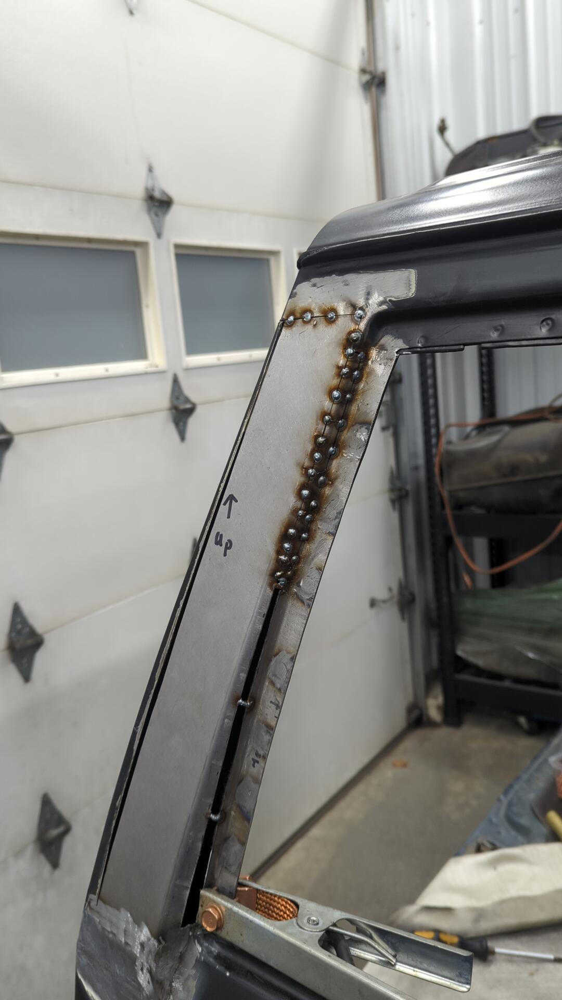

At this point the XJ was mechanically solid but in desperate need of some cosmetic work.

It was hard deciding where to draw the line in terms of what I'd work on the exterior vs what I'd leave as-is but I settled on repairing both quarter panels, and the roof as they were the worst. 

All the other panels have damage (hood has flaking paint, front doors are starting to rust on the lower edge, rear doors are dented, fenders are dented, hatch is dented) but I wasn't confident I had the motivation or desire to do a full paint job.

## Rebuilding the Passenger Quarter Panel

Since the passenger quarter panel had the most damage I figured I'd start there.

I started off by cutting off the crumpled metal and figuring out where I start rebuilding from.

While working on the pillar I noticed some rust down at the bottom of the quarter panel.

Rusted metal removed, new metal welded in.

Then I sprayed two coats of epoxy on the inside of the quarter to protect everything.

New lower patch panel welded in.

From there I started working on building a replacement skin for the pillar. This was a pretty slow process and I ended up building it out of a few patches welded together.

Passenger quarter panel metal work "done".

I was really starting to worry I was gonna end up with a second unfinished XJ at this point.

## Goodbye Windshield and Rusty Roof

With the windshield cracked it seemed like my best option was to remove it so I could do a proper paint job on the pillars / roof without having to worry about tape lines.

I also could see a little rust on the top of the windshield that I wanted to address.

I used one of those cheap piano wire tools to remove it.

The rust ended up being worse than I expected though as some of the metal was going to have to be replaced. 

I cleaned up the salvageable metal via a mix of grinding / sandblasting and coated it with some epoxy to protect it.

Just to make sure I'd be welding to good metal on the roof I decided to do a test spot with the sandblaster. 

Before:

After:

It took roughly 2 hours to sandblast that spot. 

### Patching the upper windshield channel

Making patches for the rust spots wasn't actually that bad. I could out the old metal using an air saw and drilled out 2 - 3 spot welds on each section.

From there I bent two L shaped pieces of metal using my brake and then curved them to match the profile of the roof via my shrinker / stretcher.

Then it was just a matter of welding the new metal back in.

### Sandblasting the Roof

With the windshield channel taken care of all I had to do now was sandblast the roof. This was my second least favorite thing to do as it took roughly 9 hours of blasting to get rid of the rust. 

It was pretty hot that day and the sand blasting hood I was wearing kept fogging up so I'd have to pause every 15 minutes or so to clear the lens otherwise I could see at all.

Plus by the time I finished I was just covered in media since I didn't wear a jump suit.

In terms of media I used coal slag and went through 6 bags.

With the roof blasted though it felt like the Cherokee had hit a turning point as there was almost no rust on it at this point.

Although a little lumpy, the roof looked a lot better in some fresh epoxy.

## Rebuilding the Passenger Quarter Panel AGAIN

Once the roof was sealed in epoxy I shifted focus back to the passenger quarter panel to start the filler work.

Body filler is fairly boring to photograph, so skipping ahead a few rounds of filler / primer I finally got the panel to a point where I felt like it was ready to move on to 2k primer.

On a whim I popped in the quarter panel window gasket to see how everything looked and while standing behind the XJ I realized that I had never checked the measurements for the front half of the pillar because I could too much of the windshield grommet.

It turns out what had happened was that I never fully pulled the large dent out just below the rear pillar so when I build my patch it was left the quarter window pocket "too shallow" so the window glass would almost be flat with the pillar instead of it being recessed.

This was a massive set back by a few weeks worth of work because it meant I'd have to remake part of the pillar and redo all the filler work I had spent hours on. I was fairly upset by the mistake and ended up stepping away from XJ for 4 weeks before I was ready to try again.

Taking a break was fruitful though because it gave me some time to think about the best way to solve the issue, and eventually I settled on cutting out the pillar and welding in a new patch.

Bottom of the pillar was pulled outwards by another 1/8" or so via my stud welder dent puller.

From there it was a game of welding in some thin patches on the inner edge.

Welded back up.

Filler work again.

Quick touch up with some epoxy.

It wasn't until a few weeks later when I was ready to spray the panel in 2k so I scuffed it and sprayed a fresh coat of epoxy to ensure the 2k would get good adhesion.

2k primer.

## A Little Work on the Driver Quarter Panel

The driver quarter panel wasn't in bad shape other than a small crack in the top corner, a dent or two, and a tiny bit of rust on the bottom.

Drilled out the crack to stop it from spreading.

Welded.

Lower patch welded in.

Base coat of epoxy to prep for filler.

Lots of filler and sanding later.

Sealer coat of epoxy.

2k primer sprayed to prep for block sanding.

## Doing My Best To Salvage The Roof

The roof on the XJ was wavy, and had a bunch of dents but I did my best to make it as flat as reasonably possible.

It took 3 rounds of filler work followed by spraying primer thinking I was done only to realize I missed something but after a week of working on it in the evenings I finally got it reasonably flat.

Final coat of epoxy.

2k primer.

## 3 Weeks of Block Sanding

With all of the panels in 2k primer I thought I was super close to being ready for paint because all that was left at this point was some block sanding. That was a huge understatement that I didn't realize until I actually started block sanding

Block sanding panels flat takes forever and even though I wasn't going for a show car finish, I still spent about 3 weeks block sanding everything. 

I started off blocking with 180 and once I had the panels as flat I as thought they needed to be, I sprayed another coat of 2k primer over everything. (spraying the second coat after doing the 180 work helps fill all the 180 scratches instead of having to sand them out)

Then I started blocking with 320 followed by 400 and lastly went up to 600.

Couple of spots I burnt through to bare metal were touched up with epoxy.

## Paint Time