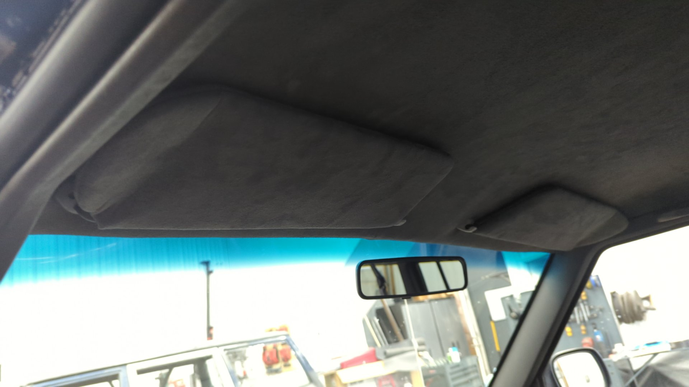
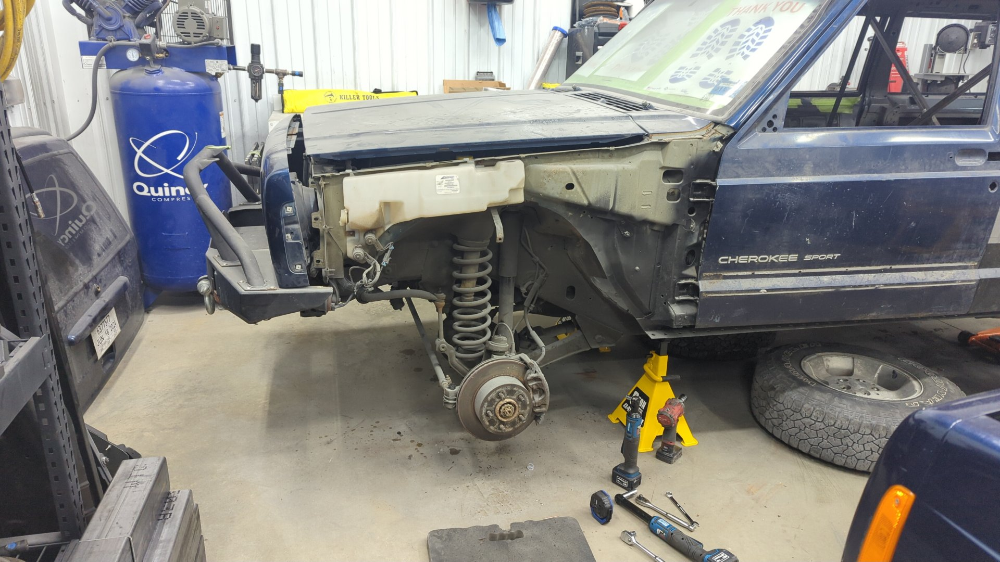
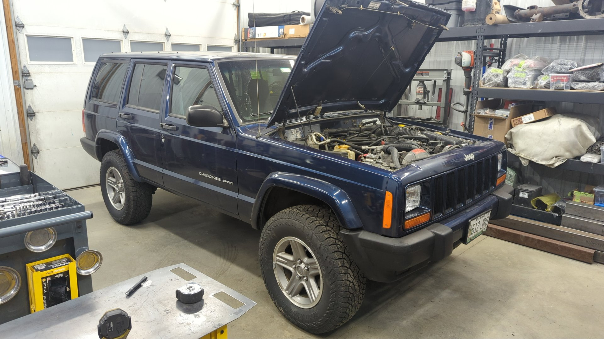
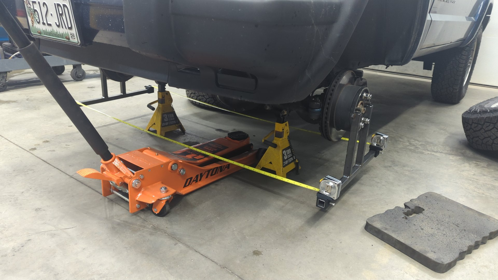
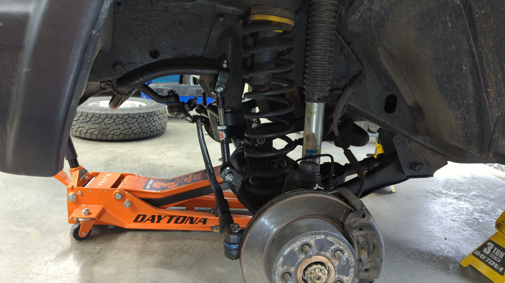

Having just passed 215k miles, the XJ from Colorado has proven to be a reliable daily over the past few months. It did have a recent incident with the alternator intermittently failing where it'd just stop charging and the "check gauges" light would come on but that was an easy fix by swapping in the spare alternator I had laying around.

Alongside some minor maintenance I've been working on the finishing touches like reupholstering the sun visors to match the charcoal gray suede headliner.

# Borrowing the Dana 30 From My Other XJ

The pinion bearing in the front axle was bad and I didn't feel like replacing it right now so I opted to borrow the Dana 30 off my other XJ.

It was pretty easy to pull the axle [since I had previously had it out back in ~2020]() and made sure to use anti-seize on all the bolts back then.

The axle had a lot of dust and grime on it because I used to fluid film the Jeep when that one was still on the road.

Every time I touched the axle my hands were getting covered in oily dirt so I gave it a quick wipe down with degreaser to make installing it a little more pleasant.

I'm impressed how well the epoxy primer I sprayed on the axle is holding up. This axles seen a few Maine winters with lots of road salt so it's nice knowing that the fluid film is actually working.

Pulling out the second front axle wasn't too difficult other than one of the lower control arms bolts needing to be cut out. Time wise, it was roughly 2 hours of work with 30 minutes of that dealing with the stuck control arm bolt.

Left axle is the one that needs a pinion bearing. I plan on rebuilding it and using it on the currently torn down XJ.

"New" axle mounted up.

All done except for the sway bar links.

I wasn't sure if the new axle would mess with the alignment so I built some DIY alignment jigs using 1" tube and two old brake rotors. The new axle was toed out ever so slightly but I'm not sure if that's just how the old axle was aligned or not.

And as an extra bonus I installed some adjustable sway bar links since my old ones were still the OE units and were too short for the 2" lift.

They're quick disconnect too which is neat.

(I shortened them after this photo)

