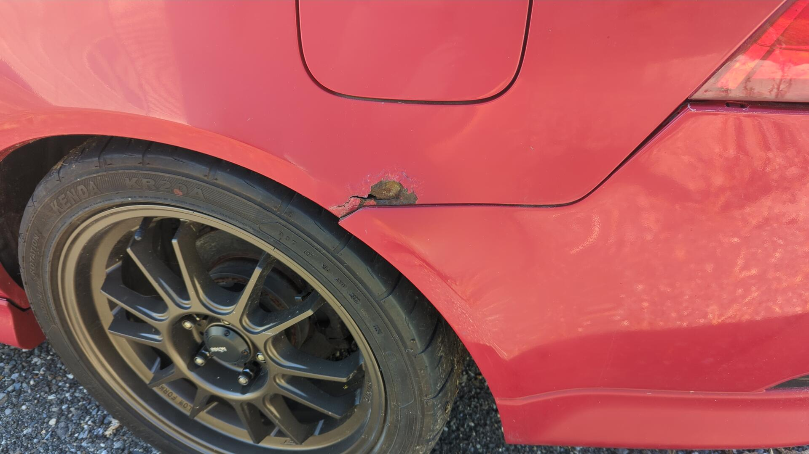
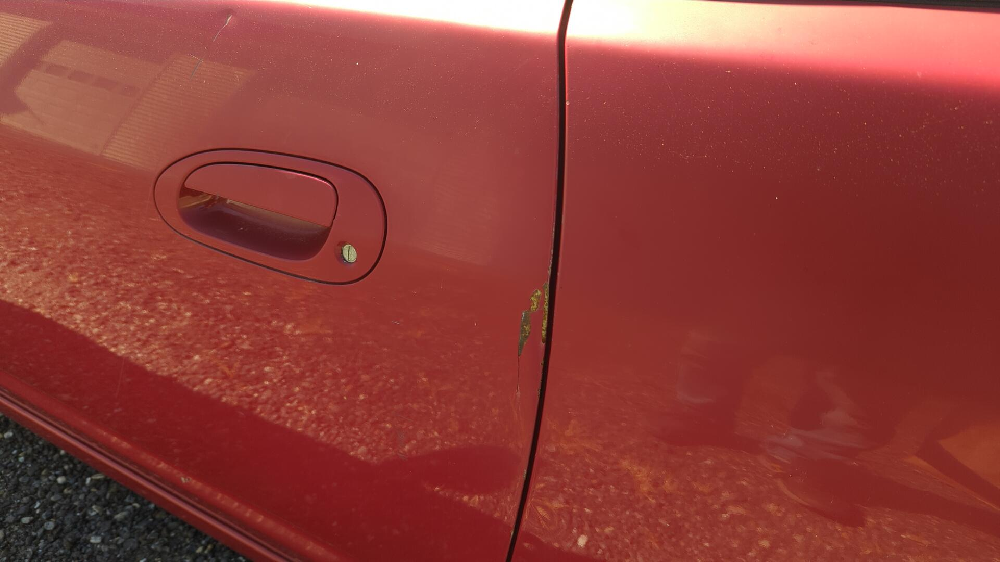
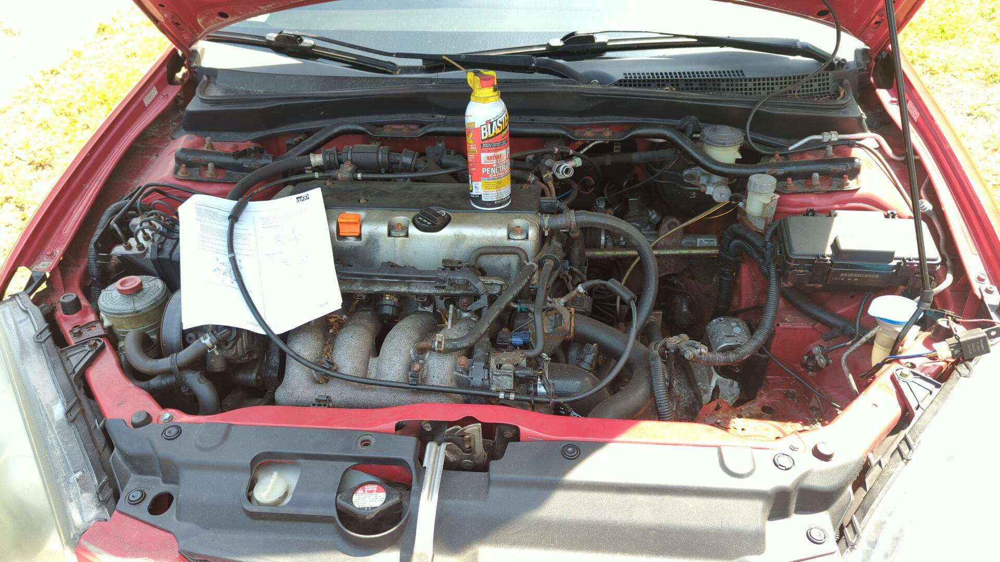
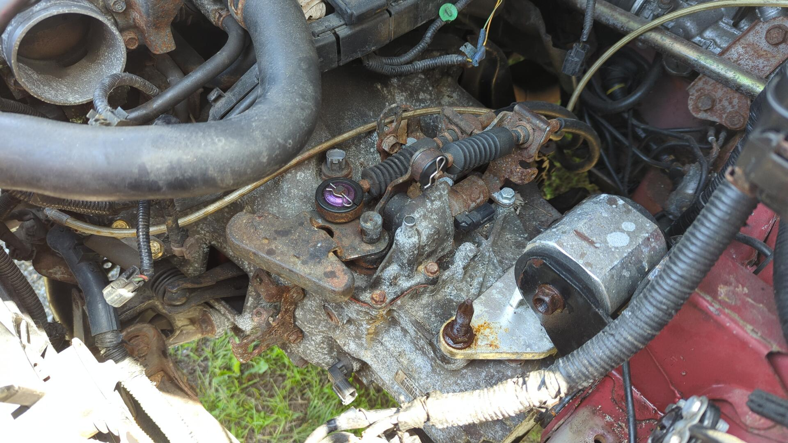
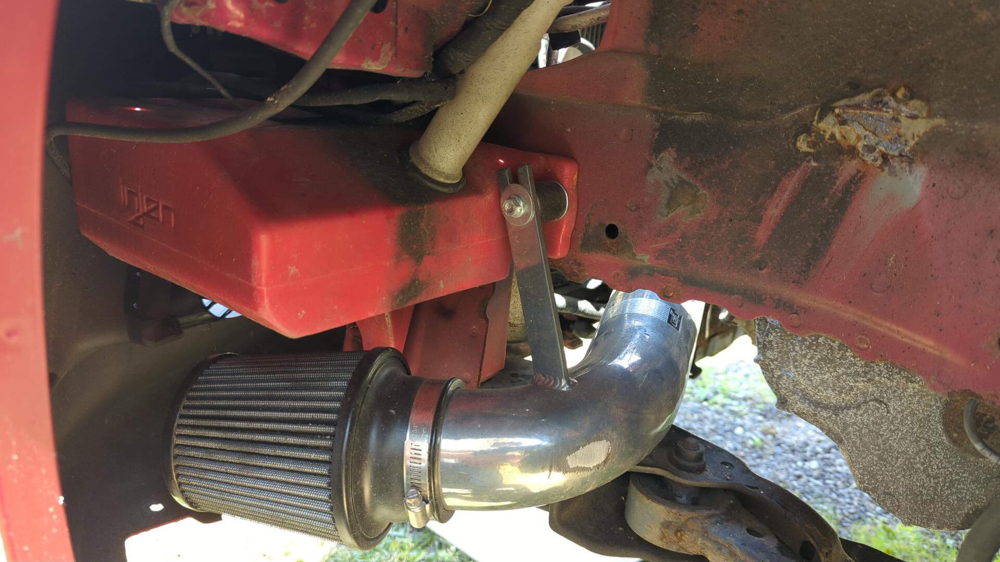
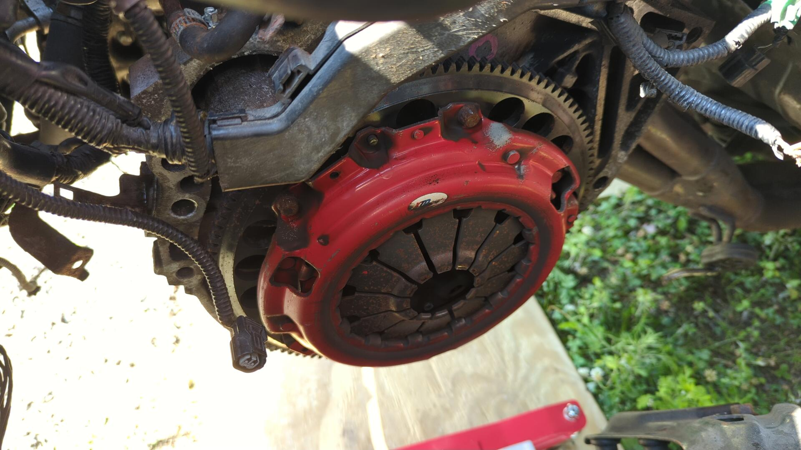
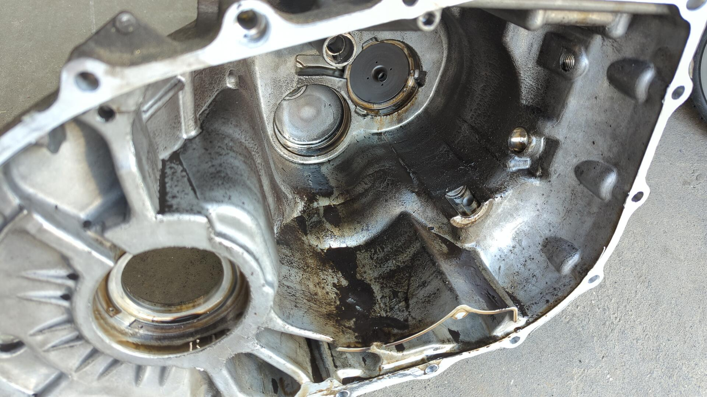
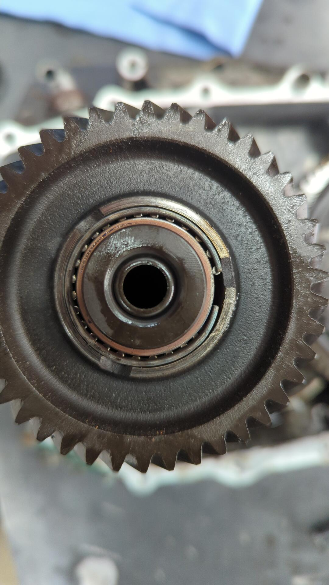
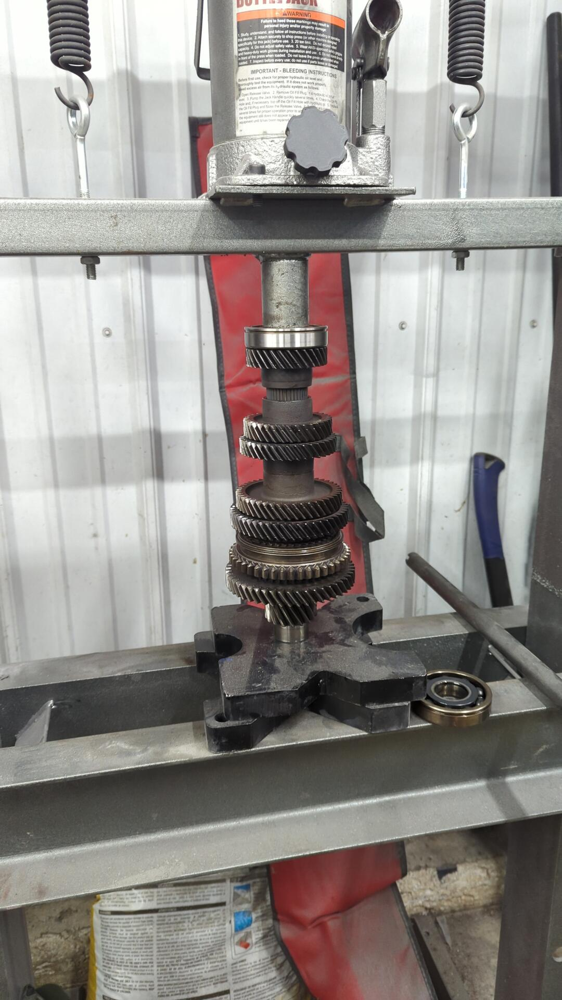

About a month back I was staying at an AirBnB with some buddies for an autocross event when one of them casually mentioned they had a friend with a broken down RSX type S sitting around and he was looking to sell it.

No one really knew what was wrong with it, but about a year ago it randomly locked up the front wheels while the owner was driving it. Ever since then the car has refused to move as if it's stuck between gears.

I wasn't actually in the market for another car but it felt like too good of an opportunity to pass up and a week later it was sitting in my ~~driveway~~ yard.

She's a little rough on the edges with a gutted rear interior, and 318k on the clock but for the most part it all checks out. It's got the typical rust in the back quarters and some more under the hood.

The driver door took a hard thunk at some point.

And the driver fender has paint cracking from a bad repair.

But it already has some nice mods like being lowered on Function & Form Type 1 coil overs. I _believe_ the spring rates are 8k front, and 10k rear which is basically perfect for autocross.

# Let's See Why The Transmissions Locked Up

My first idea for the RSX was to part it out and use it as a donor car for K-swapping my [EG hatch]() but after looking it over I think it can still be made road worthy and have some fun auto crossing it. I'm also not looking to K-swap my EG anytime soon (maybe in 3-4 years) so even if I did use it as a donor it'd just sit in my yard until then.

Before I could make any solid plans with it I needed to figure out what was going on inside the transmission. Right now the RSX won't move and if you try and shift it in gear and let the clutch out it just stalls. From what I could tell, the engagement of the clutch feels good and based on how the front wheels locked while driving I didn't expect I'd get lucky and find a bad clutch.

After getting the car up on jack stands I drained the transmission to see if it was full of glitter or metal bits but instead I found almost nothing.

That's all the fluid that came out of the transmission. There was maybe 3-4 ounces in it when OE spec is 1.8qts. Not good.

Armed with my PB blaster and a print out of some FSM pages I began pulling the transmission.

This is my first K series car so it was a nice treat unhooking the shifter linkage from atop the transmission instead of trying to press out the bitch pin that B series transmissions have.

## Missing Some Bolts

Whoever had the transmission out last saved me some time by skimping on some of the bolts.

The rear trans bracket was missing both lower bolts.

And the bottom two transmission bolts as well.

Not to mention that the flywheel inspection cover was missing.

## Subframe Is Out And The Transmission Is Free

After a few hours of wrenching I was able to get the subframe dropped and freed the transmission from the engine. For the most part this went fairly easy other than a couple stuck bolts.

### Found Some Cool Go Fast Parts

As I was pulling parts I couldn't help but notice the RSX already has some pretty cool things on it. It's got Hasport engine mounts.

An Injen cold air intake / washer reservoir.

An Ebay brand clutch. (Okay maybe not cool)

And even a Skunk2 header + exhaust system.

The exhaust is super loud and missing it's cat so I'll need to address that.

## Cracking Into the Transmission

It's pretty easy to open up a K series trans and for the most part they feel very similar to B series stuff. You just need to remove the shifter mechanism, all of the bolts holding the halves together, a couple other misc bolts and finally remove the snap ring holding the countershaft in place.

Inside of the trans I found a lot of gritty residue but nothing really looked off.

The gears themselves even looked okay but the shafts still wouldn't spin regardless of what gear I shifted it into.

It wasn't until I looked at the needle bearing inside of 6th gear that I figured out what was wrong.

That gap in the bearing isn't suppose to be there.

### It Just Keeps Getting Worse

Prior to opening up the transmission I was hoping that whatever was wrong inside of it wouldn't be that expensive to fix. I had been hoping for something silly like bent shift forks or a malfunctioning shifter mechanism causing the transmission to be stuck between gears.

A failed bearing on the mainshaft is pretty bad but on the plus side it looks like the countershaft escaped.

I decided to start popping gears off the mainshaft to see what could be salvaged. Normally this is suppose to be easy since the mainshaft gears just slide on but mine were completely stuck and I had to break out a gear puller to remove 6th.

Welp, that explains why it was so stuck.

Nothing looked off with 5th but just like 6th it was stuck in place. I tried using my puller again but this time I ended up snapping a huge chunk off 5th destroying the gear lol. The collar sitting just above the gear was so stuck I had to use a carbide burr to grind a notch in it until I was able to crack it free.

The bearing inside of 5th was even worse than 6th and feel apart into multiple pieces once the gear was removed. On a positive note 4th and 3rd slide right off although their bearings were smoked too.

This is not at all what your parts pile should look like when tearing down a transmission.

At this point I figured it'd be smarter for me to source a whole new mainshaft instead of trying to source the individual pieces (6th gear, 5th gear, all new bearings, synchros, etc...)

## Starting The Rebuild With A Quick Paint Job

If I was gonna put this much time and effort into rebuilding the transmission I wanted to make sure it looked the part. I've still got a couple cans of engine enamel laying around so after a good scrubbing to clean the inside of the housings out and a quick blasting on the exteriors (no picture sorry) the housing was ready for a fresh coat of paint.

Much better!

## Replacing The Main Shaft and Every Bearing

It took some digging but I was able to source a complete known good mainshaft for the RSX. The new mainshaft is actually from an 02-04 RSX and there are some variances between the 02-04 RSX transmission and the 05-06 RSX transmission but the mainshaft can be swapped without issue. (FD is different in the later years but that only effects the countershaft)

I also picked up new (mostly) OEM bearings and seals for the rebuild.

**Bearing Part Numbers:**

- Main shaft upper: 91002-RAS-003
- Mainshaft lower: 91001-PPP-005
- Countershaft upper: 91004-PP-014
- Counter shaft lower: 91003-PPP-004
- Differential bearings (not oem): NTN 6208

I made sure to clean out every nook and cranny of the housings to so no blasting media or old debris was left behind.

New mainshaft bearing, along with input shaft bearing and seal installed

New countershaft bearing being pressed on. The countershaft bearing is held in place by a left-handed bolt so you have to remember the good old lefty-tighty righty-loosey when removing it.

New differential bearings installed and diff back in place.

Both shafts, shift forks, and reverse selector mechanism installed. Make sure you don't install the reverse selector gear upside down!

It looks so much better.

Getting the housing closed up was actually a pain. I had a lot of trouble getting the three shift forks and shafts to pop into place while racing against the clock (the RTV on the seal was curing pretty quick). Worst of all the first time I closed it up I forgot to install the plastic oil tray and had to re-open the transmission and redo it all over.

Skipping ahead some steps here's the transmission all re-assembled.

It would have been cool to buy new bolts but that would have blown up my budget so rusty ones are good enough.

## Back In The RSX

I forgot to take pictures of popping it back into the RSX but it was basically the reverse of tearing it down.

I can happily report that the RSX shifts into gears like normal again and I was even able to move the car around in my driveway without issue. Up until now it hasn't been able to move under it's own power for almost a year!

Next steps are to work on getting it road legal. The car is behind on maintenance and will need brakes, front lower ball joints, tie rods, a catalytic converter, and a vacuum leak fixed at a minimum so this could take some effort. Stay tuned.
