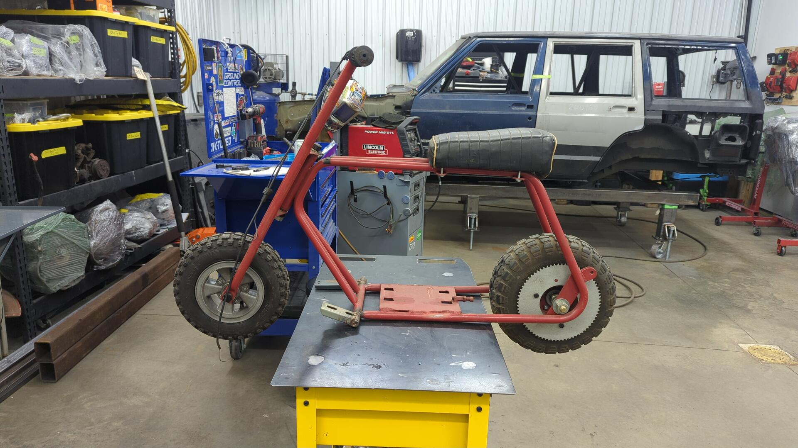
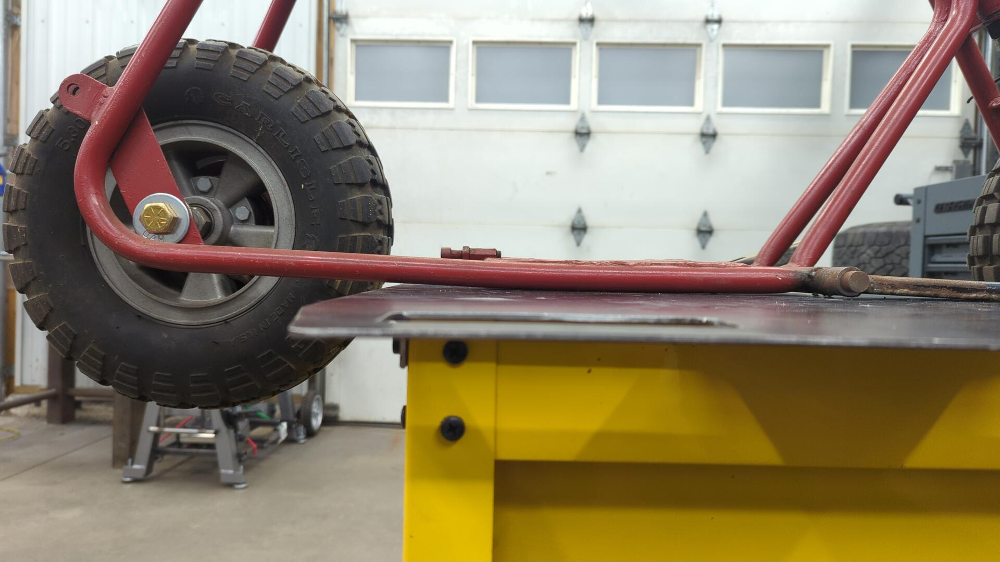
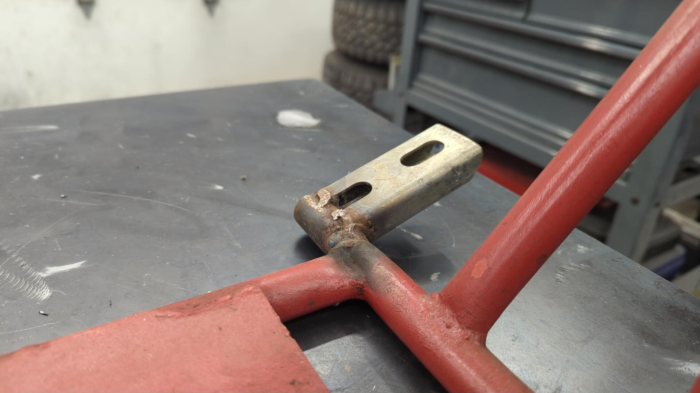
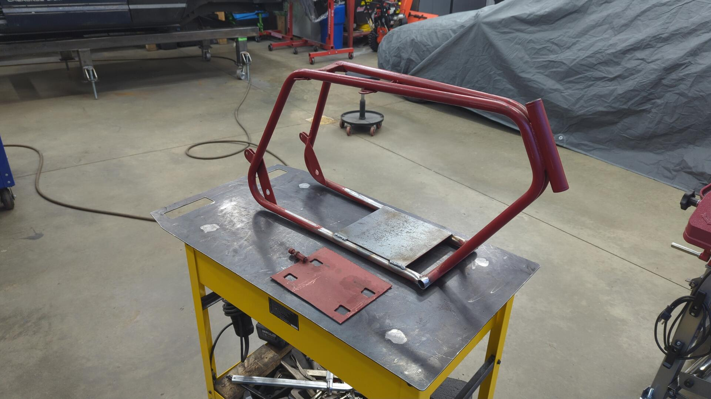
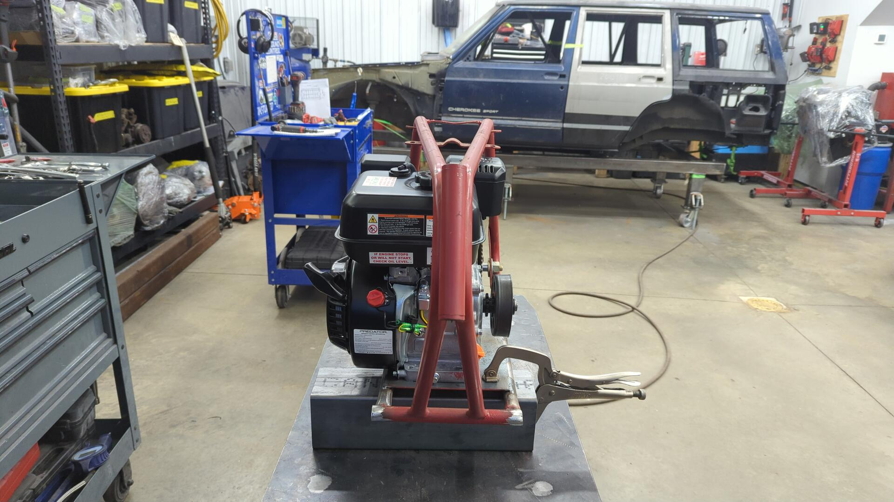
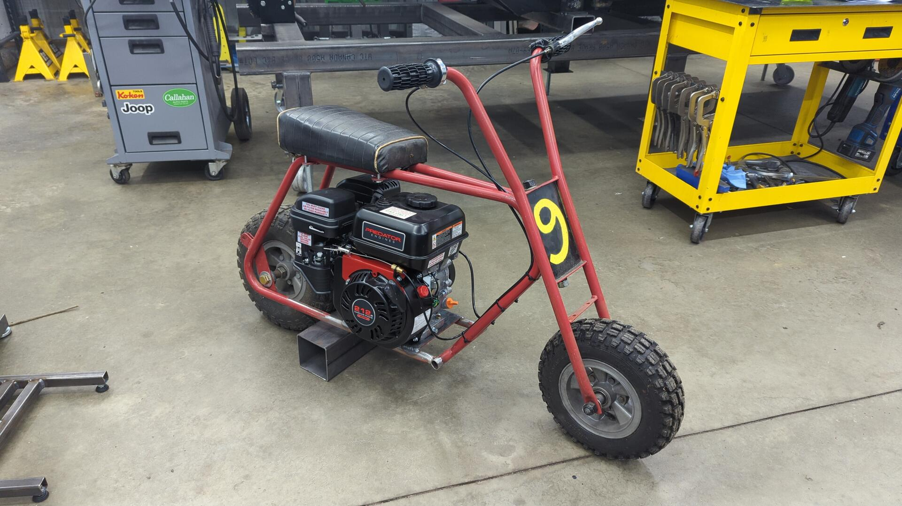
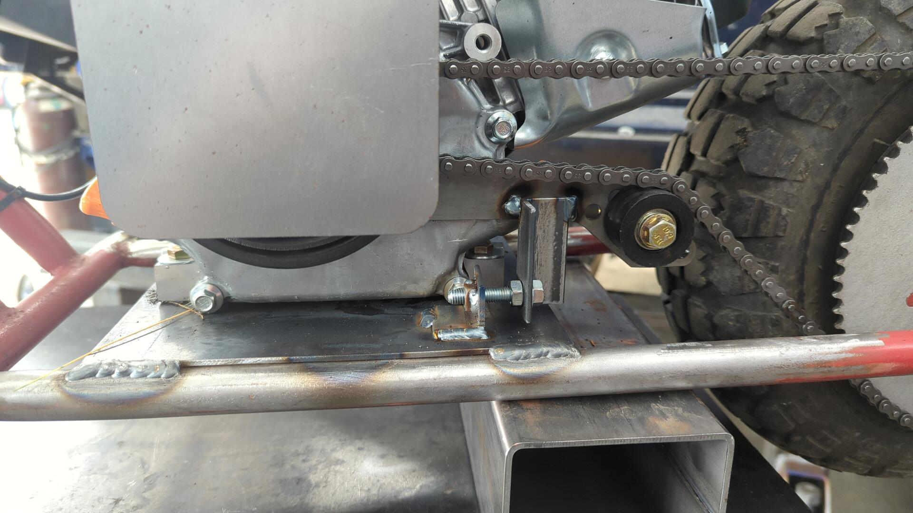
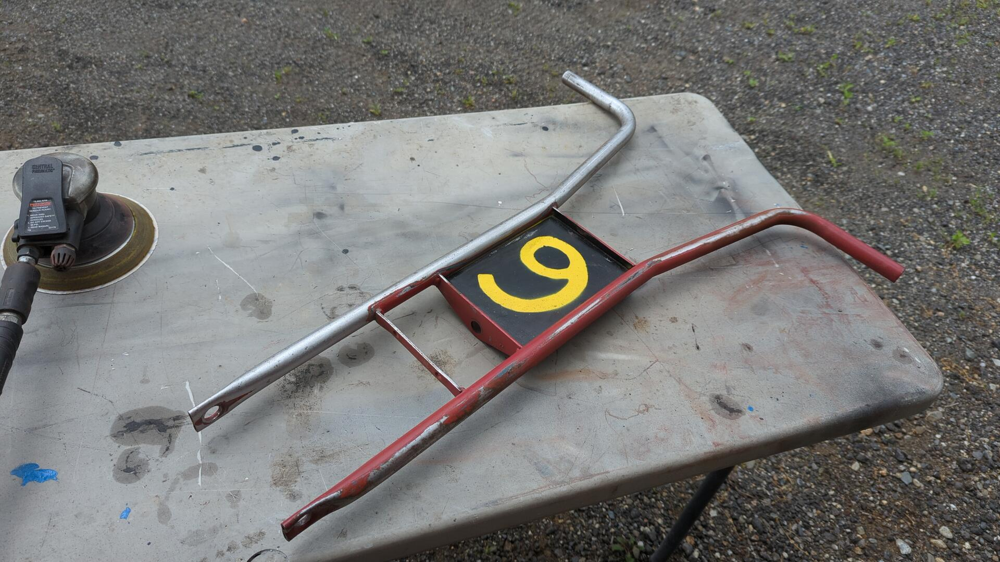

At some of the larger autocross venues I go to it can be a pain to walk around on foot because of how long it takes you to get from point A to B. To get around faster people usually bring an assortment of transporation mechanisms such as bicycles, e-bikes, drift trikes, or even ATVs to get around.

I had been wanting something for myself and back in May I found the perfect solution for my needs: a vintage mini bike.

The seller didn't know much about it but I'm pretty certain it's an Arco from the late 60s / early 70s with trailhorse wheels. The bike itself is missing too many original parts (no scrub brake, no original seat brackets, no foot pegs) to be a good candidate for a full restoration so I don't feel too bad about mucking it up with custom bits.

It came with a blown flathead motor, dry rotted tires, and was missing some bit, but the frame was decent enough and I considered it to be the perfect starting point for a build.

Since most of the parts were worn out or broken, the only bits I planned on keeping were the frame, the fork, the wheels, and the bolts they came with. The flathead motor could be rebuilt but I'm not interested in keeping it period correct and with how cheap Predator motors are I figured I'd save time and money by swapping a new motor vs rebuilding the old one. My Dad is going to take the old motor so it won't go to waste.

The frame itself would need some work because the engine plate had a couple cracked welds and the bolt holes for the engine had been opened up too big. I figured I'd cut off the old plate and make a new one out of 1/8" steel.

Not much of the frame is straight anymore but I don't mind. This thing is ~60 years old and was never intended to last this long nor for adult use.

The previous owner had been working on converting it to a foot brake before he decided to sell it. I plan on returning it back to a hand brake.

## Engine Swap Time

I wasn't sure how big of a motor to put on the bike but since Harbor Freight sells a 79cc engine and a 212cc engine for similar prices I figured I should go with the bigger one because a motor that's too fast is a better problem to have than a motor that's too slow.

One thing I didn't take into account was how big the motor would be. Thankfully it fits.

One last look at the old motor plate.

All gone. The angle is a brace I welded on prior to cutting out the plate because I was worried the frame could shift.

New plate welded in. It's a piece of 1/8" steel that I cut to 8"x8-5/8". It's secured via 4 welds on the top and 2 on the bottom. Of course the hidden welds on the bottom look the best and the top are kinda sloppy.

Figuring out how to position the motor was interesting. I didn't have a reference for how the old motor was positioned so I mainly focused on ensuring that the rear wheel sprocket and engine clutch were parallel so the chain would be happy.

Even with the clutch flipped around the engine sits off to the passenger side.

Once I was happy with the position I drilled four holes and used 5/16-24 1-1/2" bolts and lock nuts to secure it.

## Test Fitting Everything Before Paint

Since I was going custom I decided to finish assembling the bike with everything that way I know it'd all fit and worked before I painted it.

I forgot to take any assembly pictures so here's the bike all bolted together.

### Parts List

| Part                       | Link                                                                                                                      |
| -------------------------- | ------------------------------------------------------------------------------------------------------------------------- |
| Band brake kit             | https://www.ombwarehouse.com/centrifugal-clutch-band-brake-and-brake-lever-kit.html                                       |
| Brake lever                | https://www.ombwarehouse.com/7-8-brake-lever-black.html                                                                   |
| Chain tensioner            | https://www.ombwarehouse.com/mini-bike-chain-tensioner-adjuster-for-212-224-236-196-small-block-gx160-gx200-tecumseh.html |
| Clutch                     | https://www.ombwarehouse.com/clutch-35-12-tooth-3-4.html                                                                  |
| Throttle linkage kit       | https://www.ombwarehouse.com/mini-bike-parts/predator-212cc-mini-bike-amp-go-kart-throttle-linkage.html                   |
| Handle throttle with cable | https://www.ombwarehouse.com/7-8-throttle-assembly-53-cable-3-conduit-clips.html                                          |
| Foot peg covers            | https://www.ombwarehouse.com/3-4-black-grips-pair.html                                                                    |
| Front tire                 | https://www.ombwarehouse.com/410-350-x-6-universal.html                                                                   |
| Front tire tube            | https://www.ombwarehouse.com/410-x-350-x-6-l-stem.html                                                                    |
| Rear tire                  | https://www.ombwarehouse.com/530-450-x-6-universal-tire-4-ply-5_3-wide-14_7-od.html                                       |
| Rear tire tube             | https://www.ombwarehouse.com/410-x-350-x-6-l-stem.html                                                                    |
| Kick stand                 | https://www.ombwarehouse.com/kick-stand-and-bracket.html                                                                  |

**Notes**

- I didn't actually buy the brake kit linked. The previous owner did and I swapped the brake lever for a different one.
- My wheels are vintage split wheels that require tubes. Modern wheels don't use them.
- I omitted the Predator 212 from the list.

While the bike was still missing foot pegs I couldn't resist taking it for a test drive. The thing is a blast!

The 212 is definitely more motor than the bike needs and with a 12T/72T gear combo it's got a ton of low end torque. It'll spin the rear tire like nothing and wants to do wheelies. I'll probably tame it down a bit by changing the gear ratio to be more top speed oriented at some point.

I wasn't able to source any 7/8" tube locally but I was able to find some 3/4" tube so I used that to make foot pegs.

Each foot peg has a solid part that slides into the existing frame and was then plug welded in two spots for extra strength.

## Improving the Chain Tensioner

The aftermarket chain tensioner I bought was struggling to keep the chain tensioned and each time I took the bike on a short test drive the chain would come loose and even fell off once.

Maybe I just wasn't tightening the bolts into the engine enough but I decided to try and improve it by adding an additional bolt that'd attach to the motor plate. I figured this would be a more reliable setup and can confirm that the chain stayed tight after several additional test drives.

## Paint!

The paint that was on the frame / fork looked alright from a distance but it was rolled on with a roller and I wanted to redo it. I considered a couple different options like keeping the bike red, or maybe a blue, but eventually settled on yellow.

Prior to painting it I stripped the frame / fork down to metal just incase the new paint ever got chipped I didn't want the red to show through. This ended up taking about 3 - 4 hours because underneath the red there was several additional coats of paint. The frame had been painted two different shades of blue at some point and the fork had a mix of green, blue, and black hidden beneath the red.

A couple coats of primer and Rustoleum sunburst yellow later.

## All Done For Now

After giving the paint a couple days to harden up I was able to re-assemble the bike and call it officially "done". Done is in quotes because I'll probably mod it in the future but I figured I'd start off simple and get the bike going before going too crazy with it.

I also replaced the wheels / tubes since the tires looked crazy old.

All in all I'm super happy with it. It's a hoot to ride and I estimate the bike weights about ~50 lbs so it's easy to transport.
