Something I've been wanting for a long time is a bead roller so I can make my patch panels look more authentic.

But I always had my standards set really high and thought I needed a high end motorized bead roller that can do up to 36". I finally came to my senses and realized a budget 18" unit would be far more than sufficient for my needs given I'm usually making small patches.

I ended up settling on the Woodward Fab 18" bead roller.

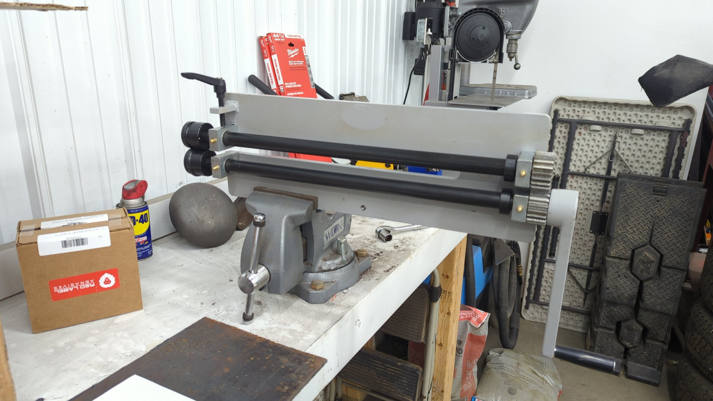

This model seems to be pretty generic and is available in multiple colors depending on the brand you buy it from. I actually see that as a benefit though because it mean the upgrades each manufacturer sells for it should be fully compatible.

While rolling a test piece I noticed that it struggled to work with 18ga steel even though it was advertised for this so the first thing I set out to do was beef up the body of it.

Using some scrap 1/4 I had laying around, I cut two braces using my trusty angle grinder.
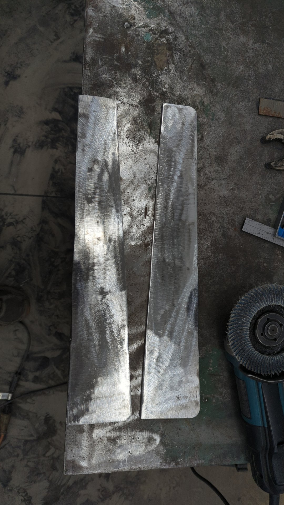

And with a bit of work using a flap disc I was able to grind off all the OEM powder coat.
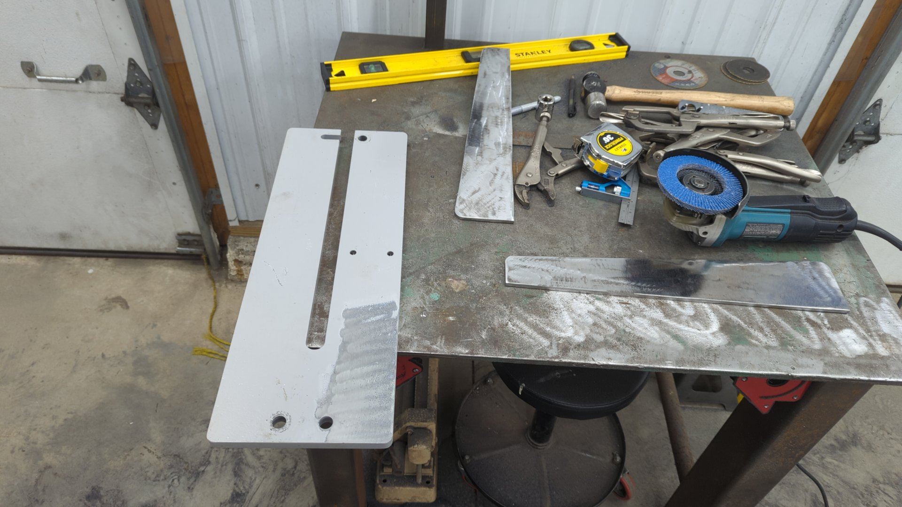

A few welds later and the bead roller was looking pretty solid. My welds are a hair on the cold side because my little Lincoln 140 just didn't have the power it needed. The Lincoln 140c power mig is only rated for up to 1/8" steel so this was absolutely maxing it out. I will say though it did pretty respectable for it's size.
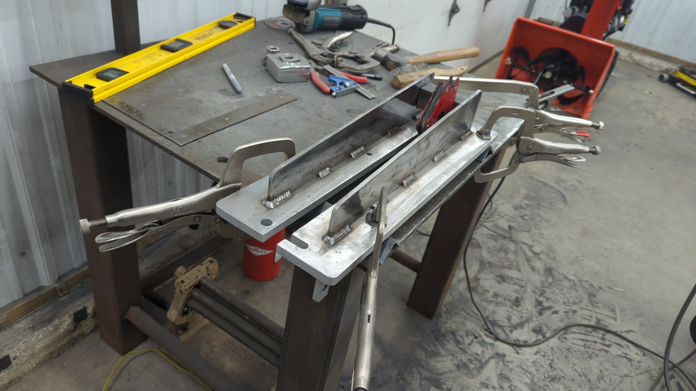
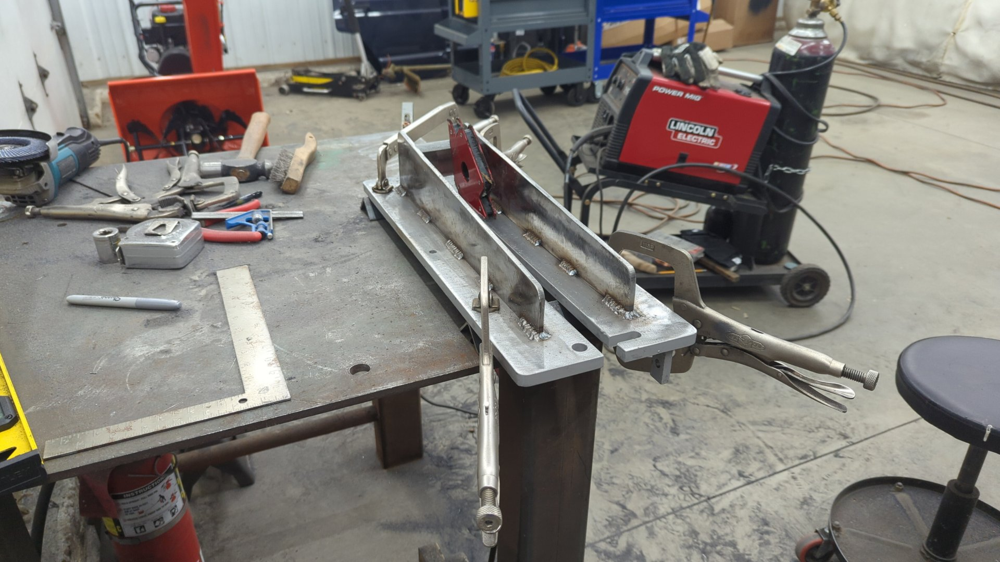
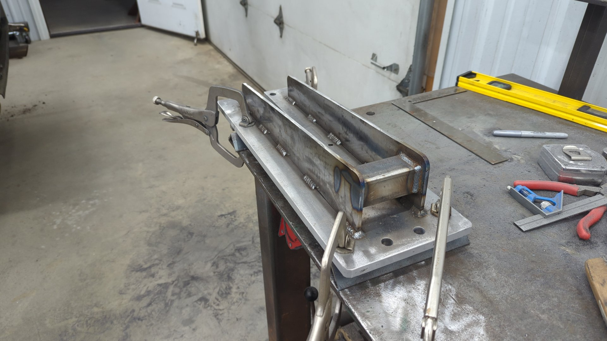

# Painting it up

Once all the welding was done I opted to pretty it up using some Rustoleum hammer finish spray paint. I've been having trouble mastering the hammered finish spray paint so my coat is a little inconsistent, but I'm not too worried about looks. I only really painted it to prevent it from rusting.

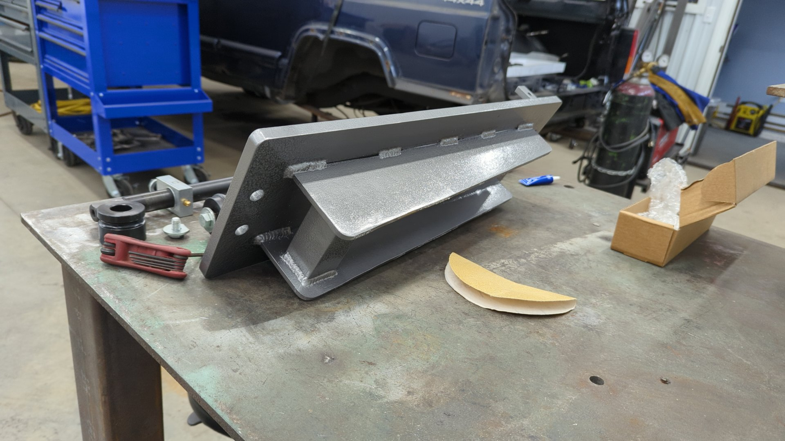

I splurged and upgraded the handle to Eastwood's 4 spoke model to make the unit a little more user friendly.

# Building a Mount for It

I've never been a big fan of mounting equipment in my vise because it means I can't use the vise for other things, so I decided to try a different approach. I didn't want to build a stand for the bead roller because I felt it would take up too much space that way, and realized the most efficient setup would be one that I could re-use for multiple pieces of equipment.

I ended up settling on a hitch receiver based setup that'd let me swap equipment on the fly.

Like always, I forgot to take a photo of the in progress work, but I ended up welding a 2" hitch receiver into my welding table.

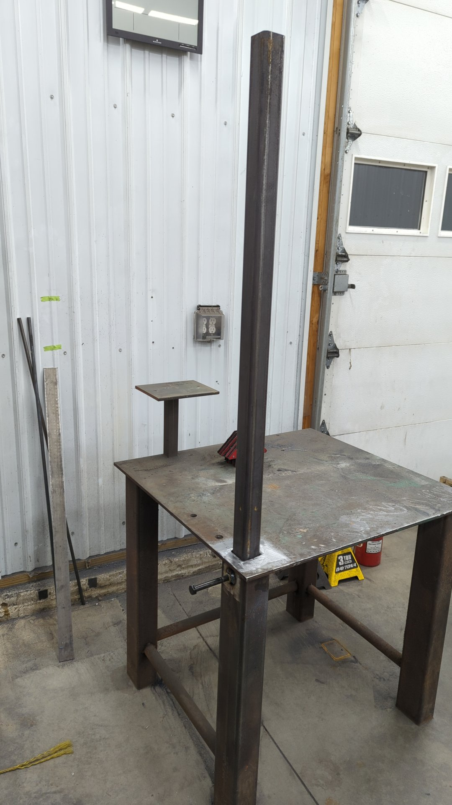

I made a heavy duty wing nut so I can hand tighten things.

At this point, all that was left was to make a mount for the bead roller. This was pretty easy to do and only required some 2" square tube and 3/16 plate.

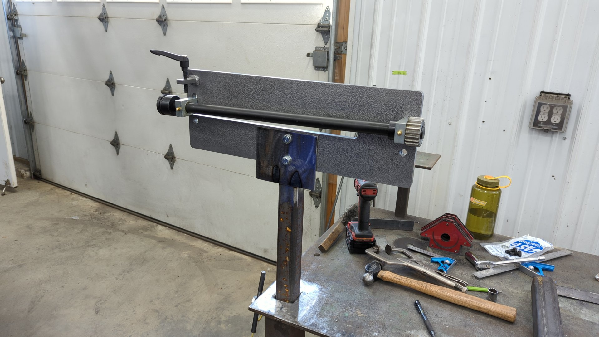

A bit of paint later and you can't even tell that it didn't come with the bead roller.
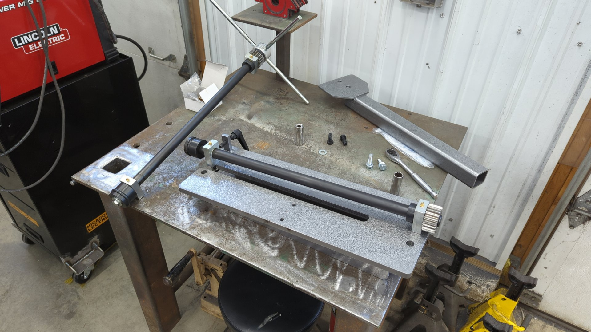

Overall, I'm supper happy with the results. I've been wanting a bead roller for a long time, and while this unit is pretty basic it's absolutely perfect for my needs. I like how it didn't break my budget, and also doesn't take up a lot of space. I ended up splurging and buying Eastwood's fab die set so I've got about 12 different dies to use now.

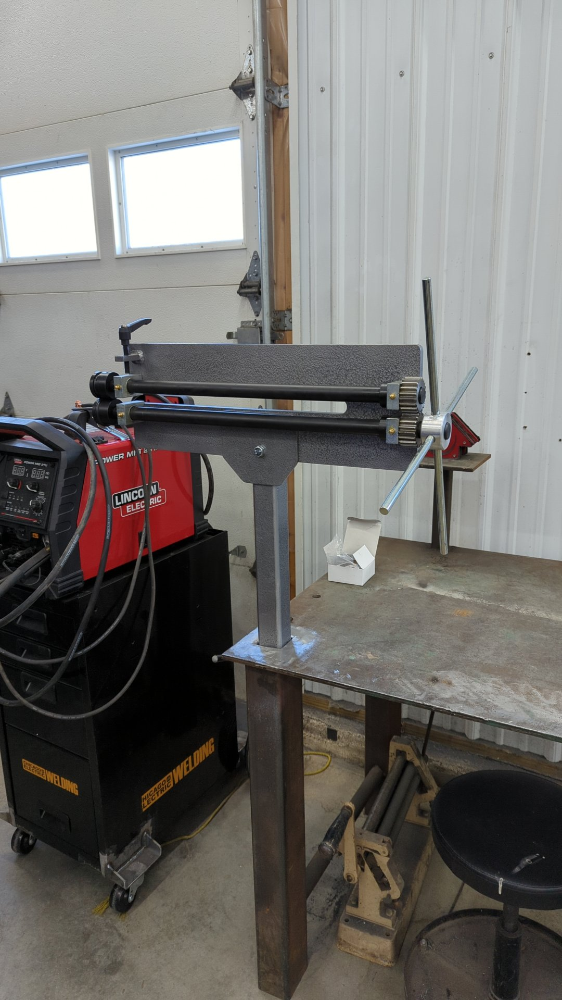

So far I've only used the bead roller on one piece for my Jeep.

