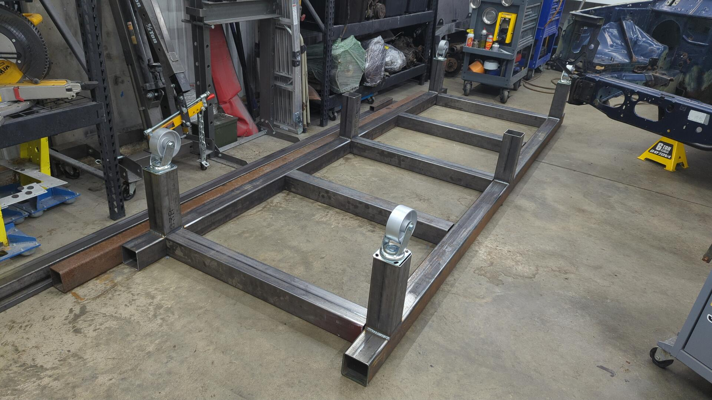
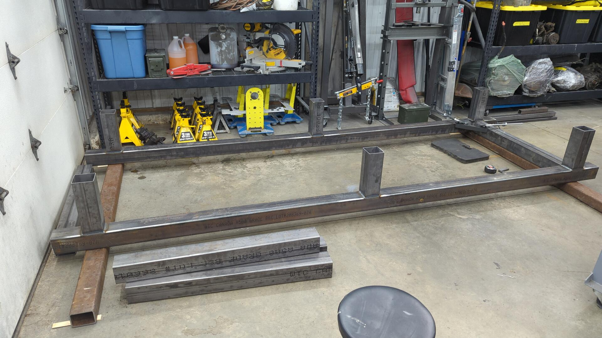
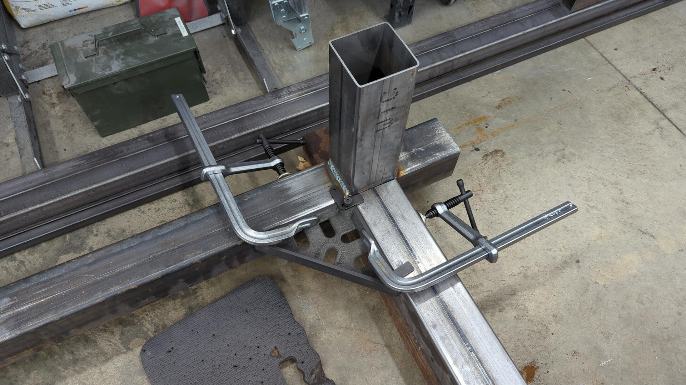
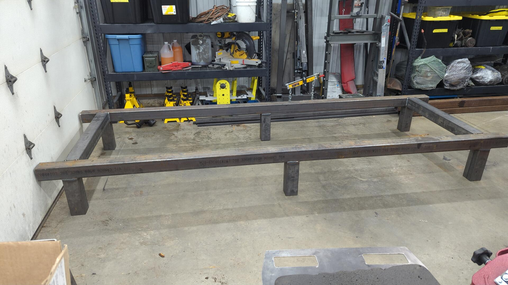
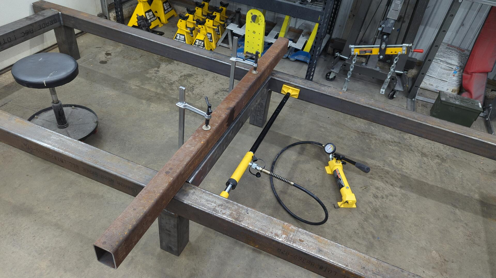
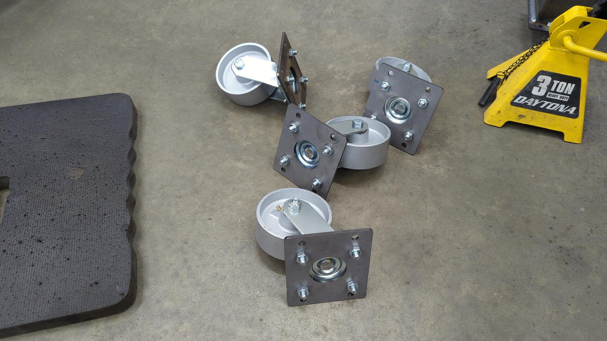
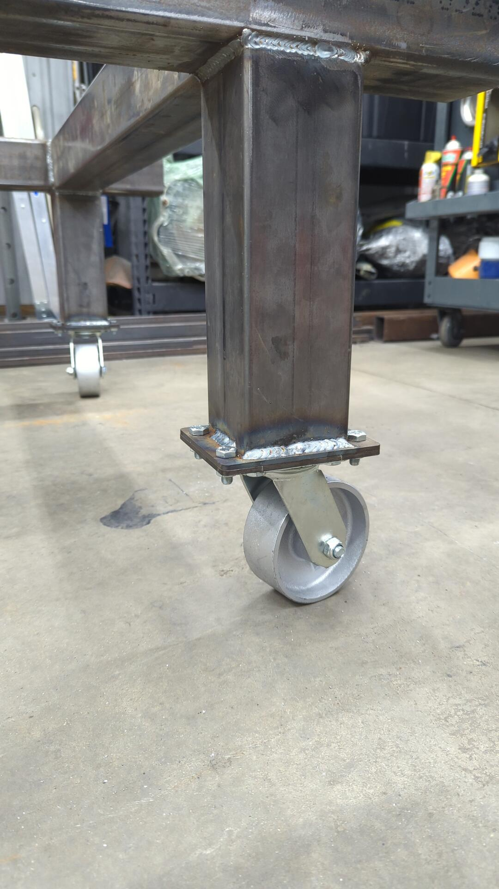
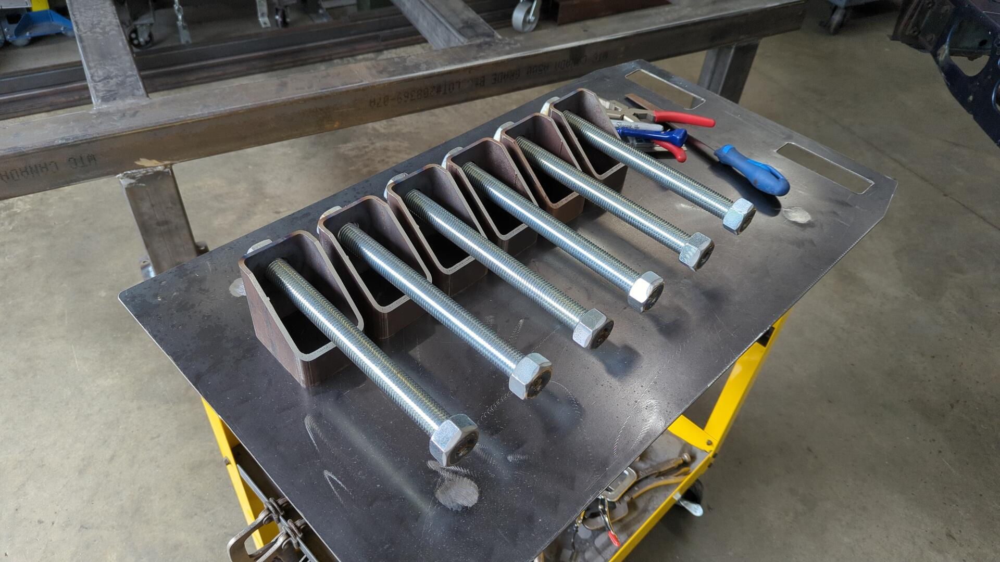
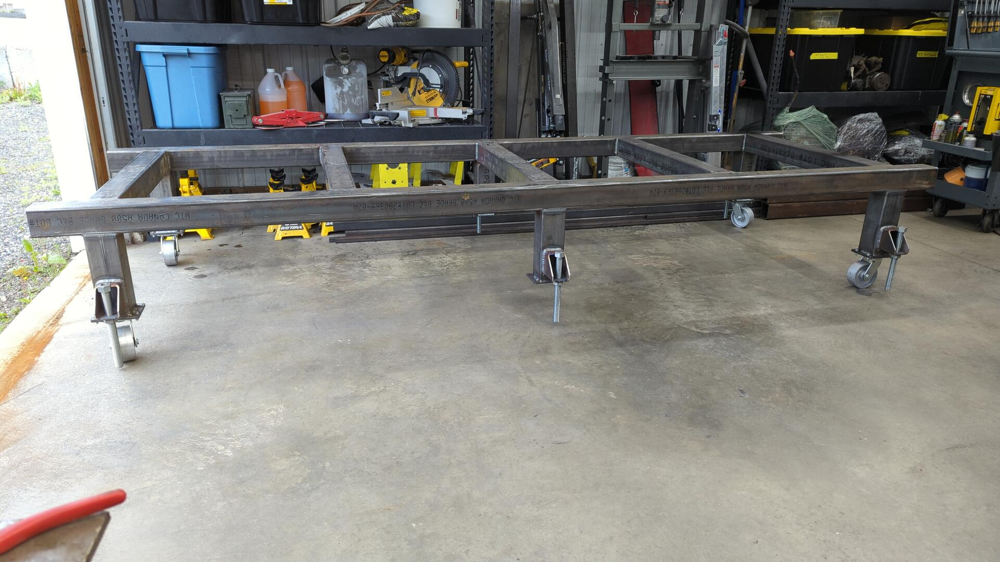

I recently built a chassis table for [the XJ I'm restoring]() and figured I'd do a brief writeup. I've never built a chassis table before and from researching them online I quickly learned there's no one size fits all solution. 

I wasn't 100% sure what I wanted the table to look like but I knew:
- It needed to be reasonable sized yet not too bulky
- It shouldn't block me from being to be able to weld underneath the XJ
- It can't be too tall otherwise how would I get the XJ on it (I don't have a lift)
- It needs to be re-purposed later on so I don't have a specialized table taking up precious shop space when I'm done
- My budget was $1,500

Of those requirements, the budget and ensuring the table could be re-purposed were the most important ones. Once the XJ is done and comes off the table I don't want the table just sitting around taking up space so I figured if I could design it to be converted into something like a massive work bench after I'm done that'd make it easier to justify the cost.

Doodling in FreeCAD I came up with a rough idea of what I wanted to build.

Specs:
- 12' long
- 4' wide
- (4) 5" casters
- 6 threaded leveling feet
- 4x4 3/16 tube for the sides
- 4x4 1/8" tube for cross members / legs

The XJ itself is roughly 14' long but I opted for a 12' long table because I don't mind if the front / rear of the XJ overhang by a bit, and also because it'd save on cost. The local steel distributor sells square tube in 24' lengths and by going with 12' I could cut one full length tube in half and use it for both sides. Otherwise if the table was any longer I'd have to buy 2 full length cuts and then I'd have scrap.

The table is only 4' wide because that'll make it easier to repurpose later on if I want to add a top to it. 4' is also just about the max width that fits between the wheels of the XJ which means I could install the axles and wheels while the XJ was on the table if needed. This may make it easier to remove the XJ off the table when the time comes.

I'm using 4x4 tube because it offers a lot of top surface area for welding jigs as necessary but also because it'll be strong. (most likely overkill for my application)

Each of the 6 legs has an adjustable leveling foot that I'll use to get the table level front to back and side to side. I want to be able to take measurements off the table while working on the XJ and my shop floor isn't flat.

Lastly, each leg will have a mounting plate that will allow me to add leg extensions to later on so I can raise the table and turn it into a workbench. 

With everything roughly planned out I put in an order for some steel.

Not all of that steel is for the table as some of the smaller stuff is going to be used for bracing the XJ unibody and making jigs.

The 4x4 tubes are for the table. They are:
- (2) 12' cuts of 4x4 3/16 steel tube
- (2) 12' cuts of 4x4 1/8 steel tube

Then I took the 1/8" thick tubes and cut each as follows:
- 40", 40", 40", 12", 12"
- 40", 40", 12", 12", 12", 12"

A bit of welding later and I had the legs done.

Mock up to see what the table would look like.

My floor isn't flat so I shimmed out two steel tubes to be perfectly level so I could weld up the table.

A square and some clamps came in super handy for ensuring the beams were perpendicular.

Once I got the outermost crossmembers tacked up I lifted the table up so I could start welding them.

At this point the table was getting too heavy to flip so I set it up right so I could continue welding in the cross members.

For some reason the sides bowed in a bit and the crossmembers wouldn't fit anymore so I used my hydraulic ram to push them outwards.

Inner crossmembers were tacked in and then welded up.

I decided to try something new and designed some brackets in CAD to have SendCutSend make for me. The price was reasonable and it saved me a lot of fabrication time.

Plates were mounted up to the casters using m10x1.25x25 bolts / nuts. The casters are Vestil 5" swivels (part #: CST-VE-5X2CI-S)

The other brackets were welded to the table legs and then the wheels were bolted up.

For the leveling feet I made them out of some 3x4 tube, 1" threaded rod and nuts. 1" bolts are pretty expensive so I figured by cutting down threaded rod and welding a nut to the end would be cheaper.

Leveling feet welded up. There's enough room for the wheel to fully rotate without hitting the threaded rod.

All done.

Lastly I made a small mount for a hand winch so I could pull the XJ up with it.

A bit of pulling later and the XJ was up on the table.

I still need to make proper jigs for holding up the XJ and I'm also likely going to weld some hooks on the table to make for attaching straps to as needed but the table is mostly done for now.

All in all I'm pretty happy with the table. Total cost came in around $1300 which was $200 less than my goal of $1500 and the table is nice and beefy.