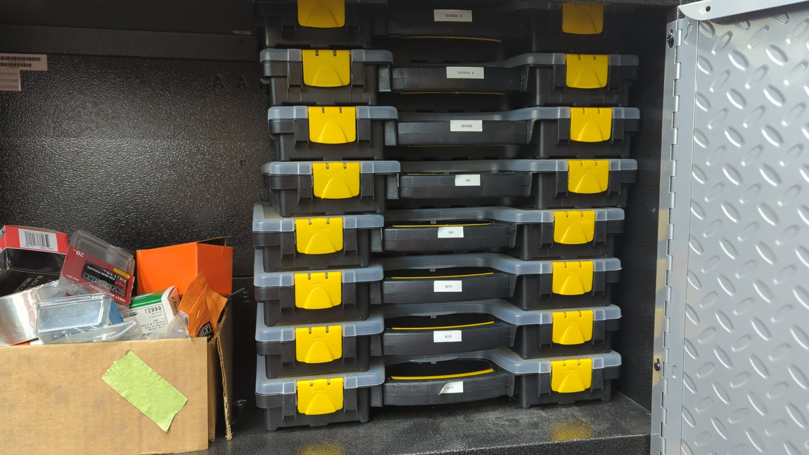
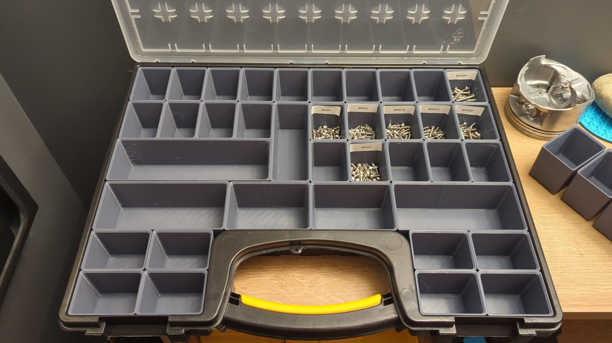
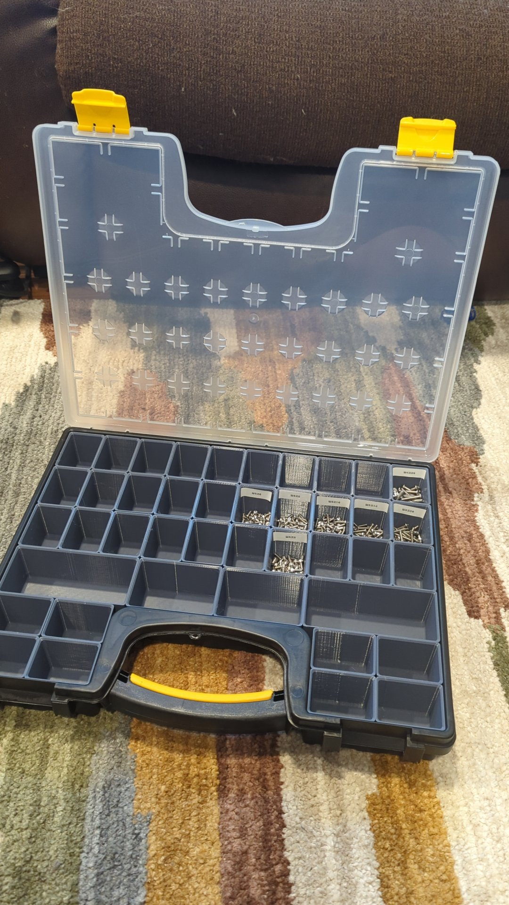

I've got a growing collection of nuts and bolts and started using the [20 bin storage cases (SKU: 93928)](https://www.harborfreight.com/20-bin-medium-portable-parts-storage-case-93928.html) that Harbor Freight sells to keep them all organized.

The bins work great for all my larger hardware such as some of my Honda bolts:

But as I collect more and more tiny m3 / m4 hardware for 3d printing projects I've found the assortment of bins they come with to be too many of the big bins and not enough of the smaller ones. Harbor Freight doesn't sell any replacement bins so the only real options you have are to buy more of the cases to pillage bins from or make your own.

Thankfully though 3d printers are great at solving problems (including ones they cause) so I couldn't resist taking the opportunity to design my own replacements bins.

I went a little overboard and ended up making 12 different sizes. 3 of them match the OEM sizes and the other 9 are custom.

The replacement bins work just like the original bins and slide right into place. They've even got tiny little feet to help center them like the originals.

Here's a couple of the smaller sizes

You can fit up to 46 of the tiny bins in one case. (Technically 48 but two of the spots don't work unless you grind off one of the bin's legs as the case is missing the feet indents)

These bins should also work with the [15 bin case variant](https://www.harborfreight.com/15-bin-small-portable-parts-storage-case-64811.html).

[For anyone with a 3D printer that's interested in making some bins for themselves the stls are available on my Github.](https://github.com/EddieAbbondanzio/3d-prints/tree/main/hf-15-20-bin-storage-case-replacement-bins)

My Ender 3 V3 SE was able to print these without much trouble.
