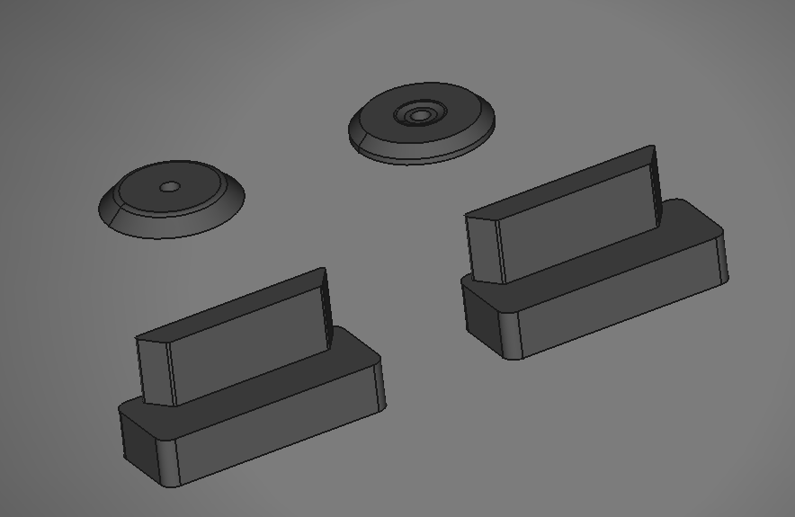

I don't need to lock my tool carts and wanted to free up some of the space used by the locking mechanism at the back of the toolbox so I decided to delete them. This was a fairly easy mod to do and only takes about 15 mins of labor once I had designed and 3d printed out the plugs.

Before:

After:

This mod also makes it possible for you to open the lower drawers without having the lid open which is a cool plus.

# Parts List
- [3d printed plugs and lock cylinder cover](https://github.com/EddieAbbondanzio/3d-prints/tree/main/hf-30-5-cart-lid-lock-delete-mod/stls)
- (1) m3x10mm button head screw
- (1) m3 hex nut

# Steps

1. [Print out the 3d printed parts](https://github.com/EddieAbbondanzio/3d-prints/tree/main/hf-30-5-cart-lid-lock-delete-mod/stls). This will take about ~2h depending on your printer. I used PLA with 40% infill and 2.0mm walls.

2. Empty out the top of your toolbox. This is also probably a good time to give it a small clean up.

3. Drill out the rivets holding the locking mechanisms in place with a 3/16 drill bit. There's 4 rivets per side to remove. If you drill slowly you should be able to remove them without much damage to the box itself.

4. Pull the lock covers off.

5. Now open up every drawer about 2" (be careful not to open them too much or your cart may tip if it's loaded!) and then pull the locking mechanisms up and out of the cart.

6. Plop the new plugs into place. I noticed there was some variations in the locking mechanism between both of my carts (I have an early gen 2 and a late gen 2) so this may not work for gen 1 or gen 3 carts. The rear plugs were designed for the late gen 2 cart where the locking mechanism brace is trapezoid like but the plugs can still be used in early gen 2 carts by flipping them 180*.

7. **(Optional)** Cut out a new drawer liner to cover the plugs, and also install the lock cylinder delete if desired.

That's it! Now you just need to put all the tools you removed back.

This mod should also be reversible if you do decide to re-add the locks later on. You'll just need some small bolts to replace the drilled out rivets.

# References
- [I was inspired by some of the posts in the infamous Garage Journal thread of HF cart mods](https://www.garagejournal.com/forum/threads/modifications-to-the-hf-4-and-5-drawer-service-carts-what-changes-have-you-made.137365/page-79#post-7699557)