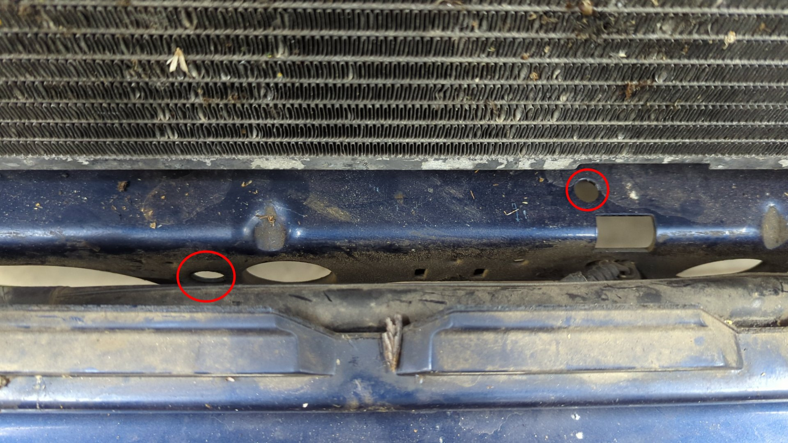
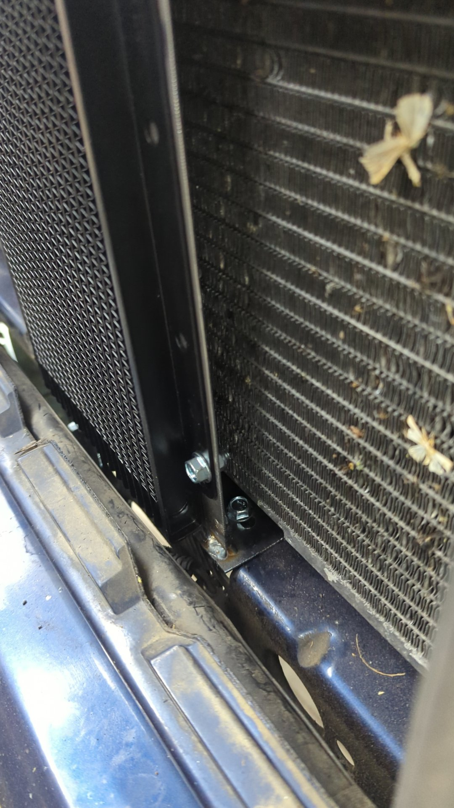
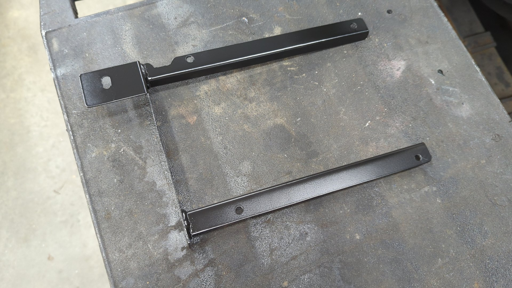
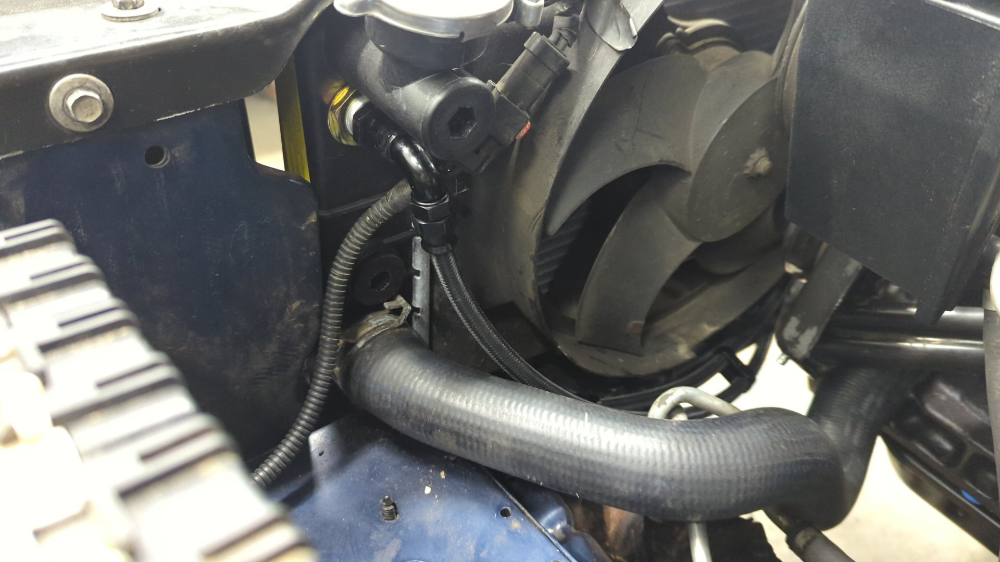
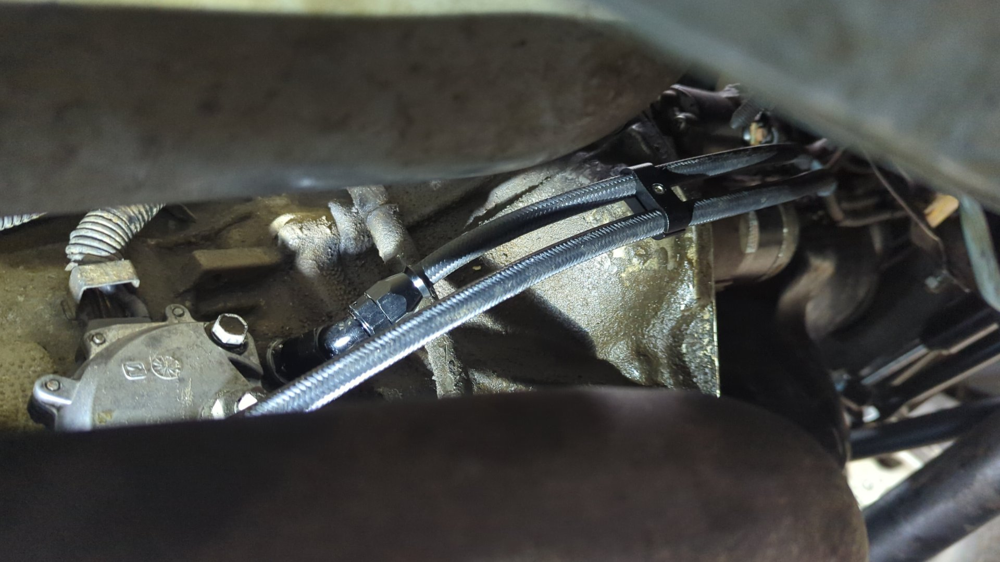
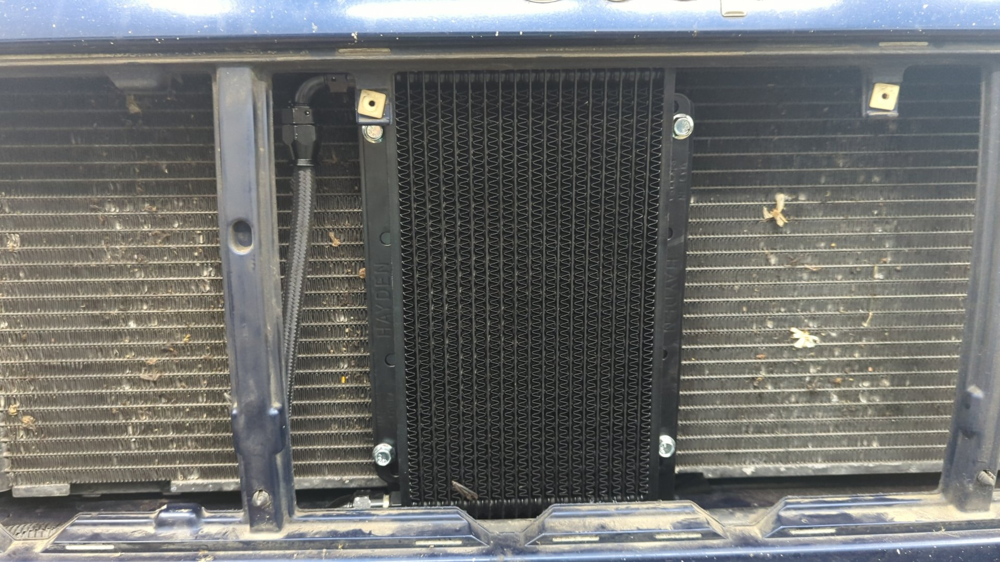
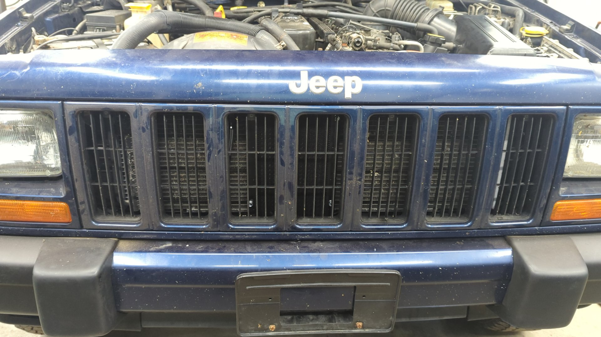

The OEM transmission lines on XJs can be difficult to work with due to their quick disconnect fittings, and the lines themselves are known to leak due to rusting out. Swapping out the OEM lines for AN lines isn't overly difficult, and it's easy to add a transmission cooler while you're doing the lines.

# How It Works

The AW4 transmission has an output line and an input line. The output line is the front most port, and the rearward port is for return.

On XJs without the tow package your output line will run from the transmission to the radiator, and then the return line will go from the radiator back to the transmission.

XJs with the tow package have a transmission cooler that sits in the middle of the return line like so:

**Note**: On 96 and older XJs the radiator lines are swapped with the output line of the trans going to the top port on the radiator, and the return line from the radiator coming out the bottom. (This is irrelevant though since we are making custom lines)

The transmission fluid runs through the radiator because it helps regulate the ATF by bringing it up to temp faster, and also pulling some of the heat out of it. A radiator is naturally hot though so it can only pull so much heat from the ATF which is why the tow package XJs have a trans cooler to help cool the fluid even more.

The goal for this upgrade is to replicate the OEM setup for tow package XJs with custom AN lines and a custom trans cooler to help keep trans fluid temps down.

# Parts

In terms of parts you'll need a bunch of AN6 fittings and some PTFE hose.

It's up to you on which trans cooler to use, but I picked the Hayden Rapid-Cool 687 because it already has AN6 outputs on it. It's a hair on the small side so you may want to look into a larger one if you're looking for a heavy duty setup.

| Quantity | Part                                     | Part #                | Description                                                    |
| -------- | ---------------------------------------- | --------------------- | -------------------------------------------------------------- |
| 1        | Transmission cooler                      | Hayden Rapid-Cool 687 |                                                                |
| 20       | 6AN PTFE hose                            | Vibrant 18976         |                                                                |
| 2        | 6AN to m14x1.5 adapter                   | Vibrant 10229         | Transmission port adapters                                     |
| 1        | 6AN to 5/8-18 inverted flare             | Russell 640380        | Top of radiator port adapter                                   |
| 1        | 6AN to 3/8" EFI quick disconnect adapter | Vibrant 16886         | Bottom of radiator quick disconnect adapter                    |
| 1        | 6an 45\* PTFE fittings                   | Vibrant 28406         | Transmission output (front port)                               |
| 3        | 6an 90\* PTFE fittings                   | Vibrant 28906         | Transmission return (rear port) / cooler input / cooler output |
| 1        | 10 pack of 6an P clamps                  | Vibrant 17192         | Secures lines to the oil pan                                   |
| 1        | 8 pack of 4AN hose separator clamps      | Any generic ones work |

**Notes**:

- 4AN separators are used because PTFE hose is thinner in diameter than regular AN hose.
- Vibrant sells a 6AN to 5/8-18 inverted flare adapter but you should avoid it. It's threads are too short and it'll leak no matter how tight you secure it.

# Mounting the Cooler

Some transmission cooler kits include these zip tie like mounts that allow you to mount the cooler to the radiator but I wasn't a fan them so I opted to make a bracket from some scrap metal I had.

To avoid having to drill any holes into the XJ I designed my bracket to use two existing holes.

The pieces of metal bent up.

Test mounting the cooler to the bracket.

Bracket welded up and secured with two m6x1.0x25 bolts + lock nuts.

Painted.

All done. The cooler is secured via 4 m6x1.0x16 bolts with lock nuts.

# Replacing the Lines

Removing the old lines isn't too bad as it's just a couple of fittings to disconnect although some of them are in fairly tight spots. Do your best to try and drain the lines before messing with them otherwise you'll spill ATF everywhere.

For the new setup you'll need to make 3 lines:

- Transmission output to lower radiator input
- Upper radiator output to lower cooler input
- Upper cooler output to

And if you've never made AN PTFE lines before (this was my first time) I found [this video](https://www.youtube.com/watch?v=HMj-ngf33zk) super helpful.

## Installed

It's up to you on how you'll route your lines but here's mine for reference. The main things to be cautious of are ensuring the lines won't interfere with any maintenance tasks such as dropping the engine or transmission oil pan, and also ensuring they won't get hit by the passenger upper control arm.

# Final Steps

Once all the lines are ran all that's left is to refill any ATF that was lost and test for leaks. Be sure to follow the OEM procedure for topping off the transmission!

# FAQs

**Why use PTFE hose?**

The transmission lines will see fairly high pressure (~220psi) so they need to be able to withstand the pressure, and also hold up to transmission fluid. Regular rubber hose isn't capable of doing that which is why PTFE must be used.

**Can I use a different brand hose with different brand fittings?**

Potentially, but compatibility isn't guaranteed. The outer diameter of PTFE hose tends to vary between brands so it's best to stick with the same brand when picking out hose and fittings.

**Why do the input lines for the radiator and cooler go in the bottom?**

This is done to help with getting air out of the system. Air bubbles that are trapped in the radiator or cooler will travel upwards due to gravity and the flow of fluid should push them into the transmission where they can escape.

This is also likely the reason why the cooler lines were flipped when they run into the radiator on 97 and up Cherokees.

# References

- https://there4.io/2019/07/17/Jeep-XJ-Transmission-Cooler-Line-Ugrade/
- https://www.cherokeeforum.com/f2/1998-aw4-cooler-lines-orientation-266757/
- https://www.roadrunnerperformance.com/ptfe-hose-what-is-it-why-is-ptfe-hose-better-than-rubber/
