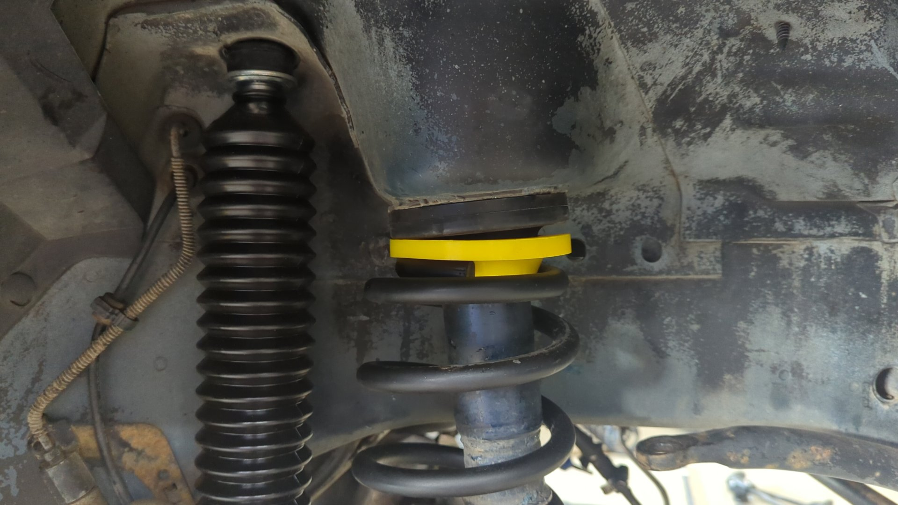
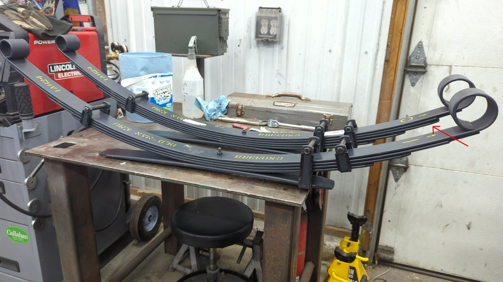
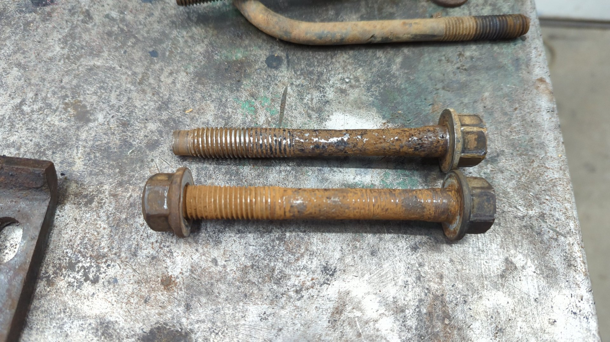

Old Man Emu is a great choice for lifting your XJ, but hunting down the correct part numbers can be difficult. I spent the last couple weeks DIYing a lift for my second XJ so I figured I'd post up everything I found.

Lifting an XJ is pretty easy in theory as all you need to do is swap the rear leaf springs, front coil springs, track bar, and shocks but in reality it tends to be much more difficult than that. XJs are old and this means you're very likely to encountered issues such as seized bolts that may snap, worn out or damaged components, and more.

Because of that you may find yourself needing a bunch of extra parts that lift kit normally don't offer, and are mentioned below.

# Front Coil Springs

For the front springs you'll want to order a set of [OME 2930 front coil springs](https://store.arbusa.com/front-coil-spring-set-2930/), and a pair of [OME JGF10 10mm coil spacers](https://store.arbusa.com/coil-spring-trim-packer-omejgf10/). The coil springs are sold as a pair, but the spacers are sold separately so make sure you order 2 spacers.

The reason for needing the spacers is because OME 2930 springs are only rated for about 1.75" of lift but the rear leaf springs are rated for 2.5" so this helps level out the XJ.

The coil spacer sits below the OEM spring isolator.

Now is also a good time to order new spring isolators if the one's on your XJ are starting to crack or fall apart.

**Note:** If you're XJ is equipped with an aftermarket front bumper and/or winch you may want to go with a set of [OME 2934 front springs](https://store.arbusa.com/front-coil-spring-set-2934/) and skip the coil spacers. 2934 springs will give an XJ about 2.5" of lift but they have a stiffer spring rate so the ride may not be as comfortable.

### Parts List

| Quantity | Part                       | Part #       |
| -------- | -------------------------- | ------------ |
| 1        | Pair of front coil springs | OME 2930     |
| 2        | 10mm coil spacers          | OME JGF10    |
| 2        | Spring isolators           | Moog K160039 |

# Rear Leaf Springs

For the rear leaf springs you'll need [2 OME CS033RB leaf springs](https://store.arbusa.com/rear-leaf-spring-cs033rb/) and will need to remove the extra leaf from the packs. The extra leaf is the third leaf down from the top.

Here's an example of a leaf spring with the extra leaf removed (front one), and one with the extra leaf still in place (rear one).

You'll also need a set of leaf spring bushings since the OME springs don't include these. Any set of OE leaf spring bushings will work since the OME leaf springs have the same size eyes.

Installing the new bushings will be difficult and a press is highly recommended.

If you live in a rust prone area it's very likely you'll need to order new leaf spring bolts. The bolts are known for rusting to the bushings which leaves you with no other choice but to cut them off. It also doesn't hurt to pick up new shackles since those are likely rusty, and may not survive the teardown.

I was lucky and was able to remove 3 of the 4 leaf spring bolts on my Jeep but none of them were re-usable.

The fourth one had to be cut out as it was stuck in the bushing.

Lastly you'll need to get 4 new u bolts for the new leaf springs. The size of the u bolts will vary depending on if you have a [Dana 35](https://www.rockauto.com/en/moreinfo.php?pk=1077736&cc=1363384&pt=10353&jsn=899) or [Chrysler 8.25](https://www.rockauto.com/en/moreinfo.php?pk=1077740&cc=1363384&pt=10353&jsn=900) rear axle.

### Parts List

| Quantity | Part                            | Part #                                                           |
| -------- | ------------------------------- | ---------------------------------------------------------------- |
| 2        | Leaf springs                    | CS033RB                                                          |
| 2        | Shackles with bolts and bushing | Moog K150405                                                     |
| 2        | Front leaf spring bushing       | Moog SB371                                                       |
| 2        | Front leaf spring bolt          | Crown 34202118                                                   |
| 4        | U bolts                         | Dana 35: Husky Spring UA125R, Chrysler 8.25: Husky Spring UA141R |

# Shocks

New shocks are needed because your OEM shocks won't be long enough to handle the taller springs when the suspension is at full droop.

For a full OME setup you'll need [2 OME 60052 front shocks](https://store.arbusa.com/front-nitrocharger-sport-shock-60052/), and [2 OME 60053 rear shocks](https://store.arbusa.com/rear-nitrocharger-sport-shock-60053/).

There's plenty of other options out there for shocks too. If you're not a fan of OME shocks, or they're out of stock and you don't want to wait Bilstein 5100s are a good alternative. For the Bilstein setup you'll need 2 Bilstein 24-185622 front shocks, and 2 Bilstein 24-185639 rear shocks.

Removing the rear shocks can be extremely difficult as the upper bolts are notorious for snapping. The bolts thread into captured nuts within the body so your options are to either drill out the snapped bolt and tap the nut to the next size up, or remove the nuts and use an upper shock fix kit.

While removing my rear shocks I found that two of the nuts were stripped out, and one bolt had the nut spinning on it, so I opted to remove the captured nuts via an air hammer and used the [Azzy upper shock fix](https://www.azzysdesignworks.com/shop/p/xj-shock-mount).

### Parts List

| Quantity | Part            | Part #    |
| -------- | --------------- | --------- |
| 2        | Front shocks    | OME 60052 |
| 2        | Rear shocks     | OME 60053 |
| 1        | Upper shock fix | n/a       |

# Track Bar

The last major piece needed for the lift is an adjustable track bar. An OEM track bar will be too short and will cause the front axle to be shifted towards the driver side.

There's an abundance of options and styles out there for track bars and for my build I opted to go with a BDS 124423 track bar.

| Quantity | Part      | Part #     |
| -------- | --------- | ---------- |
| 1        | Track bar | BDS 124423 |

# Sway Bar Links

Last but not least you'll need some longer sway bar links. Longer links are required because the body of the XJ will be sitting higher above the axle once the new springs are installed.

There's plenty of options on the market but JKS makes a nice detachable set.

| Quantity | Part               | Part #  |
| -------- | ------------------ | ------- |
| 1        | JKS sway bar links | JSK2000 |

At this point you should have everything needed to lift your XJ.

# FAQs

**Why does a leaf need to be removed from the leaf springs?**

If left untouched, the CS2033B springs will lift the rear of an XJ about 3.5" which is significantly taller than the front spring + spacer and will give the XJ a ton of rake. The CS2033B leaf springs are actually the same leafs used for 3.5" OME lift kits.

**Which leaf is the extra leaf?**

The extra leaf is the third one down from the top.

**Why do the leaf springs have a "+" or "-" or "0" symbol on them?**

OME tests their leaf springs to ensure they match their expected spring rate. For springs that test stiffer, they put a + on them, springs that test softer get a -, and springs right on spec are marked 0.

The spring rates won't be drastically different, but if you do get a mismatched pair you should put the stiffer of the two springs on the driver side since it'll need to handle more weight.

**Why is one of the front coil springs taller?**

The OME 2930 front springs will have one spring that is slightly taller than the other. The taller spring should be put on the driver side.

**Does the OME JGF10 spacer go on top or below the spring isolator?**

The coil spacer sits below the isolator.

**Can I keep my OEM sway bar links?**

No, they are too short and the bushings will wear out quickly. If you're in a pinch you can run them but they won't last more than a month or two.
