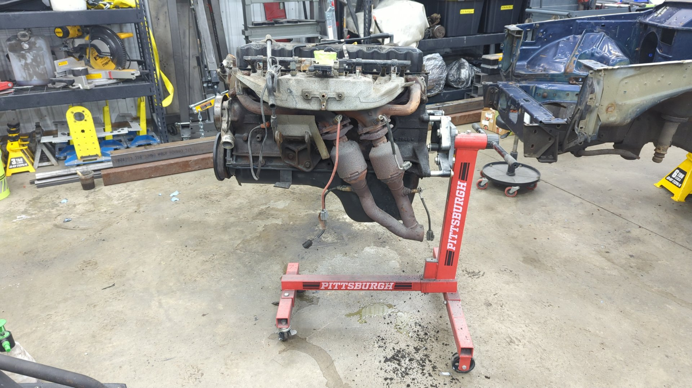

The OEM bell housing bolts are too short for an engine stand so you'll need to pick up some longer bolts.

Every engine stand is a little different but for the HF engine stand I used:

- (2) 3/8-16 3.5" bolts
- (2) 7/16-14 4" bolts

If you're worried the bolts are too long you can always pick up some extra washers.

