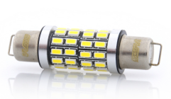
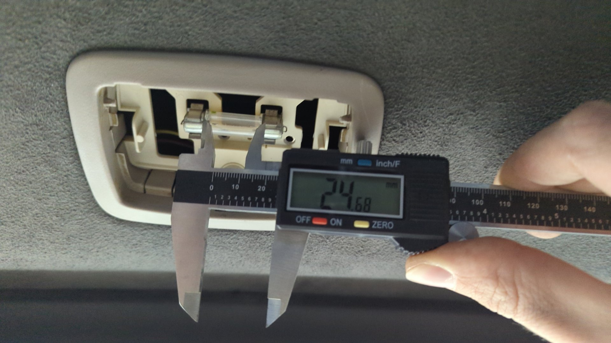
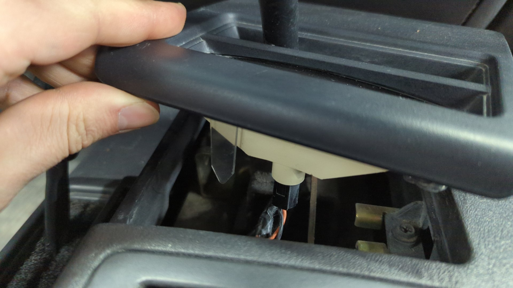

Converting the interior lights of a 97-01 XJ to LEDs is easy since there's only 12 bulbs to swap. Plus LEDs are drastically brighter than the stock incandescent bulbs so it'll help improve visibility at night, and they won't turn your interior plastic brittle or burn your fingers.

## Bulb Sizes

| Location                       | Size         | Quantity |
| ------------------------------ | ------------ | -------- |
| Front dome light               | 561          | 1        |
| Front map lights               | 194          | 2        |
| Rear dome light                | 211\*\*      | 1        |
| Front foot well lights         | 168 or 906   | 2        |
| Vanity mirrors\*               | 29mm festoon | 4        |
| Glove box light\*              | 194          | 1        |
| Automatic transmission shifter | 194 or 658   | 1        |
| Transfer case shifter          | 194 or 658   | 1        |

(\*) Optional. Not every XJ came with these so confirm your XJ has them before ordering.

(\*\*) The FSM recommends a 561 for the rear dome light but a LED 561 won't fit. 211 works perfect.

## Locations

### Front dome light / map lights.

(My dome light was missing)

**Pro-tip**: Avoid buying a 561 dome light that has the LEDs pointing in the same direction as the mounting hooks because the LEDs will point towards the front of the dome light housing instead of downwards when installed.

Bad:

Good:

### Rear Dome Light

The spacing between the contacts is roughly 25mm.

### Foot Well Lights

Driver foot well light.

Passenger foot well light.

The caps twist off, and can be tossed if preferred.

### Vanity Mirrors (If Your XJ Has Them)

### Automatic Shifter Indicator

### Transfer Case Shifter Indicator.

### Glove Box (If Your XJ Has It)

My XJ doesn't have one, but this is where it'd be.

## References

- [Interior LED Bulbs](https://www.cherokeeforum.com/f67/interior-led-bulbs-230351/#post3321388)
- [Bulb Size Cross References](https://www.diodedynamics.com/research/bulb-size-cross-references.html)
