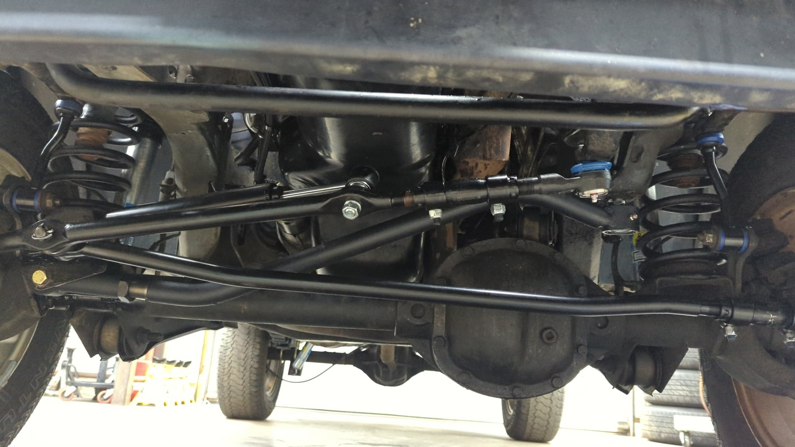
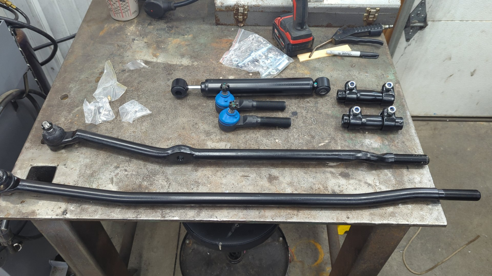
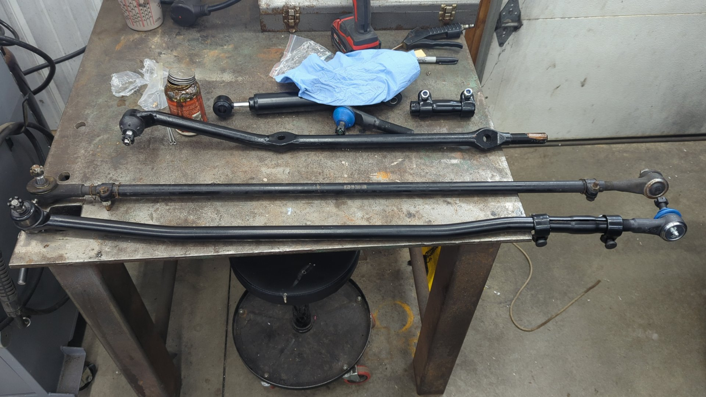

The ZJ steering upgrade is a cheap and easy bolt-on mod that'll beef up your XJ's steering. The upgrade shouldn't take more than a few hours of labor, and parts are super easy to source since they're from a 92 - 98 Grand Cherokee, and can be purchased from sites like RockAuto, or your local auto parts store.

I recently upgraded my XJ to the ZJ steering setup and have been pretty impressed with it. I was already working on the frontend due to it having death wobble (wallowed out axle side track bar bolt holes) and figured I may as well replace the rest while I was down there.

# Parts List

There's several good options out there for OE part brands so it's really up to you with who you go with. I personally went with Mevotech since I've had decent luck with them but Moog is another solid option so part #s for both brands are listed below.

| Quantity | Part | Part #s |
|----------|------|--------|
| 1 | Drag link** | Mevotech MDS1238, Moog DS1238 |
| 1 | Tie rod bar | Mevotech MDS1312, Moog DS1312 |
| 2 | Tie rod end | Mevotech MES2079S, Moog ES3096L |
| 2 | Adjuster sleeves | Mevotech MES2079S, Moog ES2079S |

**The XJ and ZJ share the same drag link so if your existing one is already in good shape you can re-use it.

Some other good items to have on hand are anti-seize for when you're assembling the new parts and some extra cotter pins in case any parts come with them missing.

# Prep

It's good to assemble the parts before you attempt to install them under the jeep. This is pretty straight forward and you should do your best to match the tie rod and drag link lengths to their old counter parts so your alignment doesn't get thrown out of whack. (It's still recommended to align the front axle post install)

If you live in a climate that experiences rust you should add some anti-seize on the threads to ensure nothing gets stuck after a winter or two.

# Install

The install isn't too complicated since you only need to remove the old drag link / tie rod. When installing the new parts I found it easier to install the drag link first and then install the tie rod since that attaches to the drag link.

Torque specs are as follows:

- **Drag Link to Pitman Arm Nut** - 81 Nm / 60 ft.lbs.
- **Drag Link to Knuckle Nut** - 47 Nm / 35 ft.lbs.
- **Drag Link Clamp Bolts** - 49 Nm / 36 ft.lbs.
- **Tie Rod Clamp Bolts** - 49 Nm / 35 ft.lbs
- **Tie Rod to Knuckle** - 47 Nm / 35 ft.lbs
- **Tie Rod to Drag Link** - 75 Nm / 55 ft.lbs.

[Source](https://wranglertjforum.com/threads/zj-tie-rod-conversion.2373/page-3#post-94101)

Once everything is installed you'll want to grease any parts that need it, and do a front end alignment just to be safe since your toe may be out of spec.

# FAQs

**What's the difference between the 1238 and 1310 drag link?**

ZJ Grand Cherokees came with two different length drag lengths depending on if they were a v8 model or not. The v8 models came with the 1310 drag link which is 30.83" long, and the straight six models came with the 1238 drag link which is 30.18" long. 

The 1310 drag link is too long for XJs and will not work.

[Source](https://www.cherokeeforum.com/f67/zj-steering-upgrade-but-drag-link-tre-pitman-touching-sleeve-262805/#post3651933)

**How do I remove the old steering parts?**

After removing the cotter pins and nuts for the various parts you may find they're still stuck in their mounting holes. You'll need to use a [tie rod removal tool](https://www.harborfreight.com/tie-rod-and-pitman-arm-puller-63684.html?event_id=182962), or a [pickle fork](https://www.harborfreight.com/16-in-ball-joint-separator-63420.html).

Both options work good, but I'd recommend the tie rod removal tool because it's less likely to damage the tie rod boot. (although this doesn't matter if you're tossing the old parts)

**How do I adjust my front toe?**

Toe can be adjusted by messing with the adjuster sleeve on the tie rod by the driver knuckle. Shortening the tie rod length will pull the toe in, and lengthening the tie rod will push toe out.

**How do I center the steering wheel?**

**Note**: Don't attempt to center your steering wheel until after you've set toe!

If your steering wheel is no longer centered when the wheels are pointed straight you'll need to adjust the sleeve on the drag link up by the pitman arm.

If the steering wheel is pointing to the right when the wheels are straight you need to increase the drag link's length. If the steering wheel is pointing to the left when the wheels are straight you need to decrease the drag link's length.

Don't forget to re-torque the drag link sleeve bolts to 35 ft/lbs when done.
