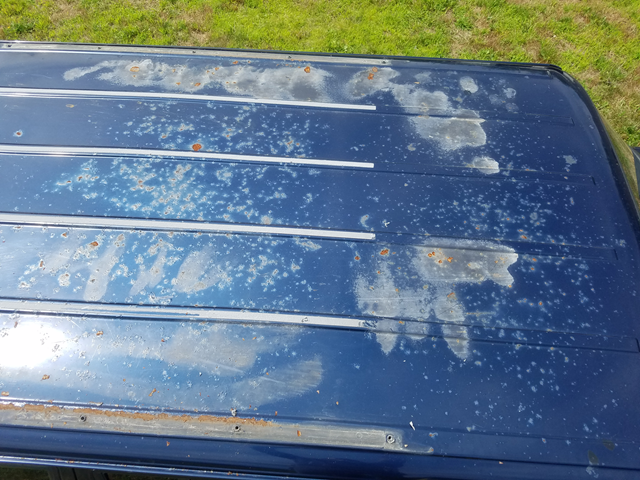
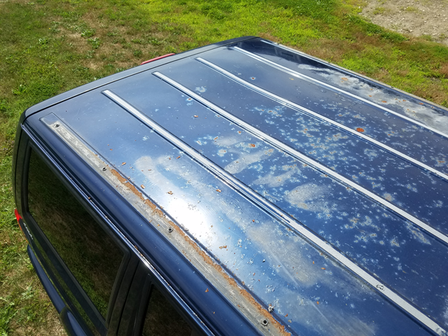

I'm a big fan of older vehicles. I just love the simplicity of them and how easy they are to work on them. Plus the cost of
parts really can't be beat. Since my civic is far from snow worthy I also own a 2000 Jeep Cherokee. It may not be the prettiest
vehicle out there but it's never let me down, and has successfully traveled 20,000 miles in it's first year of owner ship with
a couple road trips ranging in the 800-1000 mile range.

However, with the way Chrysler OEM paint is, the roof was well overdue for a touch up.

I didn't really like the thought of repainting the roof with OEM paint as the rest of the body is quite beat, and I'm constantly
putting things in the roof basket and didn't want to cause scratches. Because of this I decided to go with truck bed liner.

Unlike most though I made an honest effort to eliminate any pre-existing rust before painting and took the time to sandblast the
entire roof. I forgot to take a before shot after stripping all the paint but here's a mid progress shot of the sandblasting.

Then once everything was sandblasted I did a quick pass using the DA with 80 grit to ensure the paint would have a nice
surface to mate to.

A base coat of POR15 and two coats of bed liner later the roof was done.

I'm happy with the outcome. At first I was a little unsure because it looked blotchy, but the second coat of bedliner really evened things
out. Overall it's not too noticeable unless your looking at it from above. I think with the roof basket back in place it will fit right in
with the style of the jeep.

Next fix on the jeep is going to be a new passenger side rocker panel...
