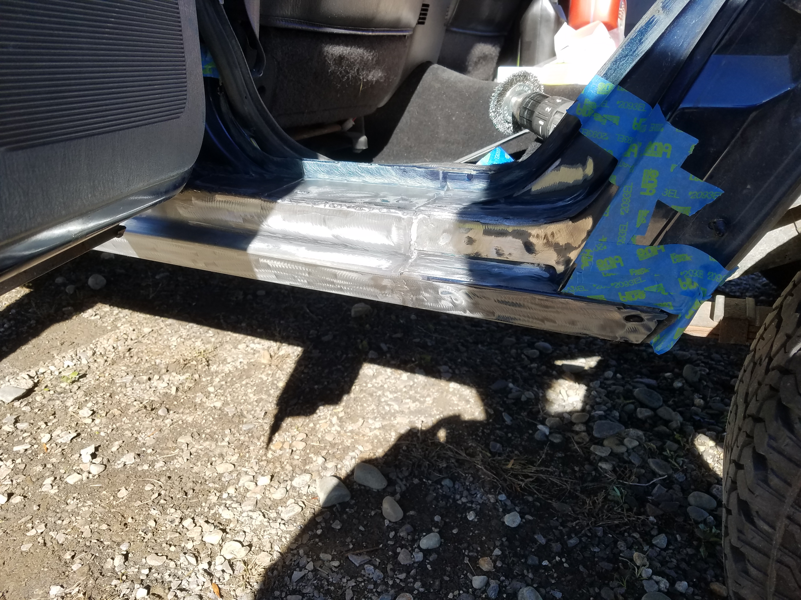
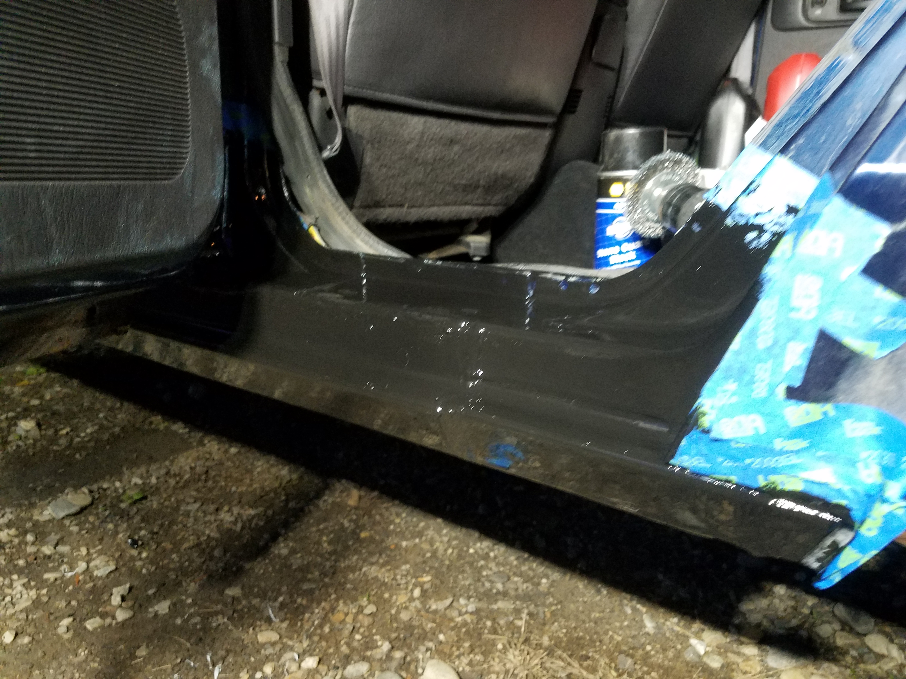
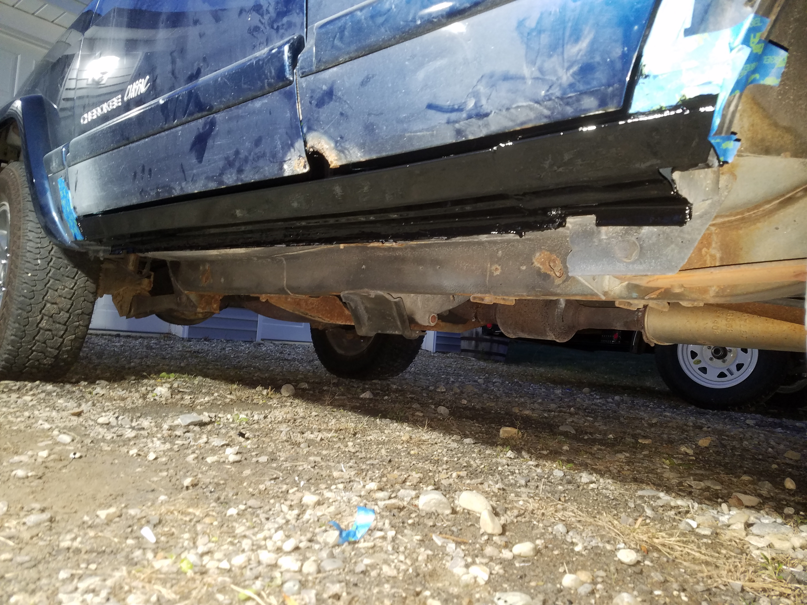

With winter approaching fast, and my Civic only having summer tires I needed to hurry up and finish the Cherokee. The Civic was also suffering from a stuck open thermostat that ensured the engine temperature never reached operating temp, and my heat was always cold.

The funny thing is, when I was preparing to drop the B20B engine into the Civic I clearly remember thinking how pointless it would be to replace the thermostat. I figured since I never had a thermostat fail on me it was something I could skip over. It was honestly one of the only parts I didn't replace on the engine before install, and looking back I wish I had swapped it out.

This weekend I finally tackled welding in the driver side rocker panel on the Jeep. This is how it looked when I started:

I didn't take too many pictures since it was cold, and I was working outside but it only took me about an hour to weld in the patch.

This side of the Jeep actually wasn't very rusty, and didn't need a patch welded in but I figured if one side had rusted out it wouldn't be long till the other did. I also decided to leave as much of the original metal as possible to make the job easier.

The welds aren't the best, but it's nothing the grinder can't take care of.

After going to town with the angle grinder I had it all prepped for paint.

I decided to use POR-15. I've found it to be the strongest stuff out there that can be brushed on, and it leaves a very durable finish. It's so durable that if you forget to wear gloves like me, it'll leave your hands stained for a couple weeks.

Overview shot. It was getting so dark out that I had to drag out the shop light to finish things up. Thankfully though the Cherokee was ready to be driven and I could finally park the Civic.

