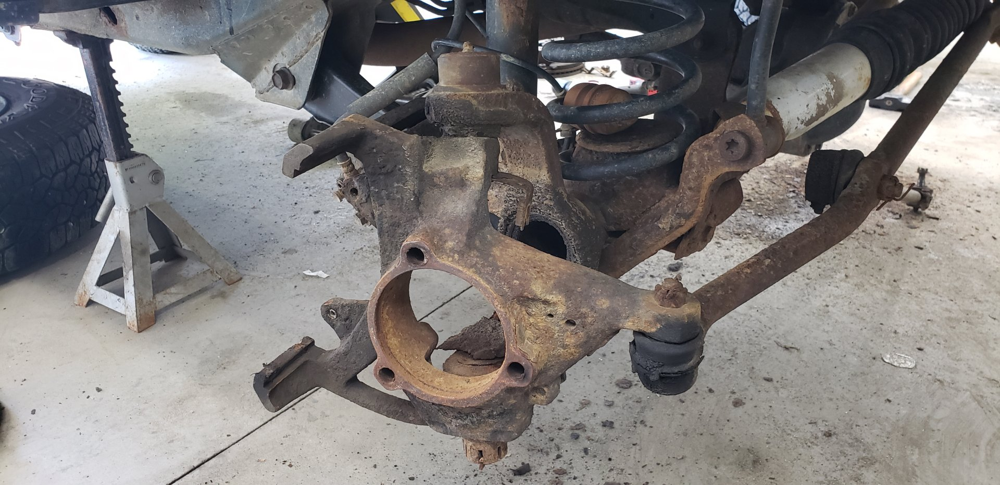
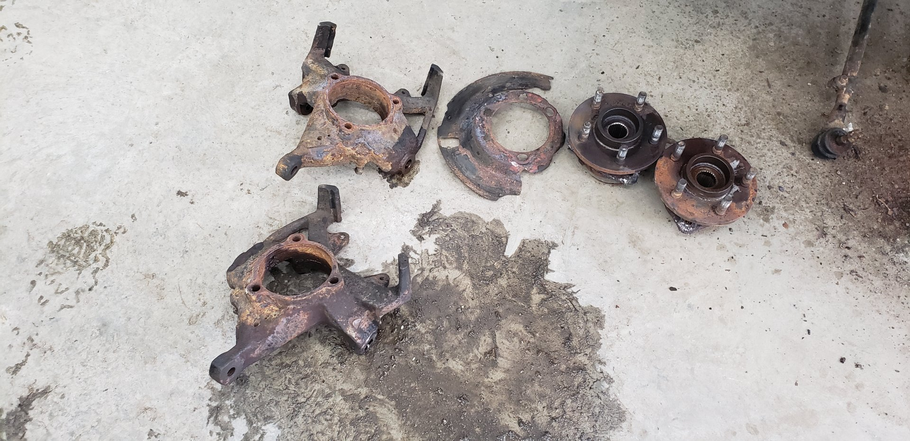
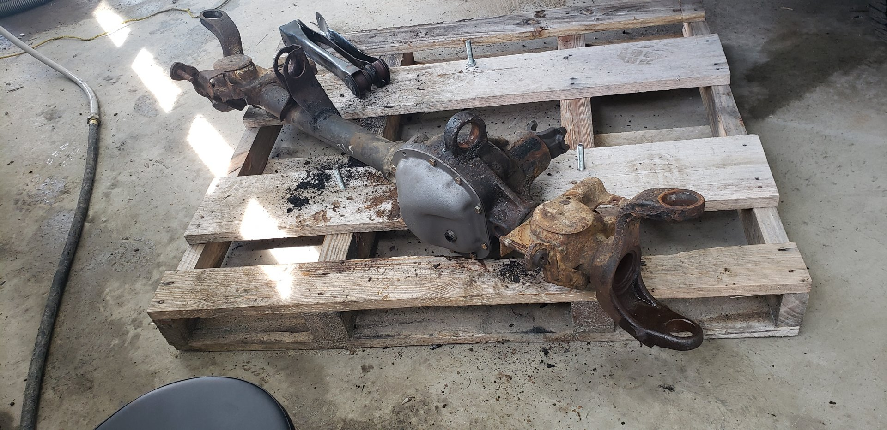
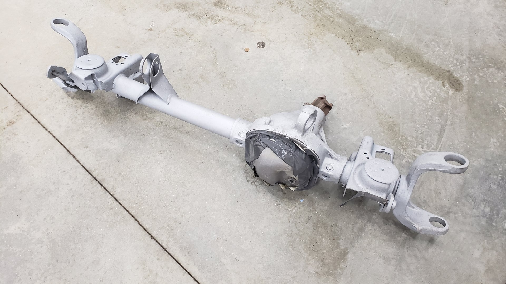
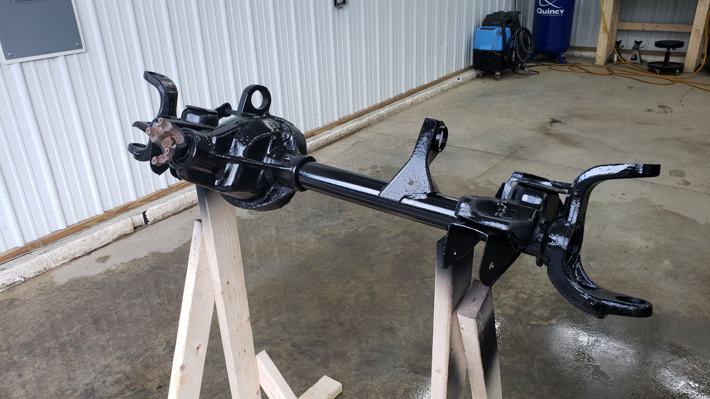
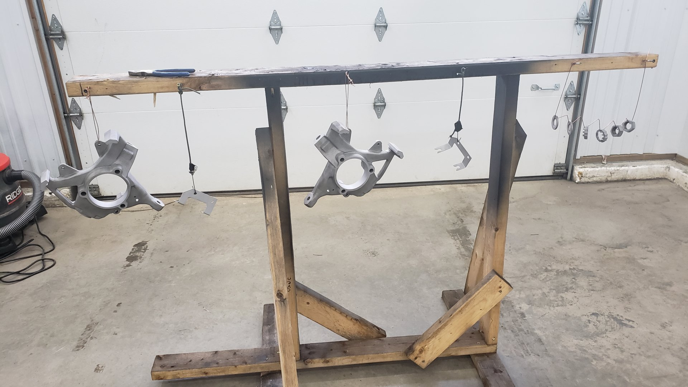
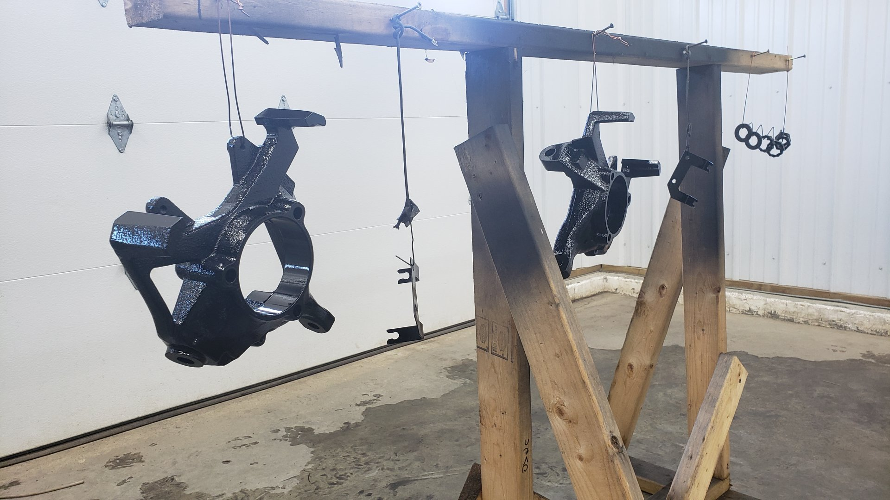
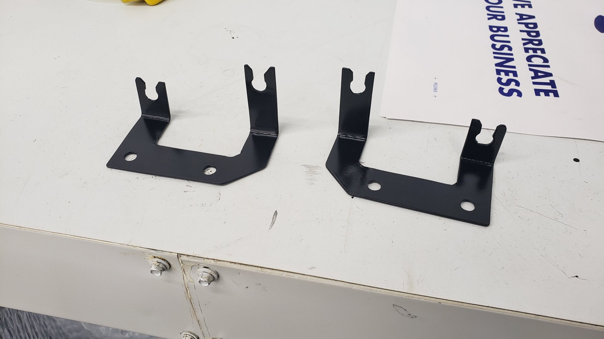
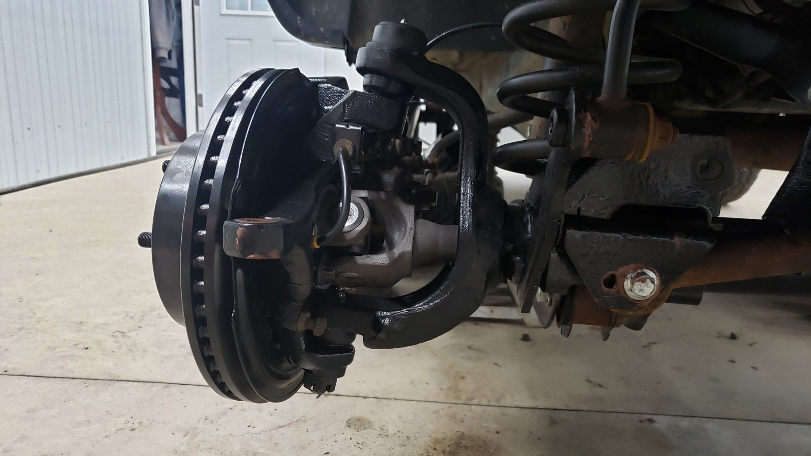
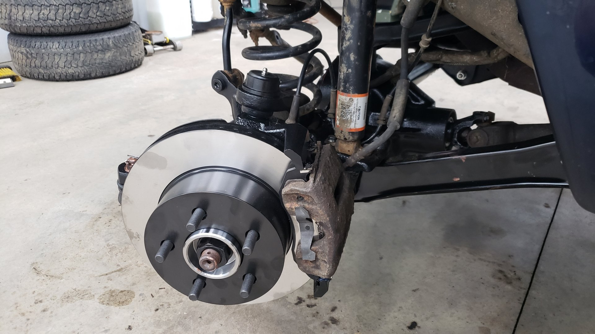

The front axle of my Cherokee has been in desperate need of some attention for quite awhile. Just about every component on it was worn to the point of needing to be replaced and the axle housing itself had built up some pretty intense rust.

I figured my best bet would be to remove the axle from the Jeep and do a full rebuild.

I was a little too excited to get a jump on this project and forgot to take some pictures before I started.

Here's a shot of the passenger side knuckle after the axle shafts were removed and the wheel bearings had been removed. Both wheel bearings had to have their bolts heated red hot via torch to break them free.

One of the dust shields had completed rotted off. The other only had about 2/3s of it remaining.

The axle fully stripped down.

That black spot of original paint by the pinion only managed to survive because it was underneath a sticker.

ABS has never worked quite right on this Jeep. Every once and awhile ABS would randomly engage when stopping. I didn't realize how bad the tone rings were.

Cracked in several spots.

This could use some sand-blasting.

Some of the u-joint caps were completely toast. Two of them were so rusted that the bearing pins were basically dust.

50-50 shot after sandblasting, and painting one of the axles. The u-joint was also replaced.

New tone ring pressed on.

The knuckles were in pretty rough shape as well. I spent a couple hours with them in the blasting cabinet to remove all of the rust.

But when I was getting ready to paint the knuckles I noticed the brake pads had worn grooves into their slides (a common issue for these) and figured they were basically ruined at this point.

I ended up ordering two new ones.

Removing the upper control arm bushings on the axle was a major pain.

I had to cut the rubber out of the bushings and make a relief cut into their metal casings. Just so I could push them out.

With how large the axle itself is there was no way I could fit it in my sand blasting cabinet. I ended up having to blast it outside.

Looking better!

A couple coats of SPI epoxy primer later.

This was actually my first time using a spray gun. I'd be lying if I said I didn't have a lot of spots to touch up afterwards.

Some of the various brackets and other parts ready for paint. (Not all of these are for the axle. I was restoring the e-brake equilalizer housing at the same time)

Since the track bar bolt hole was wallowed out on the axle I picked up a [SFR](https://www.stinkyfab.com/products/heavy-duty-stock-replacement-track-bar-bracket-xj-tj-zj) heavy duty replacement. It comes in two parts and you weld them onto the axle.

Some more parts ready for paint. The knuckles in this pic are actually the new ones.

I didn't want to install the new knuckles as is because they were bare metal. I really want these ones to hold up so I figured it be worth painting them.

I actually made these brackets by hand. They are for the ABS sensors. I couldn't find any replacements and mine were toast.

New knuckles.

And with a bit of wresting I was able to reinstall the axle back into my Jeep. Of course I skimped on the pictures.

Here's an action shot of me pressing in my new balljoints.

Driver side knuckle re-installed.

Passenger side done.

New wheel bearings bolted up. I used a liberal amount of anti-sieze on the bolts so hopefully they won't need a torch next time.

You can also see the upgraded track bar mount in this pic.

Super happy with this. I love seeing everything all nice and clean.

Driver side.

Splurged and bought some power coated rotors.

And of course I'm still using the rusted out tie rod. I ran out of time fixing up this axle and figured I'd replace it anyways within a few years.

Really hope to replace the brake calipers eventually too.

Complete axle done!

And after a several month hiatus she was finally back on all four wheels.

