Another year has come and gone and the XJ remains in pieces. I truly intended on starting to fix it last time I posted about the XJ [but then I impulsively bought a second XJ ]() and it needed some work of it's own that ended up taking me almost a year to finish.

But now that the other XJ is my daily and I sold the Integra this XJ is going to be my main focus for the next 18 months or so. Unfortunately it's looking even sadder than the last time I posted about it because I had to steal the front axle and some other parts off it to get my daily XJ going.
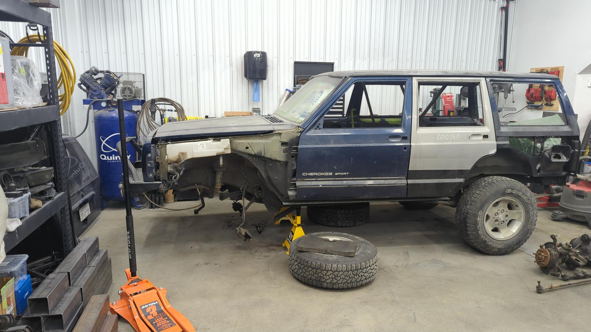

# The Plan

I'm changing up my approach to how I've been fixing up the XJ so I can be more "proper" about rebuilding it. Before proceeding with any sheet metal work I'm going to pull the motor and rear axle and put the XJ on a chassis table. I'm doing this because I want to fix the rust in the engine bay but also because I made a large mistake.

## The Mistake

Back when I was rebuilding the drip rails  I failed to notice that the roof had shifted backwards by about 1/8" due to not enough bracing. This messed with the door gaps and now the top corners of the front doors are just about touching the A pillars.

Back when the XJ was still whole the front doors never touched the pillars. (It's not a great photo but you can see the door / pillar are parallel)
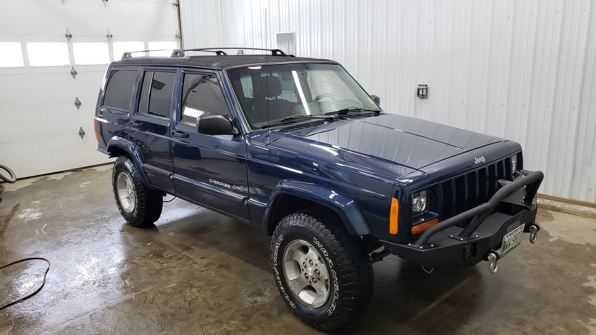

Digging through all my photos I was able to identify that the issue occurred shortly after I cut out the drip rail. I'm fairly certain it happened due to a lack of bracing. 

With the drip rail missing there just wasn't enough structure left to keep the roof in position.
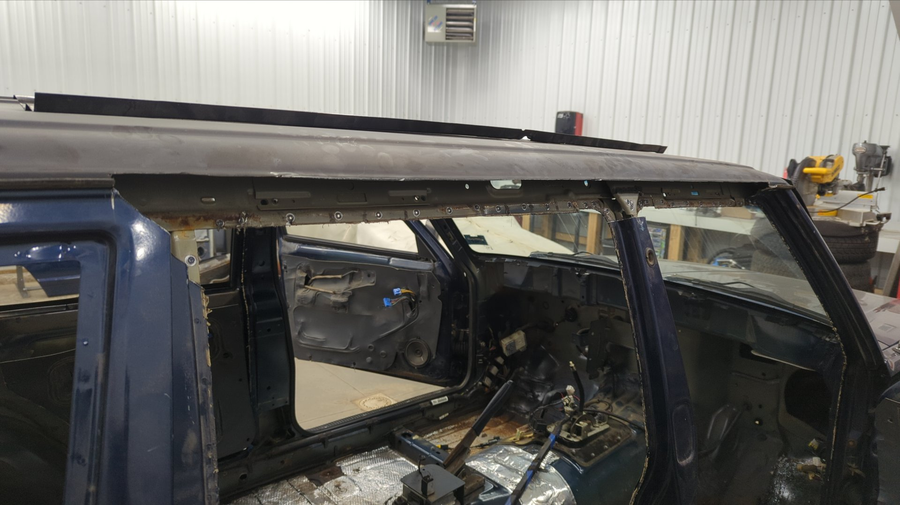

I did eventually add bracing but by then it was already too late. 
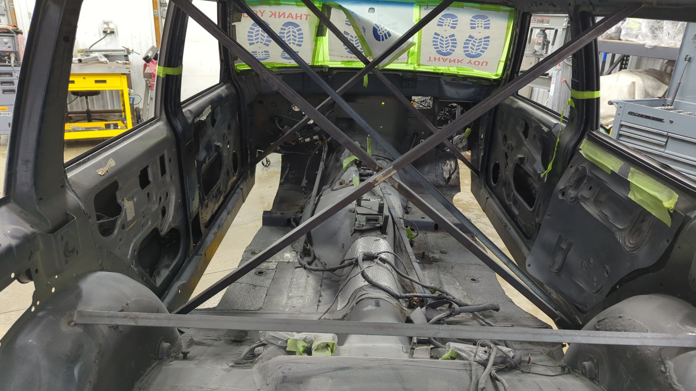

In hindsight this seems like a pretty obvious mistake but I figured since I was doing each drip rail separately there'd still be enough structure in the roof.

I'm not super thrilled to have to redo all that work but I am glad to see the issue occurred _before_ I replaced the inner and outer rockers as I don't believe I'll need to make any changes to them.

In order to fix it right I'll need to separate the B pillars from the roof and push the windshield forward with my hydraulic ram and then weld everything back up. I'l also make sure to use extra bracing this time.

# Pulling the Engine

Everything in the engine bay needs to come out.
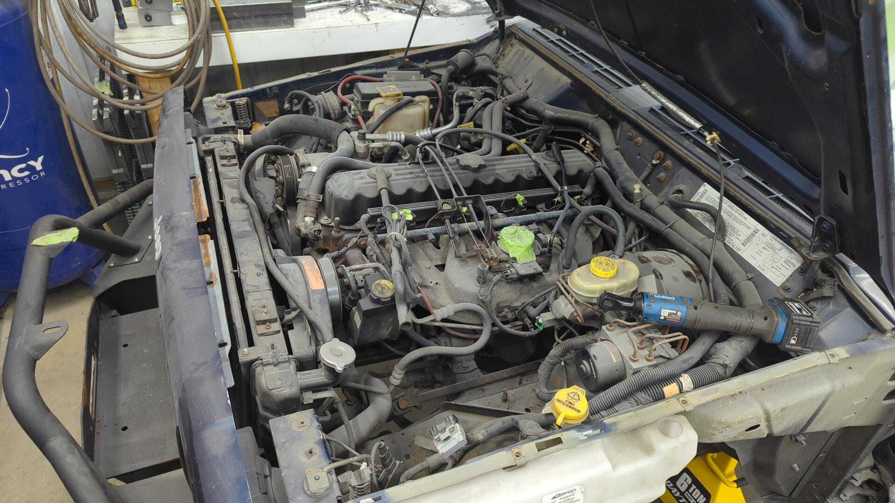

I relocated the XJ to face the front of my shop to get a bit more space and started pulling parts.
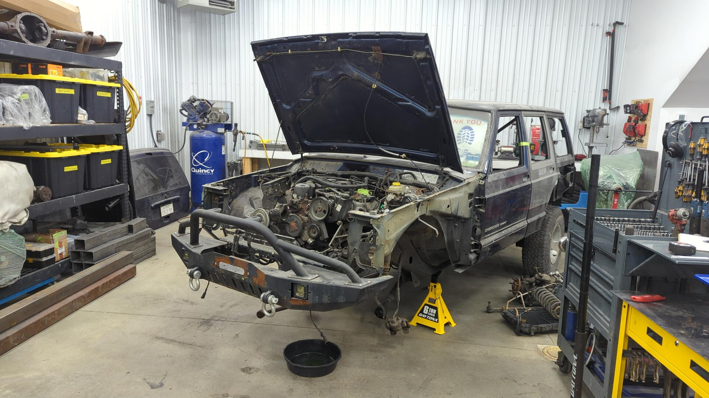

Engine is just about ready to pull at this point.

Some of the bigger parts I pulled.

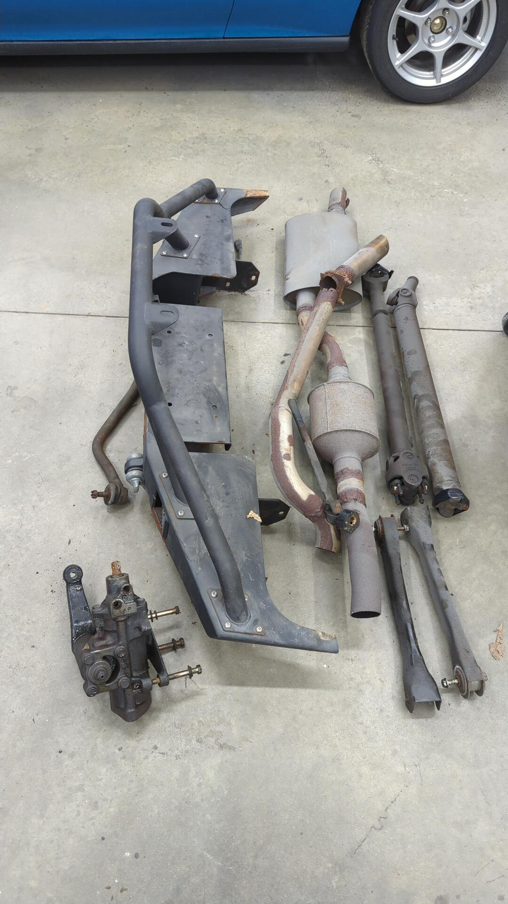

A few hours later and the drivetrain was out. 
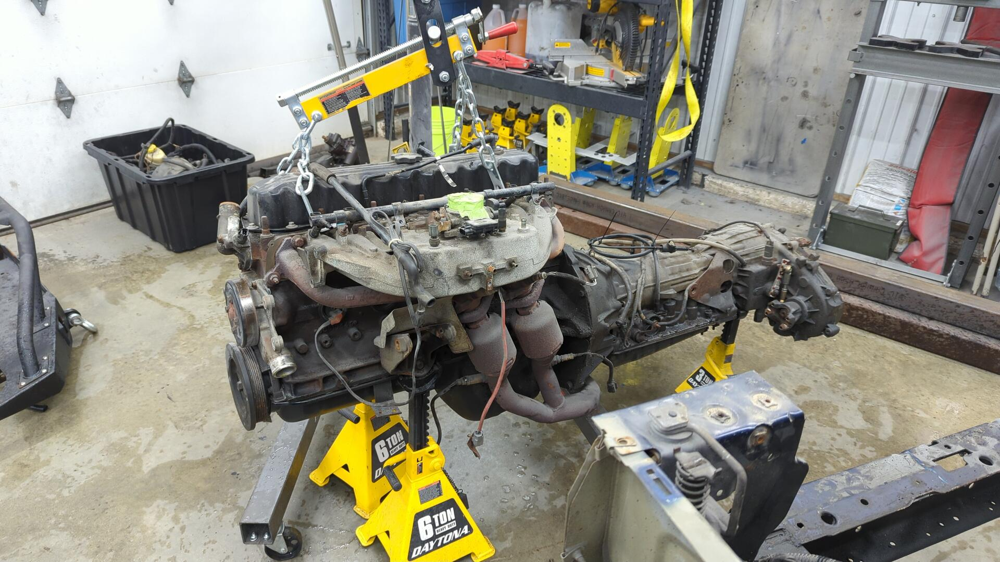

I left the exhaust header attached because the bolts are rusted in place and looked like a nightmare to mess with.

Engine was put on a stand and the AW4 / 242 were wrapped up and put on the shelf.

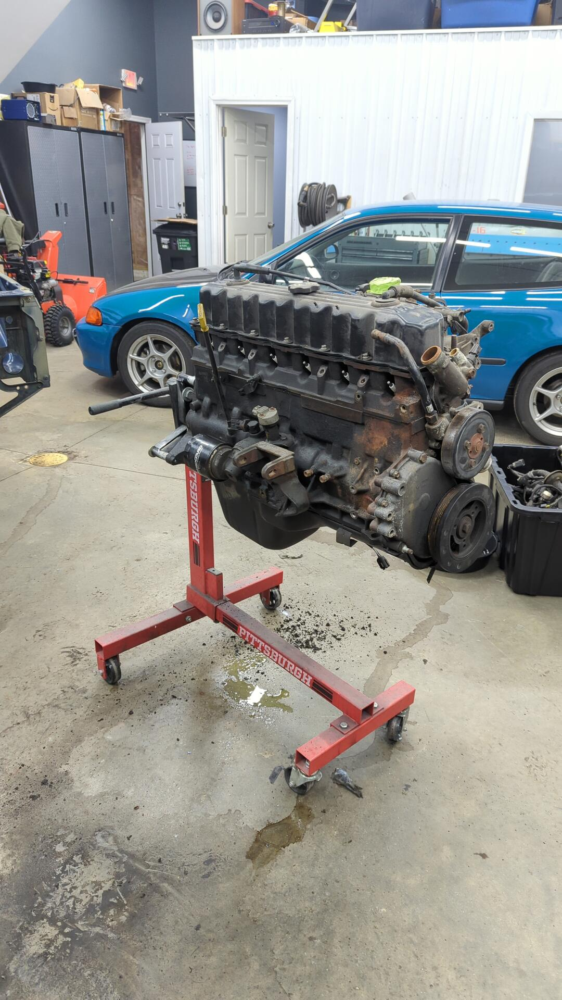
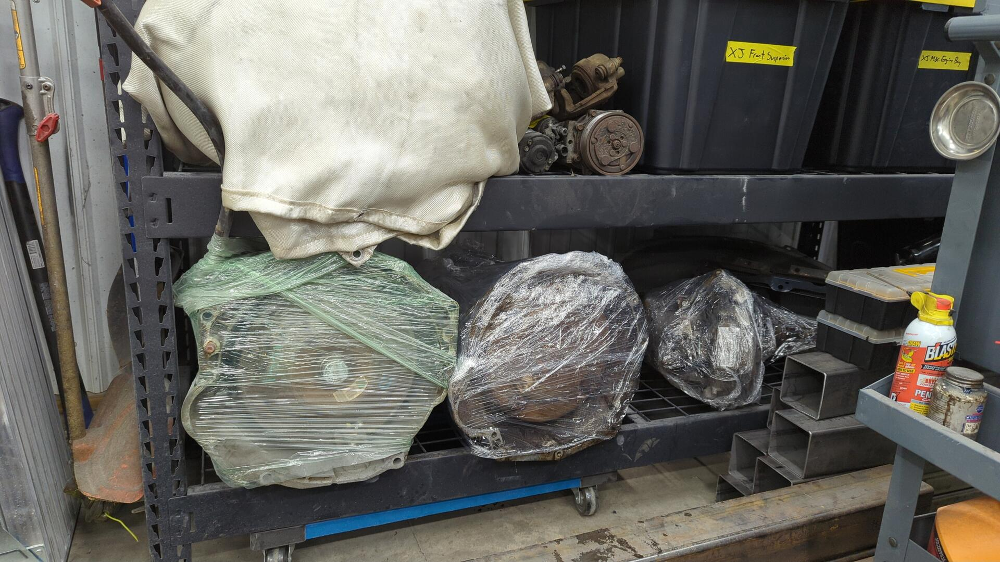

Tucked the 4.0 away in the corner next to the 5.3.
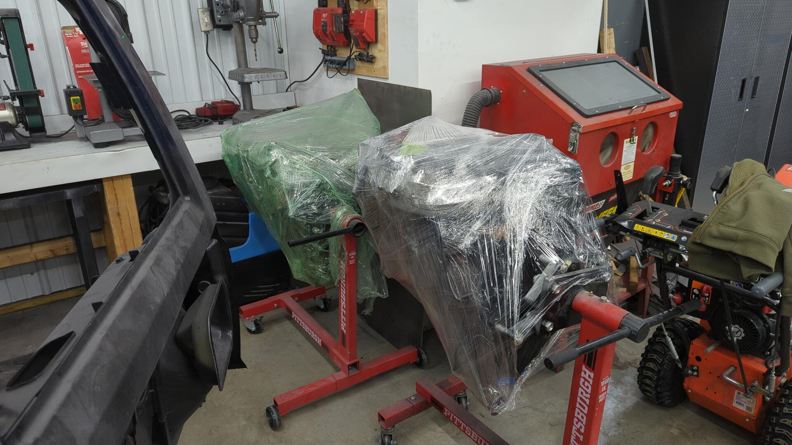

# Cleaning Out the Engine Bay

All that was left at this point was to pull the last bit of wiring and some brake / fuel lines.
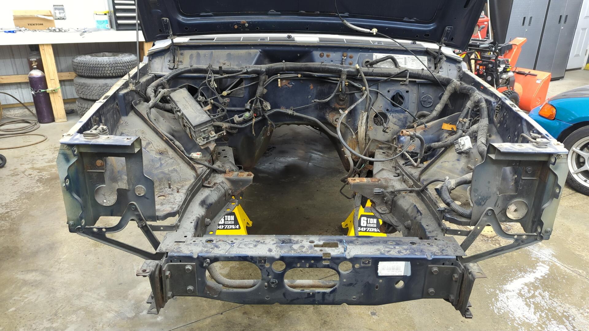

One very dirty engine bay.
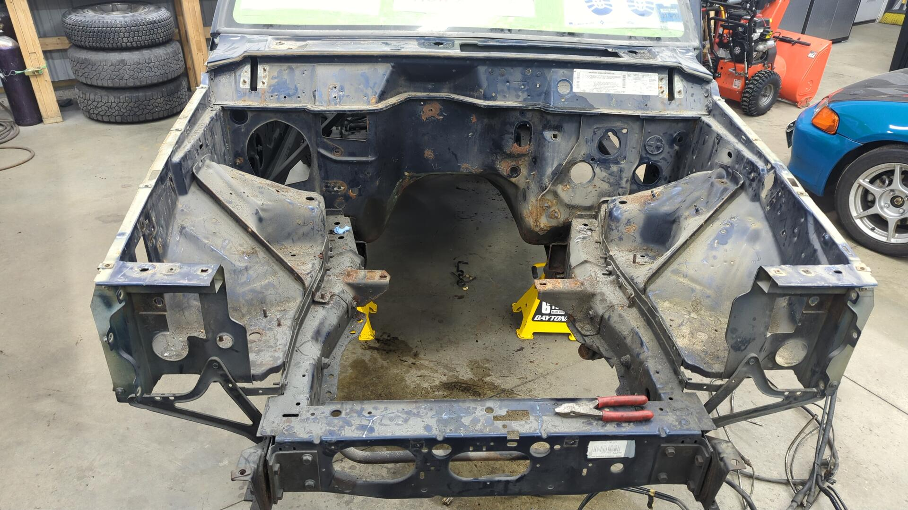
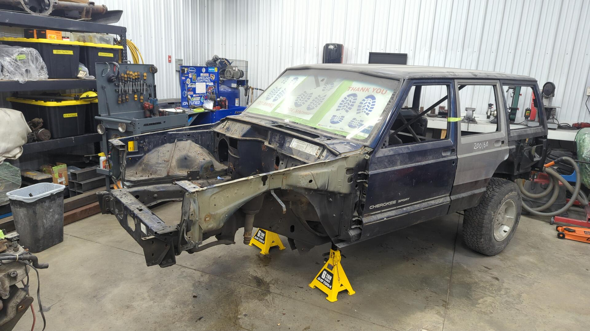

I gave the engine bay a good scrubbing to see what I was up against.

There's more rusty spots than I expected but at the same time they aren't terrible. Most of them will clean up with some sandblasting and the rest will be patched.

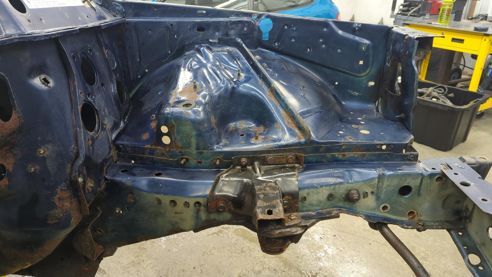
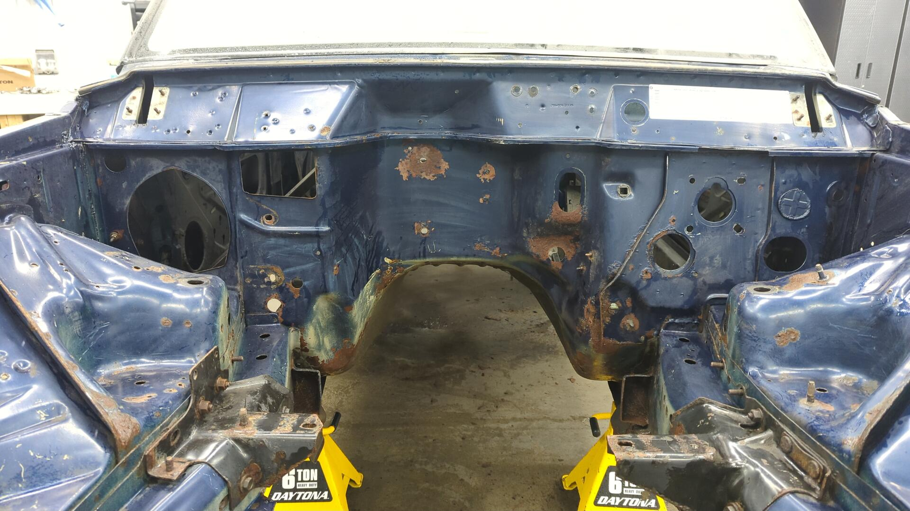

Bunch of new bins on my shelf full of XJ parts.
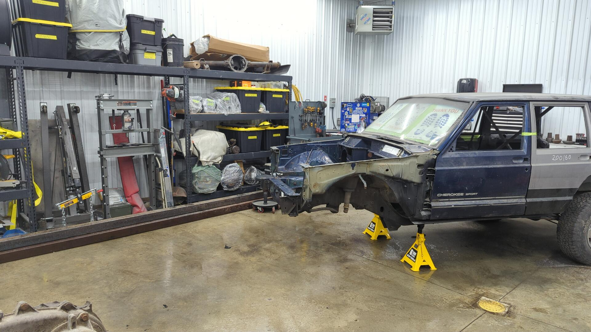

Next up is to build a chassis table.