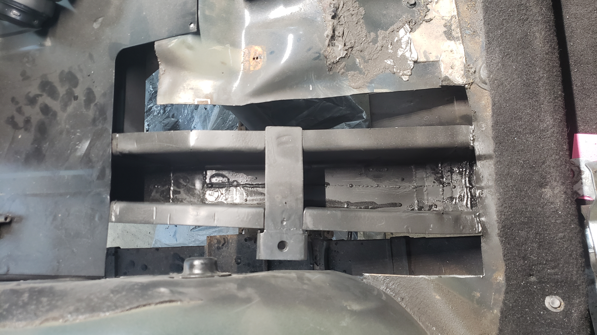
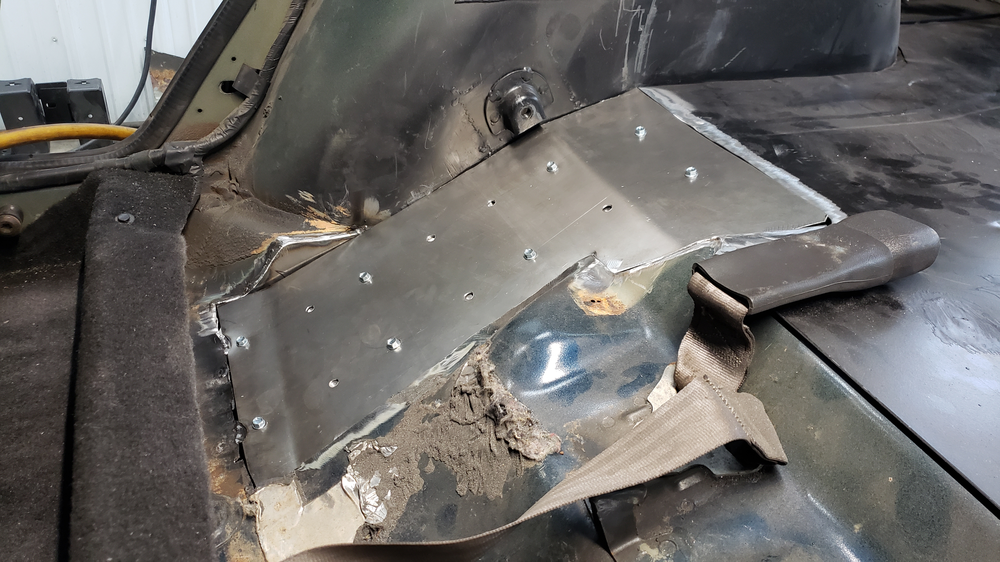
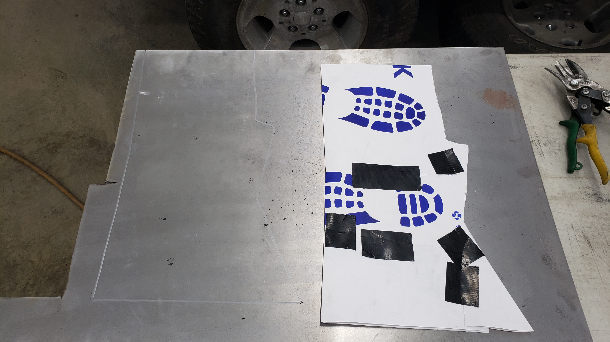
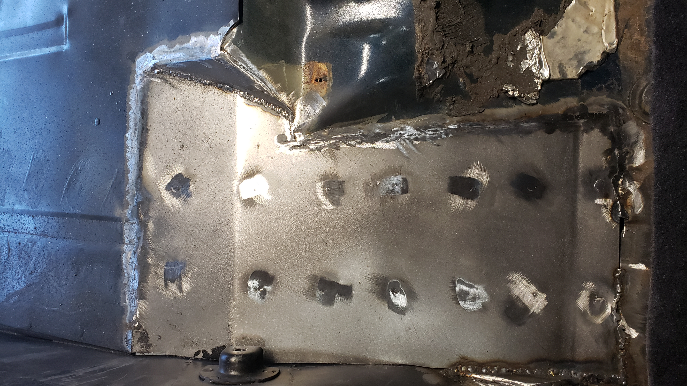
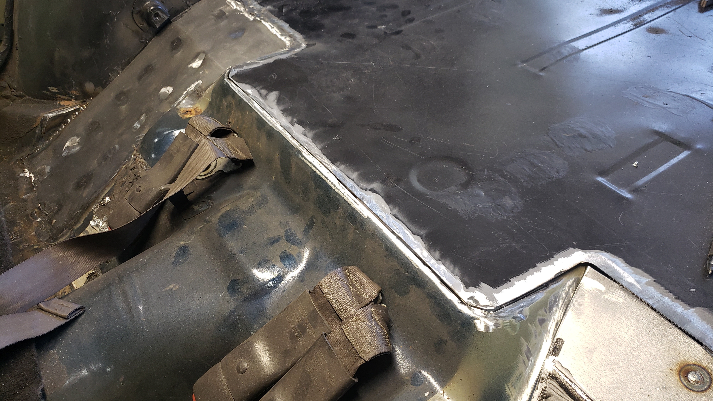
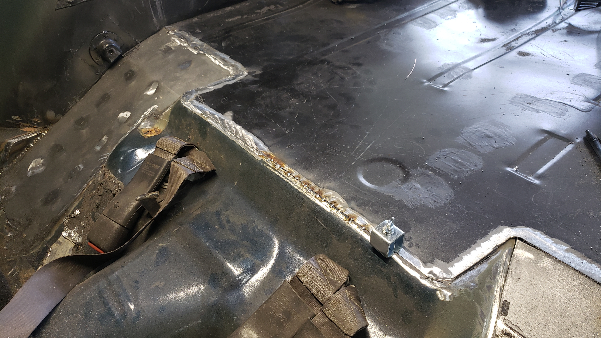
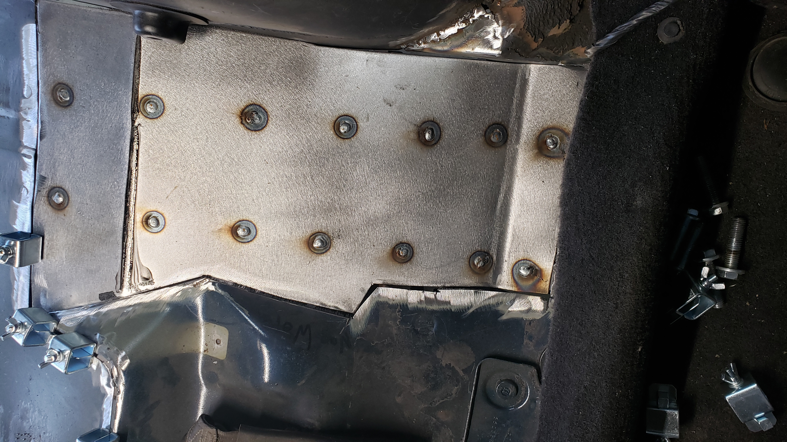
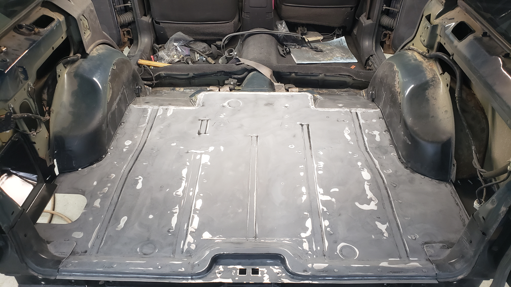
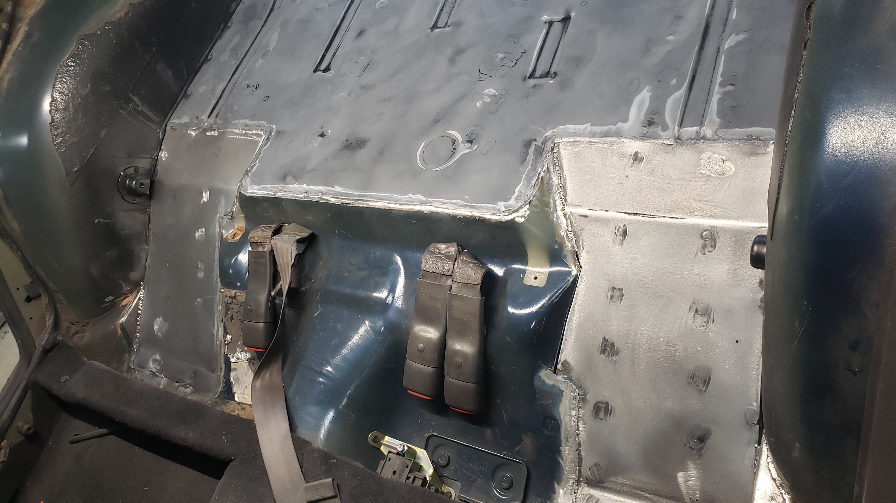

The least exciting portion of this project by far was closing up the two holes left in the floor directly below where the rear seat goes. I initally cut these holes in the floor way back at the beginning of the project because I needed to remove the original frame rails.

Before I could even weld them closed I had to make some smaller patches on the edges to simplify closing them up.

I made my patches out of 18ga which is slightly thicker than the OEM floor. I really wish I had a bead roller as I feel like that would have made the patches look more OEM.

Because of the odd location of the patch I wasn't able to use clamps to hold it down on the frame to spot weld it in place. Instead I used self tappers to hold it tight. This worked out pretty decently and ensured the floor was firmly against the frame. It also allowed me to prep the edges of the floor that would be welded to the patch.

Doing the other side was basically the same exact process. A small patch had to be made near the wheel well to prepare for the larger patch.

In order to make the large patch I made a template of it using thick paper. Then traced it out on my sheet metal.

Several cuts with the angle grinder later.

Then two bends in the metal brake and several holes drilled for spot welds we had our second patch.

I decided to prep them for paint so I could cover the bottomside that will be covered by the frame rail.

I was feeling lazy and brushed the paint on. I wish I had sprayed it instead.

But with the paint on the backside I was ready to weld them in.

Spot welding them to the frame was actually pretty easy. I've got a lot of practice dialing in the welder now when working with 18ga and 16ga.

To make butt welding up the seams I picked up some butt weld clamps from Harbor Freight. I've never heard of these till now but I really llike them.

Welding up the seams took a long time as I had to work slow to prevent from warping the floor.

With all the welding done, it was time to break out the grinder and clean everything up.

If I could do this all over I'd run the patch through a bead roller to give it a more OEM look. Oh well it's not a show Jeep.

One part that worried me a bit was welding the cargo area patch to the center of the floor below the rear seat.

I left the patch overhanging the OEM floor a bit. I ended up using the angle grinder with a cutting disc to cut off the excess so I could butt weld it up.

Talk about a slow process. I tack welded it extra slow to ensure the floor didn't get too hot.

Welding in the driver side patch went fairly smooth. My cuts were a bit sloppier as the gaps were larger on this side, but it wasn't anything extra welding couldn't fix.

With both patches welded in I sanded down the floor so I could lay a fresh coat of paint down.

I made sure to tape off everything extra carefully.

And two coats of paint later it was looking better.

Well until it dried. The floor ended up with a lot of overspray unfortunately. This was my first time spraying in an enclosed area and I didn't realize the lack of airflow would cause a massive overspray issue. Live and learn I suppose. Least it'll be hidden underneath all the carpet and what not.

[Continue on to Part 10]()
